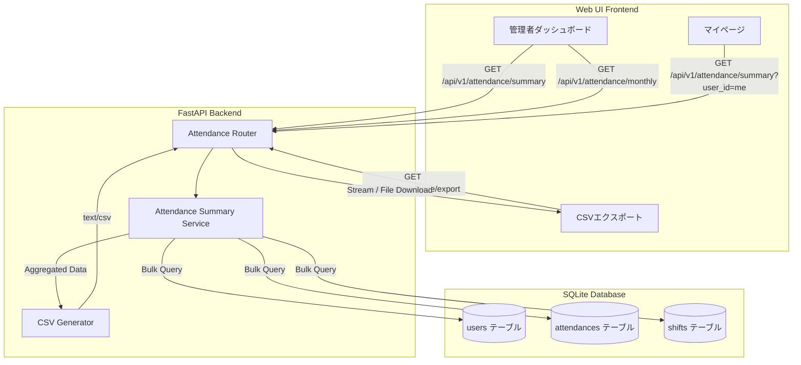
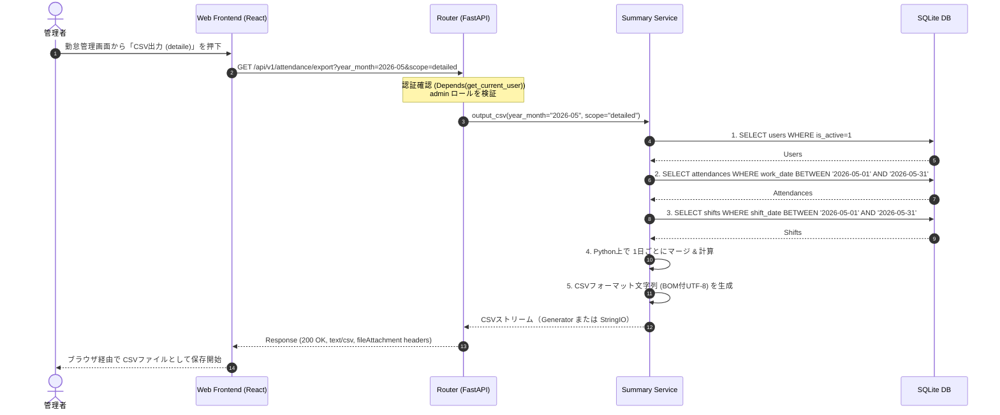

# 管理者用勤怠一覧・CSV出力・月次サマライズ 設計書

## 1. 背景と目的
NFC 勤怠管理システム Kint において、管理者がワーカーの稼働状況を把握・管理し、給与計算などの外部業務へのデータ連携（ローカルファイルへのエクスポート）を容易に行うため、以下の機能を追加設計する。

1. **すべてのワーカーの勤怠記録の一覧表示（管理者専用）**
2. **勤怠記録の 1か月区切りでのサマライズ（月次集計）**
3. **勤怠データをローカルに保存できる機能（CSV エクスポート）**

これらはいずれも、勤怠管理システムにおける実務上の必須機能であり、Google Calendar シフト情報とも整合性を持たせたビジネスロジックで集計される。

---

## 2. 実装される主なユースケース
本機能が対象とするユースケースは以下の4点である。

- **UC-01: 月次勤怠サマリーの参照**
  - 管理者は、指定年月のワーカー全員の出勤状況（出勤日数、欠勤日数、不整合件数、総勤務時間、4月からの総勤務時間等）を一覧でサマライズして閲覧できる。
  - **従業員検索・絞り込み**: 表示名、氏名、またはメールアドレスを入力することで、該当する従業員を一覧上でリアルタイムに絞り込むことができる。
- **UC-02: ユーザー個別月次勤怠詳細の参照**
  - 管理者は、特定のユーザーにフォーカスして、指定年月の 1ヶ月分の日別勤怠記録とシフト情報の突き合わせをマトリクス形式で閲覧できる。
- **UC-03: 勤怠データのエクスポート（ローカル保存）**
  - 管理者は、指定年月・全ワーカーの「日別勤怠データ（詳細）」または「月次サマリーデータ（集計）」を CSV ファイルとしてダウンロードできる。
- **UC-04: 本人による自分の月次サマリーの参照（マイページ拡張）**
  - 一般ユーザーも、マイページから自分の指定月の勤務サマリーを閲覧できる。

---

## 3. システムアーキテクチャとデータフロー

システムは既存の `Router -> Service -> Repository` パターンを踏襲する。



---

## 4. ビジネスロジック設計（集計仕様）

1か月区切りの月次サマリー（集計）は、以下の定義およびロジックに基づいて計算する。

### 4-1. 集計対象期間（1か月区切り）
指定された年月（`YYYY-MM`）の「当月 1日 JST（現地時間）」から「当月末日 JST」までを基本とする。
※将来的に締め日設定（例: 20日締め）に対応可能なよう、Service 層の内部引数としては `from_date` と `to_date` で期間を自在にコントロールできる構造で設計する。

### 4-2. 月次サマリー集計項目と算定式

| 項目名 (レスポンスキー) | 定義・算定ロジック |
| :--- | :--- |
| **総所定労働日数** (`prescribed_days`) | 当該月に `shifts`（シフト情報）が存在するユニークな日付の日数。 |
| **総所定労働日数** (`prescribed_days`) | 当該月に `shifts`（シフト情報）が存在するユニークな日付の日数。 |
| **出勤日数** (`working_days`) | `attendances` のうち、該当ユーザーの `work_date` が当該月内にあり、`check_in` が存在するユニークな日付の日数。 |
| **有給/公休日数** (`holiday_days`) | 会社の休日や有給、シフトがそもそもない日数（所定労働日以外）。 |
| **総勤務時間** (`total_working_hours`) | 各日における実仕事時間の合計。<br>算定式: $\sum (\text{check\_out} - \text{check\_in})$ (時間換算、画面表示やCSV出力では `[h]:mm` 形式で表示/出力)。※`check_out` が未打刻の日（打刻漏れ）は計算から除外。 |
| **欠勤日数** (`absence_days`) | シフト (`shifts`) が存在する日のうち、勤怠レコード (`attendances`) が全く存在しない、または `check_in` が `NULL` のままである日数。 |
| **打刻不整合・エラー日数** (`incomplete_days`) | `check_in` のみで `check_out` が未打刻といった、打刻エラーが発生している日数（管理者による修正が必要なデータ）。 |

### 4-3. データのマージ方法
データベースから一括で `users`, `attendances`, `shifts` を取得し、Python メモリ上でマージを行うことで N+1 問題を排除する。

1. **JST基準の期間日付範囲の算出** (例: 2026-05 → `2026-05-01` ~ `2026-05-31`)
2. **Bulk Query による取得**:
   - `SELECT * FROM users WHERE is_active = 1`
   - `SELECT * FROM attendances WHERE work_date BETWEEN :from_date AND :to_date`
   - `SELECT * FROM shifts WHERE shift_date BETWEEN :from_date AND :to_date`
3. **インメモリでの結合**:
   - `dict[user_id, dict[work_date, (attendance, shift)]]` のような多次元ディクショナリを構築し、1日ごとに突き合わせ処理を行う。

---

## 5. API エンドポイント設計 (OpenAPI 仕様)

以下は追加・変更する OpenAPI 3.1 互換設計スニペットである。

### 5-1. `GET /api/v1/attendance/summary` (月次サマリー)
管理者または本人が、指定月の集計結果を一括して取得する。

```yaml
/attendance/summary:
  get:
    tags: [Attendance]
    summary: 月次勤怠サマリーの取得
    description: >-
      指定された年月の勤怠集計データ（サマリー）を返却します。
      管理者は全ワーカー、一般従業員は自分のデータのみ参照可能です。
    parameters:
      - in: query
        name: year_month
        required: true
        schema:
          type: string
          pattern: '^\d{4}-\d{2}$'
        description: 集計対象の年月（YYYY-MM 形式）
      - in: query
        name: user_id
        required: false
        schema:
          type: string
        description: >-
          対象ユーザーID（管理者のみ指定可能）。
          一般従業員が他人のIDを指定した場合は 403 を返却します。
    responses:
      '200':
        description: 月次サマリーの取得成功
        content:
          application/json:
            schema:
              type: object
              required: [year_month, items]
              properties:
                year_month:
                  type: string
                  example: "2026-05"
                items:
                  type: array
                  items:
                    $ref: '#/components/schemas/AttendanceMonthlySummary'
      '400':
        description: パラメータエラー (フォーマット不正など)
        content:
          application/json:
            schema:
              $ref: '#/components/schemas/ErrorResponse'
      '403':
        description: 権限不足
        content:
          application/json:
            schema:
              $ref: '#/components/schemas/ErrorResponse'
```

### 5-2. `GET /api/v1/attendance/monthly` (日別一括詳細)
管理者が、特定のユーザーの指定月の 1か月分の日別対比データを取得する。

```yaml
/attendance/monthly:
  get:
    tags: [Attendance]
    summary: 月間日別勤怠詳細の取得
    description: >-
      指定された年月における、全日程の日別勤怠・シフト明細データを返却します。
      管理者は全ワーカー分、一般従業員は自分のデータのみ参照可能です。
    parameters:
      - in: query
        name: year_month
        required: true
        schema:
          type: string
          pattern: '^\d{4}-\d{2}$'
        description: 対象の年月（YYYY-MM 形式）
      - in: query
        name: user_id
        required: true
        schema:
          type: string
        description: 対象ユーザーID（一般従業員は自分のIDのみ指定可）
    responses:
      '200':
        description: 月間日別詳細の取得成功
        content:
          application/json:
            schema:
              $ref: '#/components/schemas/AttendanceMonthlyDetailResponse'
      '400':
        description: バリデーションエラー
        content:
          application/json:
            schema:
              $ref: '#/components/schemas/ErrorResponse'
```

### 5-3. `GET /api/v1/attendance/export` (ローカルCSV保存)
バックエンドから指定月のデータを CSV ファイルストリームとしてダウンロードする。

```yaml
/attendance/export:
  get:
    tags: [Attendance]
    summary: 勤怠データCSVエクスポート (管理者専用)
    description: >-
      指定された年月における勤怠データを CSV フォーマットでエクスポートします。
      このエンドポイントは管理者（admin ロール）専用です。
    parameters:
      - in: query
        name: year_month
        required: true
        schema:
          type: string
          pattern: '^\d{4}-\d{2}$'
        description: 対象の年月 (YYYY-MM)
      - in: query
        name: scope
        required: false
        schema:
          type: string
          enum: [summary, detailed]
          default: detailed
        description: >-
          エクスポートの種類。
          `summary`: ユーザーごとの月間集計サマリー
          `detailed`: 日次の全ワーカー打刻詳細（日付別）
    responses:
      '200':
        description: CSV ファイルのダウンロード成功
        headers:
          Content-Disposition:
            schema:
              type: string
              example: attachment; filename="kint_attendance_detailed_2026-05.csv"
        content:
          text/csv:
            schema:
              type: string
              format: binary
      '403':
        description: 管理者以外のアクセス拒否
        content:
          application/json:
            schema:
              $ref: '#/components/schemas/ErrorResponse'
```

---

## 6. スキーマ定義 (Pydantic Schema / OpenAPI Components)

### 6-1. `AttendanceMonthlySummary`
```yaml
components:
  schemas:
    AttendanceMonthlySummary:
      type: object
      required:
        - user_id
        - user_name
        - full_name
        - email
        - prescribed_days
        - working_days
        - total_working_hours
        - absence_days
        - incomplete_days
      properties:
        user_id:
          type: string
          example: "usr_01"
        user_name:
          type: string
          description: 表示名
          example: "yamada"
        full_name:
          type: string
          description: 氏名
          example: "山田 太郎"
        email:
          type: string
          description: メールアドレス
          example: "yamada@example.com"
        prescribed_days:
          type: integer
          description: 所定内（シフトあり）日数
          example: 21
        working_days:
          type: integer
          description: 実稼働（打刻あり）日数
          example: 20
        total_working_hours:
          type: number
          format: float
          description: 当月の総勤務時間 (h)
          example: 162.50
        absence_days:
          type: integer
          description: 欠勤日数
          example: 1
        incomplete_days:
          type: integer
          description: 打刻不整合（打刻漏れ等エラー）の日数
          example: 0
```

### 6-2. `AttendanceMonthlyDetailResponse`
```yaml
    AttendanceMonthlyDetailResponse:
      type: object
      required: [user_id, year_month, summary, days]
      properties:
        user_id:
          type: string
        year_month:
          type: string
        summary:
          $ref: '#/components/schemas/AttendanceMonthlySummary'
        days:
          type: array
          items:
            $ref: '#/components/schemas/DailyAttendanceDetail'

    DailyAttendanceDetail:
      type: object
      required: [work_date, has_shift, is_holiday, status]
      properties:
        work_date:
          type: string
          format: date
          example: "2026-05-15"
        has_shift:
          type: boolean
          description: シフトの有無
        is_holiday:
          type: boolean
          description: 休日判定（シフトがなく、打刻もない場合など）
        shift_start:
          type: string
          format: date-time
          nullable: true
        shift_end:
          type: string
          format: date-time
          nullable: true
        check_in:
          type: string
          format: date-time
          nullable: true
        check_out:
          type: string
          format: date-time
          nullable: true
        working_hours:
          type: number
          format: float
          nullable: true
          description: 1日の勤務時間(h)
        status:
          type: string
          enum: [normal, incomplete, off_duty]
          description: 日次の勤怠状態
          example: "normal"
        source:
          type: string
          nullable: true
          description: 打刻ソース
          example: "webusb_nfc"
        is_manual_work_time:
          type: boolean
          default: false
        shifts:
          type: array
          items:
            $ref: '#/components/schemas/ShiftPeriod'
          description: その日の全シフト予定時間リスト
        punches:
          type: array
          items:
            $ref: '#/components/schemas/PunchPeriod'
          description: その日の全打刻ペアリスト

    ShiftPeriod:
      type: object
      required: [start_time, end_time]
      properties:
        start_time:
          type: string
          format: date-time
        end_time:
          type: string
          format: date-time
```

---

## 7. CSV 出力フォーマット仕様 (ローカル保存)

CSV 出力時は文字コードとして `UTF-8 (BOM付き: UTF-8 with BOM)` を採用する。
(Windows 標準の Excel で直接開いた際の日本語文字化けを防ぐためである。)

### 7-1. 日別詳細エクスポート (scope=detailed)
全ワーカーの指定月の全暦日をシリアルに出力する。

**ヘッダー定義**:
```csv
日付,表示名,氏名,シフト開始時刻,シフト終了時刻,出勤打刻,退勤打刻,出勤,退勤,勤務時間,勤怠ステータス,打刻ソース,修正理由
```

**出力サンプル**:
```csv
2026-05-01,yamada,山田 太郎,09:00,18:00,08:55,18:15,09:00,18:00,8:15,正常,webusb_nfc,
2026-05-01,sasaki,佐々木 美咲,09:00,18:00,09:15,18:00,09:15,18:00,7:45,遅刻,web_user_id,寝坊のため
2026-05-02,yamada,山田 太郎,09:00,18:00,08:59,,08:59,,,打刻漏れ,webusb_nfc,
```

### 7-2. 月次サマリーエクスポート (scope=summary)
当月の全ワーカーの集計された数値を1行ずつ出力する。

**ヘッダー定義**:
```csv
対象月,ユーザーID,表示名,氏名,所定労働日数,実出勤日数,総勤務時間,欠勤日数,打刻エラー日数
```

**出力サンプル**:
```csv
2026-05,usr_01,yamada,山田 太郎,21,20,162:30,1,0
2026-05,usr_02,sasaki,佐々木 美咲,21,18,140:00,3,1
```

---

## 8. シーケンス・ダイアグラム

### 8-1. CSVダウンロード実行シーケンス
ローカル保存機能におけるフロントエンドとバックエンドの連携シーケンスを示す。



---

## 9. 変更影響範囲
本機能の設計・実装にあたり、既存モジュールに以下の修正・追加を加える。

1. **`docs/api-contract.openapi.yaml` (本契約ドキュメント)**:
   - 新規エンドポイントおよびスキーマ定義の追記。
2. **`docs/specification.md`**:
   - `5-1. 打刻機能` もしくは `5-3. 勤怠修正機能` の付近に「5-9. 管理者用勤怠一覧・出力・サマリー機能」を追加。
3. **`docs/architecture.md`**:
   - 構成図および構成要素の説明に CSV エクスポート・集計を追加。
4. **`src/kint/routers/attendance.py`**:
   - `GET /attendance/summary`, `GET /attendance/monthly`, `GET /attendance/export` の追加。
5. **`src/kint/services/attendance.py`** (または新規に **`src/kint/services/attendance_summary.py`**):
   - 一括計算および CSV 出力用ビジネスロジックの実装（`@backend` または `@database` に委譲）。
6. **`frontend/src/`**:
   - 管理者ダッシュボードへの「月次勤怠一覧」「CSVダウンロード」画面の追加（`@frontend` に委譲）。

---

## 10. 勤務時間報告書 CSV インポート設計

### 10-1. 概要とエンドポイント
外部の勤務時間報告書 CSV（`氏名,勤務開始日時,勤務終了日時`）を取り込むため、`POST /api/v1/attendance/import-csv` エンドポイントを拡張。

### 10-2. マッチングおよび処理フロー
1. **氏名の正規化照合**:
   - 氏名文字列に含まれるすべてのスペース (`\s`) を除外した文字列同士で、DB内の `User.full_name` と照合（`User.name` は照合対象外）。
2. **打刻および勤務時間の反映**:
   - `勤務開始日時` を `check_in`、`勤務終了日時` を `check_out` にセットし、`calculate_working_time` により勤務開始・終了（`work_start`/`work_end`）を動的計算。
   - 同一 `user_id` かつ同一 `work_date` の既存レコードは即座に最新打刻で上書き更新（`source="admin_manual"`）。
   - `実働時間数` 列は無視する。
3. **未一致データの追跡・報告**:
   - 一致するアカウントが見つからなかった氏名はレスポンスの `unmatched_names` および `unmatched_rows` に集計し、フロントエンドモーダル上で表示報告する。

