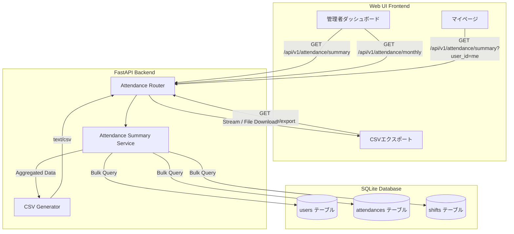
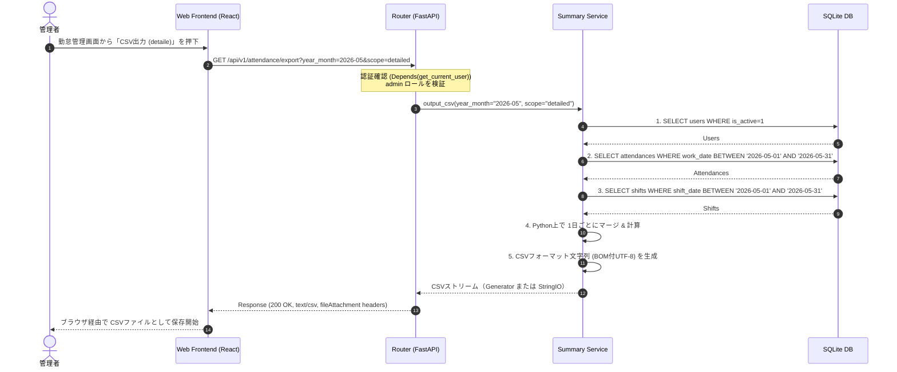

# 管理者用勤怠一覧・CSV出力・月次サマライズ 設計書

## 1. 背景と目的
NFC 勤怠管理システム Kint において、管理者がワーカーの稼働状況を把握・管理し、給与計算などの外部業務へのデータ連携（ローカルファイルへのエクスポート）を容易に行うため、以下の機能を追加設計する。

1. **すべてのワーカーの勤怠記録の一覧表示（管理者専用）**
2. **勤怠記録の 1か月区切りでのサマライズ（月次集計）**
3. **勤怠データをローカルに保存できる機能（CSV エクスポート）**

これらはいずれも、勤怠管理システムにおける実務上の必須機能であり、Google Calendar シフト情報とも整合性を持たせたビジネスロジックで集計される。

---

## 2. 実装される主なユースケース
本機能が対象とするユースケースは以下の4点である。

- **UC-01: 月次勤怠サマリーの参照**
  - 管理者は、指定年月のワーカー全員の出勤状況（出勤日数、欠勤日数、不整合件数、総勤務時間、4月からの総勤務時間等）を一覧でサマライズして閲覧できる。
  - **従業員検索・絞り込み**: 表示名、氏名、またはメールアドレスを入力することで、該当する従業員を一覧上でリアルタイムに絞り込むことができる。
- **UC-02: ユーザー個別月次勤怠詳細の参照**
  - 管理者は、特定のユーザーにフォーカスして、指定年月の 1ヶ月分の日別勤怠記録とシフト情報の突き合わせをマトリクス形式で閲覧できる。
- **UC-03: 勤怠データのエクスポート（ローカル保存）**
  - 管理者は、指定年月・全ワーカーの「日別勤怠データ（詳細）」または「月次サマリーデータ（集計）」を CSV ファイルとしてダウンロードできる。
- **UC-04: 本人による自分の月次サマリーの参照（マイページ拡張）**
  - 一般ユーザーも、マイページから自分の指定月の勤務サマリーを閲覧できる。

---

## 3. システムアーキテクチャとデータフロー

システムは既存の `Router -> Service -> Repository` パターンを踏襲する。


```mermaid
flowchart TD
  subgraph Client [Web UI Frontend]
    AdminDash[管理者ダッシュボード]
    MyPage[マイページ]
    ExportBtn[CSVエクスポート]
  end

  subgraph API [FastAPI Backend]
    Router[Attendance Router]
    Service[Attendance Summary Service]
    CsvGen[CSV Generator]
  end

  subgraph DB [SQLite Database]
    Users[(users テーブル)]
    Attendances[(attendances テーブル)]
    Shifts[(shifts テーブル)]
  end

  AdminDash -->|GET /api/v1/attendance/summary| Router
  AdminDash -->|GET /api/v1/attendance/monthly| Router
  ExportBtn -->|GET /api/v1/attendance/export| Router
  MyPage -->|GET /api/v1/attendance/summary?user_id=me| Router

  Router --> Service
  Service -->|Bulk Query| Users
  Service -->|Bulk Query| Attendances
  Service -->|Bulk Query| Shifts

  Service -->|Aggregated Data| CsvGen
  CsvGen -->|text/csv| Router
  Router -->|Stream / File Download| ExportBtn
```

---

## 4. ビジネスロジック設計（集計仕様）

1か月区切りの月次サマリー（集計）は、以下の定義およびロジックに基づいて計算する。

### 4-1. 集計対象期間（1か月区切り）
指定された年月（`YYYY-MM`）の「当月 1日 JST（現地時間）」から「当月末日 JST」までを基本とする。
※将来的に締め日設定（例: 20日締め）に対応可能なよう、Service 層の内部引数としては `from_date` と `to_date` で期間を自在にコントロールできる構造で設計する。

### 4-2. 月次サマリー集計項目と算定式

| **総所定労働日数** (`prescribed_days`) | 当該月に `shifts`（シフト情報）が存在するユニークな日付の日数。 |
| **出勤日数** (`working_days`) | `attendances` のうち、該当ユーザーの `work_date` が当該月内にあり、`check_in` が存在するユニークな日付の日数。 |
| **有給/公休日数** (`holiday_days`) | 会社の休日や有給、シフトがそもそもない日数（所定労働日以外）。 |
| **総勤務時間** (`total_working_hours`) | 各日における勤務時間の月間単純合計（実時間）。 |
| **申請勤務時間** (`total_requested_hours`) | 月次の総勤務時間（単純合計）を **30分（0.5時間）単位で切り上げた時間**。<br>画面表示では `申請勤務時間(実時間)` として `切り上げ時間 (単純合計の実時間)` 形式（例: `144:00 (143:45)`）で表示。 |
| **4月からの総勤務時間** (`yearly_working_hours`) | 当年度4月1日から当月末までの期間における切り上げ後の申請勤務時間の累計。 |
| **欠勤日数** (`absence_days`) | シフト (`shifts`) が存在する日のうち、勤怠レコード (`attendances`) が全く存在しない、または `check_in` が `NULL` のままである日数。 |
| **打刻不整合・エラー日数** (`incomplete_days`) | `check_in` のみで `check_out` が未打刻といった、打刻エラーが発生している日数（管理者による修正が必要なデータ）。 |
| **要確認・アラート件数** (`alert_count`) | 長時間勤務や遅い時間の退勤など、注意が必要な勤怠状況（アラート）が発生した合計件数。※詳細は `attendance_rules.md` の「勤務時間のアラート判定」を参照。 |
| **未確認アラート数** (`unacknowledged_alert_count`) | 発生したアラート（`alert_count`）のうち、管理者が「確認済」としてマークしていない未確認のアラート件数。 |

### 4-3. データのマージ方法
データベースから一括で `users`, `attendances`, `shifts` を取得し、Python メモリ上でマージを行うことで N+1 問題を排除する。

1. **JST基準の期間日付範囲の算出** (例: 2026-05 → `2026-05-01` ~ `2026-05-31`)
2. **Bulk Query による取得**:
   - `SELECT * FROM users WHERE is_active = 1`
   - `SELECT * FROM attendances WHERE work_date BETWEEN :from_date AND :to_date`
   - `SELECT * FROM shifts WHERE shift_date BETWEEN :from_date AND :to_date`
3. **インメモリでの結合**:
   - `dict[user_id, dict[work_date, (attendance, shift)]]` のような多次元ディクショナリを構築し、1日ごとに突き合わせ処理を行う。

---

## 5. API エンドポイント設計 (OpenAPI 仕様)

以下は追加・変更する OpenAPI 3.1 互換設計スニペットである。

### 5-1. `GET /api/v1/attendance/summary` (月次サマリー)
管理者または本人が、指定月の集計結果を一括して取得する。

```yaml
/attendance/summary:
  get:
    tags: [Attendance]
    summary: 月次勤怠サマリーの取得
    description: >-
      指定された年月の勤怠集計データ（サマリー）を返却します。
      管理者は全ワーカー、一般従業員は自分のデータのみ参照可能です。
    parameters:
      - in: query
        name: year_month
        required: true
        schema:
          type: string
          pattern: '^\d{4}-\d{2}$'
        description: 集計対象の年月（YYYY-MM 形式）
      - in: query
        name: user_id
        required: false
        schema:
          type: string
        description: >-
          対象ユーザーID（管理者のみ指定可能）。
          一般従業員が他人のIDを指定した場合は 403 を返却します。
    responses:
      '200':
        description: 月次サマリーの取得成功
        content:
          application/json:
            schema:
              type: object
              required: [year_month, items]
              properties:
                year_month:
                  type: string
                  example: "2026-05"
                items:
                  type: array
                  items:
                    $ref: '#/components/schemas/AttendanceMonthlySummary'
      '400':
        description: パラメータエラー (フォーマット不正など)
        content:
          application/json:
            schema:
              $ref: '#/components/schemas/ErrorResponse'
      '403':
        description: 権限不足
        content:
          application/json:
            schema:
              $ref: '#/components/schemas/ErrorResponse'

/attendance/{user_id}/alerts/acknowledge:
  post:
    tags: [Attendance]
    summary: アラートを確認済にする
    description: 管理者が特定の従業員の指定日の特定アラートを確認済としてマークします。
    parameters:
      - in: path
        name: user_id
        required: true
        schema:
          type: string
        description: 対象従業員ID
    requestBody:
      required: true
      content:
        application/json:
          schema:
            $ref: '#/components/schemas/AlertAcknowledgmentRequest'
    responses:
      '204':
        description: 確認成功
      '403':
        description: 権限不足（管理者以外）
        content:
          application/json:
            schema:
              $ref: '#/components/schemas/ErrorResponse'
  delete:
    tags: [Attendance]
    summary: アラートの確認済を解除する
    description: 管理者が特定の従業員の指定日の特定アラートの確認済マークを解除します。
    parameters:
      - in: path
        name: user_id
        required: true
        schema:
          type: string
        description: 対象従業員ID
    requestBody:
      required: true
      content:
        application/json:
          schema:
            $ref: '#/components/schemas/AlertAcknowledgmentRequest'
    responses:
      '204':
        description: 解除成功
      '403':
        description: 権限不足
        content:
          application/json:
            schema:
              $ref: '#/components/schemas/ErrorResponse'

```

### 5-2. `GET /api/v1/attendance/monthly` (日別一括詳細)
管理者が、特定のユーザーの指定月の 1か月分の日別対比データを取得する。

```yaml
/attendance/monthly:
  get:
    tags: [Attendance]
    summary: 月間日別勤怠詳細の取得
    description: >-
      指定された年月における、全日程の日別勤怠・シフト明細データを返却します。
      管理者は全ワーカー分、一般従業員は自分のデータのみ参照可能です。
    parameters:
      - in: query
        name: year_month
        required: true
        schema:
          type: string
          pattern: '^\d{4}-\d{2}$'
        description: 対象の年月（YYYY-MM 形式）
      - in: query
        name: user_id
        required: true
        schema:
          type: string
        description: 対象ユーザーID（一般従業員は自分のIDのみ指定可）
    responses:
      '200':
        description: 月間日別詳細の取得成功
        content:
          application/json:
            schema:
              $ref: '#/components/schemas/AttendanceMonthlyDetailResponse'
      '400':
        description: バリデーションエラー
        content:
          application/json:
            schema:
              $ref: '#/components/schemas/ErrorResponse'
```

### 5-3. `GET /api/v1/attendance/export` (ローカルCSV保存)
バックエンドから指定月のデータを CSV ファイルストリームとしてダウンロードする。

```yaml
/attendance/export:
  get:
    tags: [Attendance]
    summary: 勤怠データCSVエクスポート (管理者専用)
    description: >-
      指定された年月における勤怠データを CSV フォーマットでエクスポートします。
      このエンドポイントは管理者（admin ロール）専用です。
    parameters:
      - in: query
        name: year_month
        required: true
        schema:
          type: string
          pattern: '^\d{4}-\d{2}$'
        description: 対象の年月 (YYYY-MM)
      - in: query
        name: scope
        required: false
        schema:
          type: string
          enum: [summary, detailed]
          default: detailed
        description: >-
          エクスポートの種類。
          `summary`: ユーザーごとの月間集計サマリー
          `detailed`: 日次の全ワーカー打刻詳細（日付別）
    responses:
      '200':
        description: CSV ファイルのダウンロード成功
        headers:
          Content-Disposition:
            schema:
              type: string
              example: attachment; filename="kint_attendance_detailed_2026-05.csv"
        content:
          text/csv:
            schema:
              type: string
              format: binary
      '403':
        description: 管理者以外のアクセス拒否
        content:
          application/json:
            schema:
              $ref: '#/components/schemas/ErrorResponse'
```

---

## 6. スキーマ定義 (Pydantic Schema / OpenAPI Components)

### 6-1. `AttendanceMonthlySummary`
```yaml
components:
  schemas:
    AttendanceMonthlySummary:
      type: object
      required:
        - user_id
        - user_name
        - full_name
        - email
        - prescribed_days
        - working_days
        - total_working_hours
        - absence_days
        - incomplete_days
      properties:
        user_id:
          type: string
          example: "usr_01"
        user_name:
          type: string
          description: 表示名
          example: "yamada"
        full_name:
          type: string
          description: 氏名
          example: "山田 太郎"
        worker_id:
          type: string
          nullable: true
          description: 学籍番号・従業員ID
          example: "1234567"
        email:
          type: string
          description: メールアドレス
          example: "yamada@example.com"
        prescribed_days:
          type: integer
          description: 所定内（シフトあり）日数
          example: 21
        working_days:
          type: integer
          description: 実稼働（打刻あり）日数
          example: 20
        total_working_hours:
          type: number
          format: float
          description: 当月の総勤務時間 (h)
          example: 162.50
        absence_days:
          type: integer
          description: 欠勤日数
          example: 1
        incomplete_days:
          type: integer
          description: 打刻不整合（打刻漏れ等エラー）の日数
          example: 0
        alert_count:
          type: integer
          description: アラート（要確認事項）の総件数
          example: 3
        unacknowledged_alert_count:
          type: integer
          description: 未確認のアラート件数
          example: 1
```

### 6-2. `AttendanceMonthlyDetailResponse`
```yaml
    AttendanceMonthlyDetailResponse:
      type: object
      required: [user_id, year_month, summary, days]
      properties:
        user_id:
          type: string
        year_month:
          type: string
        summary:
          $ref: '#/components/schemas/AttendanceMonthlySummary'
        days:
          type: array
          items:
            $ref: '#/components/schemas/DailyAttendanceDetail'

    DailyAttendanceDetail:
      type: object
      required: [work_date, has_shift, is_holiday, status]
      properties:
        work_date:
          type: string
          format: date
          example: "2026-05-15"
        has_shift:
          type: boolean
          description: シフトの有無
        is_holiday:
          type: boolean
          description: 休日判定（シフトがなく、打刻もない場合など）
        shift_start:
          type: string
          format: date-time
          nullable: true
        shift_end:
          type: string
          format: date-time
          nullable: true
        check_in:
          type: string
          format: date-time
          nullable: true
        check_out:
          type: string
          format: date-time
          nullable: true
        working_hours:
          type: number
          format: float
          nullable: true
          description: 1日の勤務時間(h)
        status:
          type: string
          enum: [normal, late, early_leave, late_and_early, absence, incomplete, off_duty, scheduled, working]
          description: 日次の勤怠状態
          example: "normal"
        source:
          type: string
          nullable: true
          description: 打刻ソース
          example: "webusb_nfc"
        is_manual_work_time:
          type: boolean
          default: false
        shifts:
          type: array
          items:
            $ref: '#/components/schemas/ShiftPeriod'
          description: その日の全シフト予定時間リスト
        punches:
          type: array
          items:
            $ref: '#/components/schemas/PunchPeriod'
          description: その日の全打刻ペアリスト
        daily_alerts:
          type: array
          items:
            $ref: '#/components/schemas/AlertResult'
          description: 日次の要確認事項リスト
        weekly_alerts:
          type: array
          items:
            $ref: '#/components/schemas/AlertResult'
          description: 週次の要確認事項リスト

    AlertResult:
      type: object
      required: [rule_id, message, is_acknowledged]
      properties:
        rule_id:
          type: string
          description: アラートを生成したルールのID
        message:
          type: string
          description: アラートメッセージ
        is_acknowledged:
          type: boolean
          description: 管理者が確認済みにしたかどうかのフラグ
          default: false

    AlertAcknowledgmentRequest:
      type: object
      required: [date, rule_id]
      properties:
        date:
          type: string
          format: date
          description: 対象日 (YYYY-MM-DD)
        rule_id:
          type: string
          description: 対象ルールID

    ShiftPeriod:
      type: object
      required: [start_time, end_time]
      properties:
        start_time:
          type: string
          format: date-time
        end_time:
          type: string
          format: date-time
```

---

## 7. CSV 出力フォーマット仕様 (ローカル保存)

CSV 出力時は文字コードとして `UTF-8 (BOM付き: UTF-8 with BOM)` を採用する。
(Windows 標準の Excel で直接開いた際の日本語文字化けを防ぐためである。)

### 7-1. 日別詳細エクスポート (scope=detailed)
全ワーカーの指定月の全暦日をシリアルに出力する。

**ヘッダー定義**:
```csv
日付,表示名,氏名,シフト開始時刻,シフト終了時刻,出勤打刻,退勤打刻,出勤,退勤,勤務時間,勤怠ステータス,打刻ソース,修正理由
```

**出力サンプル**:
```csv
2026-05-01,yamada,山田 太郎,09:00,18:00,08:55,18:15,09:00,18:00,8:15,正常,webusb_nfc,
2026-05-01,sasaki,佐々木 美咲,09:00,18:00,09:15,18:00,09:15,18:00,7:45,遅刻,web_user_id,寝坊のため
2026-05-02,yamada,山田 太郎,09:00,18:00,08:59,,08:59,,,打刻漏れ,webusb_nfc,
```

### 7-2. 月次サマリーエクスポート (scope=summary)
当月の全ワーカーの集計された数値を1行ずつ出力する。

**ヘッダー定義**:
```csv
対象月,ユーザーID,表示名,氏名,所定労働日数,実出勤日数,申請勤務時間,実勤務時間,総勤務時間(4月〜),時間外労働時間,遅刻回数,早退回数,欠勤日数,打刻エラー日数
```

**出力サンプル**:
```csv
2026-05,usr_01,yamada,山田 太郎,21,20,162:30,162:15,320:00,0:00,0,0,1,0
2026-05,usr_02,sasaki,佐々木 美咲,21,18,140:00,139:45,280:00,5:00,0,1,3,1
```

---

## 8. シーケンス・ダイアグラム

### 8-1. CSVダウンロード実行シーケンス
ローカル保存機能におけるフロントエンドとバックエンドの連携シーケンスを示す。


```mermaid
sequenceDiagram
  autonumber
  actor Admin as 管理者
  participant UI as Web Frontend (React)
  participant Router as Router (FastAPI)
  participant Service as Summary Service
  participant DB as SQLite DB

  Admin->>UI: 勤怠管理画面から「CSV出力 (detaile)」を押下
  UI->>Router: GET /api/v1/attendance/export?year_month=2026-05&scope=detailed
  Note over Router: 認証確認 (Depends(get_current_user))<br/>admin ロールを検証
  Router->>Service: output_csv(year_month="2026-05", scope="detailed")
  Service->>DB: 1. SELECT users WHERE is_active=1
  DB-->>Service: Users
  Service->>DB: 2. SELECT attendances WHERE work_date BETWEEN '2026-05-01' AND '2026-05-31'
  DB-->>Service: Attendances
  Service->>DB: 3. SELECT shifts WHERE shift_date BETWEEN '2026-05-01' AND '2026-05-31'
  DB-->>Service: Shifts

  Service->>Service: 4. Python上で 1日ごとにマージ & 計算
  Service->>Service: 5. CSVフォーマット文字列 (BOM付UTF-8) を生成
  Service-->>Router: CSVストリーム（Generator または StringIO）
  Router-->>UI: Response (200 OK, text/csv, fileAttachment headers)
  UI-->>Admin: ブラウザ経由で CSVファイルとして保存開始
```

---

## 9. 変更影響範囲
本機能の設計・実装にあたり、既存モジュールに以下の修正・追加を加える。

1. **`docs/api-contract.openapi.yaml` (本契約ドキュメント)**:
   - 新規エンドポイントおよびスキーマ定義の追記。
2. **`docs/specification.md`**:
   - `5-1. 打刻機能` もしくは `5-3. 勤怠修正機能` の付近に「5-9. 管理者用勤怠一覧・出力・サマリー機能」を追加。
3. **`docs/architecture.md`**:
   - 構成図および構成要素の説明に CSV エクスポート・集計を追加。
4. **`src/kint/routers/attendance.py`**:
   - `GET /attendance/summary`, `GET /attendance/monthly`, `GET /attendance/export` の追加。
5. **`src/kint/services/attendance.py`** (または新規に **`src/kint/services/attendance_summary.py`**):
   - 一括計算および CSV 出力用ビジネスロジックの実装（`@backend` または `@database` に委譲）。
6. **`frontend/src/`**:
   - 管理者ダッシュボードへの「月次勤怠一覧」「CSVダウンロード」画面の追加（`@frontend` に委譲）。
7. **月次勤務サマリー コメント（管理者共有メモ）機能（`## 12`）**:
   - 新規テーブル `attendance_monthly_comments`（`src/kint/models/monthly_comment.py` `AttendanceMonthlyComment`）の追加。
   - 新規サービス `src/kint/services/monthly_comment.py` `MonthlyCommentService` の追加。
   - `src/kint/services/user.py` `hard_delete_user` に、削除対象ユーザーを `updated_by_user_id` に持つコメント行を `NULL` 化する後始末処理を追加。
   - `src/kint/routers/attendance.py` に `GET /attendance/summary/comment`, `PUT /attendance/summary/comment` を追加。
   - フロントエンド新規コンポーネント `frontend/src/components/Attendance/MonthlyCommentPanel.tsx` の追加。

---

## 10. 勤務時間報告書 CSV インポート設計

### 10-1. 概要とエンドポイント
外部の勤務時間報告書 CSV（`氏名,勤務開始日時,勤務終了日時`）を取り込むため、`POST /api/v1/attendance/import-csv` エンドポイントを拡張。

### 10-2. マッチングおよび処理フロー
1. **氏名の正規化照合**:
   - 氏名文字列に含まれるすべてのスペース (`\s`) を除外した文字列同士で、DB内の `User.full_name` と照合（`User.name` は照合対象外）。
2. **打刻および勤務時間の反映**:
   - `勤務開始日時` を `check_in`、`勤務終了日時` を `check_out` にセットし、`calculate_working_time` により勤務開始・終了（`work_start`/`work_end`）を動的計算。
   - 同一 `user_id` かつ同一 `work_date` の既存レコードは即座に最新打刻で上書き更新（`source="admin_manual"`）。
   - `実働時間数` 列は無視する。
3. **未一致データの追跡・報告**:
   - 一致するアカウントが見つからなかった氏名はレスポンスの `unmatched_names` および `unmatched_rows` に集計し、フロントエンドモーダル上で表示報告する。

---

## 11. 勤務時間報告書（パートタイム職員等勤務時間報告書）データ取得および備考連携設計

### API エンドポイント
- `GET /api/v1/attendance/working-hours-report?year_month=YYYY-MM&user_id={user_id}`

### 設計方針
1. **日別備考の永続化**:
   - `attendances` テーブルに `remarks` (TEXT) カラムを持たせ、日別勤怠詳細画面の各行インライン入力、または勤怠修正リクエスト (`PATCH /api/v1/attendance/{id}`) 経由で更新・永続化。
2. **報告書データへの自動反映**:
   - `GET /api/v1/attendance/working-hours-report` の取得時、各対象日の `valid_punches` の `remarks` を抽出して `WorkingHoursReportDayItem.remarks` に設定。
   - フロントエンドの報告書プレビューモーダル (`WorkingHoursReportModal.tsx`) で各日の備考初期値として自動表示される。

---

## 12. 月次勤務サマリー コメント（管理者共有メモ）機能設計

### 12-1. ユースケース
- **UC-05: 月次勤務サマリーの管理者共有メモの参照・編集**
  - 管理者は、指定年月（`YYYY-MM`）につき 1 件、勤務時間の付け替えや修正の経緯などを共有するための自由記述メモを閲覧・編集できる。
  - メモは投稿者を限定せず、管理者であれば誰でも上書き編集・削除（空保存）できる。最終更新者・最終更新日時は常に最新の編集者の情報に更新される。

### 12-2. 画面配置
- 勤怠管理画面の「月次勤務サマリー」見出し直下（ヘッダーブロックとサマリー表の間）に、選択中の年月に対応するメモ欄をインライン表示する。
- 年月を切り替えると、表示されるメモもその年月のものに切り替わる（年月ごとに 1 件）。
- 一般従業員には本パネル自体を表示しない。
- 未登録の年月では「メモはありません」を表示し、「編集」操作で新規作成扱いとなる。
- 本文が 6 行以上の場合は先頭 5 行のみ表示し、「続きを表示」/「折りたたむ」トグルで全文表示を切り替える（年月切替時は折りたたみ状態に戻る）。本文は左揃えで表示する。

### 12-3. API エンドポイント設計 (OpenAPI 仕様)
以下は追加する OpenAPI 3.1 互換設計スニペットである。両エンドポイントとも管理者（`role == 'admin'`）専用であり、一般従業員からのアクセスは 403 を返す。月ロック（締め）中の年月であっても編集を許可する（月ロックチェックは行わない）。

```yaml
/attendance/summary/comment:
  get:
    tags: [Attendance]
    summary: 月次勤務サマリー コメント（管理者共有メモ）の取得
    description: >-
      指定された年月の管理者共有メモを取得します。管理者専用エンドポイントです。
      未登録の年月に対しても 200 で空のメモ（body=""）を返却します（404 にしない）。
    parameters:
      - in: query
        name: year_month
        required: true
        schema:
          type: string
          pattern: '^\d{4}-\d{2}$'
        description: 対象の年月（YYYY-MM 形式）
    responses:
      '200':
        description: メモの取得成功（未登録の場合も含む）
        content:
          application/json:
            schema:
              $ref: '#/components/schemas/MonthlyCommentResponse'
      '403':
        description: 権限不足（管理者以外）
        content:
          application/json:
            schema:
              $ref: '#/components/schemas/ErrorResponse'
      '422':
        description: year_month の形式不正
        content:
          application/json:
            schema:
              $ref: '#/components/schemas/ErrorResponse'
  put:
    tags: [Attendance]
    summary: 月次勤務サマリー コメント（管理者共有メモ）の作成・更新
    description: >-
      指定された年月の管理者共有メモを作成・上書き更新します。管理者専用エンドポイントです。
      管理者であれば投稿者に関わらず誰でも上書き編集できます（last-write-wins）。
      body が空（前後の空白除去後に空文字）の場合はメモを削除します。
      月ロック（締め）中の年月であっても実行可能です。
    requestBody:
      required: true
      content:
        application/json:
          schema:
            $ref: '#/components/schemas/MonthlyCommentUpsertRequest'
    responses:
      '200':
        description: 作成・更新（または空保存による削除）成功
        content:
          application/json:
            schema:
              $ref: '#/components/schemas/MonthlyCommentResponse'
      '403':
        description: 権限不足（管理者以外）
        content:
          application/json:
            schema:
              $ref: '#/components/schemas/ErrorResponse'
      '422':
        description: year_month の形式不正、または body が 2000 文字超過
        content:
          application/json:
            schema:
              $ref: '#/components/schemas/ErrorResponse'
```

### 12-4. スキーマ定義
```yaml
components:
  schemas:
    MonthlyCommentUpsertRequest:
      type: object
      required: [year_month]
      properties:
        year_month:
          type: string
          pattern: '^\d{4}-\d{2}$'
          example: "2026-05"
        body:
          type: string
          maxLength: 2000
          default: ""
          description: メモ本文。前後の空白を除去した結果が空文字の場合は削除扱い。

    MonthlyCommentResponse:
      type: object
      required: [year_month, body]
      properties:
        year_month:
          type: string
          example: "2026-05"
        body:
          type: string
          description: メモ本文。未登録の場合は空文字。
        updated_by_user_id:
          type: string
          nullable: true
          description: 最終更新者のユーザーID。未登録、または最終更新者が退会済みの場合は null。
        updated_by_name:
          type: string
          nullable: true
          description: 最終更新者の表示名。未登録、または最終更新者が退会済みの場合は null。
        updated_at:
          type: string
          format: date-time
          nullable: true
          description: 最終更新日時。未登録の場合は null。
```

### 12-5. DB 定義
- 新規テーブル `attendance_monthly_comments`（`year_month` TEXT(7) PK、`body`、`updated_by_user_id` FK `users.id` ON DELETE SET NULL、`created_at`、`updated_at`）を追加する。
- 物理モデルの詳細は `docs/database-design.md` `### 2-10. attendance_monthly_comments` を正とする。
- ユーザーが完全削除（物理削除）された場合、`hard_delete_user` 処理内で当該ユーザーが最終更新者となっているメモ行の `updated_by_user_id` を `NULL` 化する（メモ本文自体は削除しない）。

### 12-6. 権限・運用ルール
- **閲覧・編集権限**: 管理者（`role == 'admin'`）のみ。一般従業員には画面上にパネル自体を表示せず、API も 403 を返す。
- **編集者の制限なし**: 投稿者に関わらず、管理者であれば誰でも上書き編集・削除できる。
- **空保存 = 削除**: `body` を空文字（前後空白除去後）で PUT すると、既存のメモ行を削除し、空のレスポンスを返す。
- **月ロック中も編集可**: `attendance_locks` による締め処理の状態に関わらず、本メモの参照・編集は常に可能（意図的に月ロックチェックを行わない）。
- **並行編集は last-write-wins**: 明示的な「保存」ボタン方式とし、フロントエンドは編集開始時に最新のメモを再取得することで競合を緩和する。サーバー側での楽観ロックは行わない。
- **CSV / 勤務時間報告書PDF / 支払い情報ダイアログには非掲載**: 本メモは内部の管理者間共有用途に限定し、`GET /attendance/export`（CSV）、勤務時間報告書（`working-hours-report`）、支払い情報ダイアログの集計・出力データには一切含めない。
