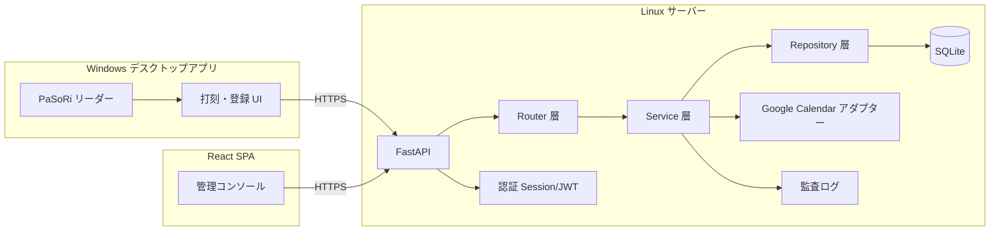
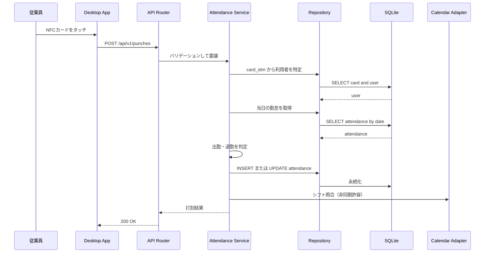
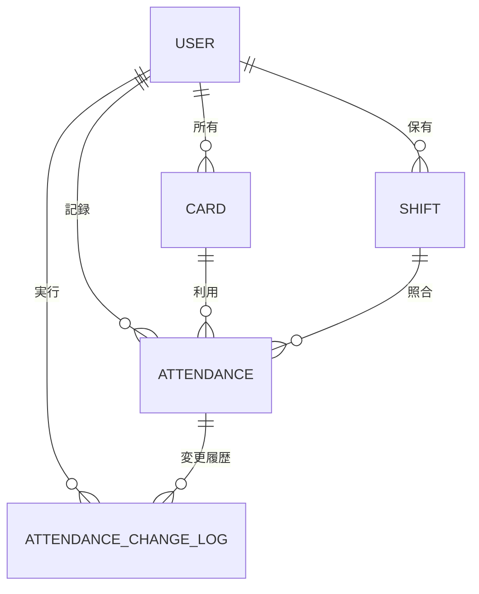

# Kint アーキテクチャ設計

## 1. 目的
Kint は、正確性、監査性、運用容易性を重視した NFC 勤怠管理システムです。
アーキテクチャは Router -> Service -> Repository を採用し、Desktop の打刻機能と Web の管理機能を分離します。
また、利用者自身による打刻修正を許可し、その際は修正理由を必須とし、変更前後の内容と実行者情報をすべて履歴として記録します。

## 2. システム構成

## 3. 各レイヤーの責務
- Router
  - HTTP 入力バリデーション、認証・認可チェック、レスポンス整形。
- Service
  - 出勤・退勤判定、勤怠修正ルール、本人所有レコードの検証、シフト照合、変更履歴の記録などの業務ロジック。
- Repository
  - データ永続化、トランザクションを伴うデータアクセス、勤怠変更履歴の追記保存。
- Calendar Adapter
  - Google Calendar API との連携境界。

## 4. 打刻シーケンス

## 5. 概念 ER 図

## 6. 勤怠修正ポリシー
- 利用者は自分自身の勤怠記録のみ修正できる。
- 管理者は全利用者の勤怠記録を修正できる。
- 修正時は必ず reason を指定する。
- 修正のたびに、変更前値、変更後値、実行者、実行日時、修正理由を履歴として追記保存する。
- 履歴は上書きせず、監査証跡として不変のログとして扱う。

## 7. アーキテクチャ決定事項
- ADR-001: 現段階ではモジュラモノリスを採用する。
  - 根拠: 開発速度を確保しつつ、運用複雑性を抑えられるため。
- ADR-002: Desktop API と Web API を論理的に分離する。
  - 根拠: セキュリティ境界と責務分離を明確にするため。
- ADR-003: 打刻 API は冪等キーをサポートする。
  - 根拠: 再送時の二重打刻を防ぐため。
- ADR-004: 勤怠修正では修正理由を必須にする。
  - 根拠: 監査証跡を確保するため。
- ADR-005: 利用者本人による勤怠修正を許可し、全変更履歴を不変ログとして保持する。
  - 根拠: 現場運用の柔軟性を確保しつつ、変更の追跡可能性を失わないため。

## 8. トレードオフ整理
- 現時点の推奨構成はモジュラモノリス。
- 将来的に外部 API 負荷が増えた場合は、Calendar 同期を別ワーカーサービスへ分離する。
