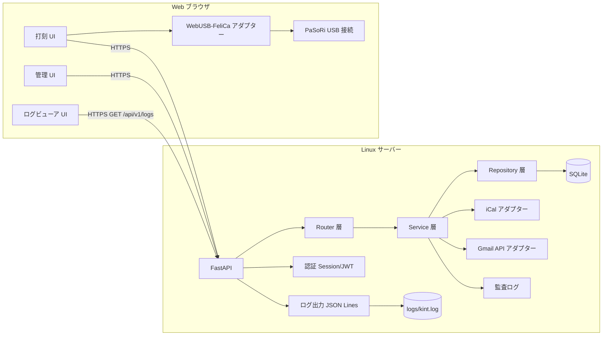
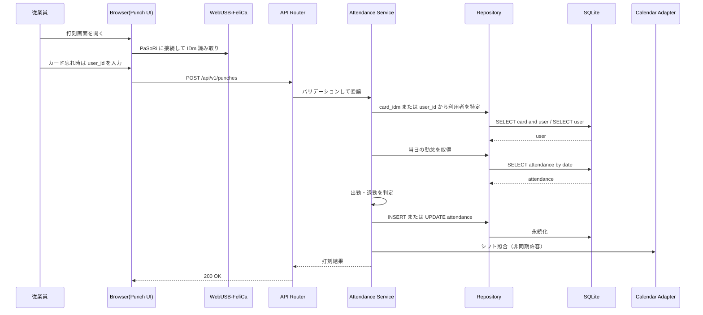
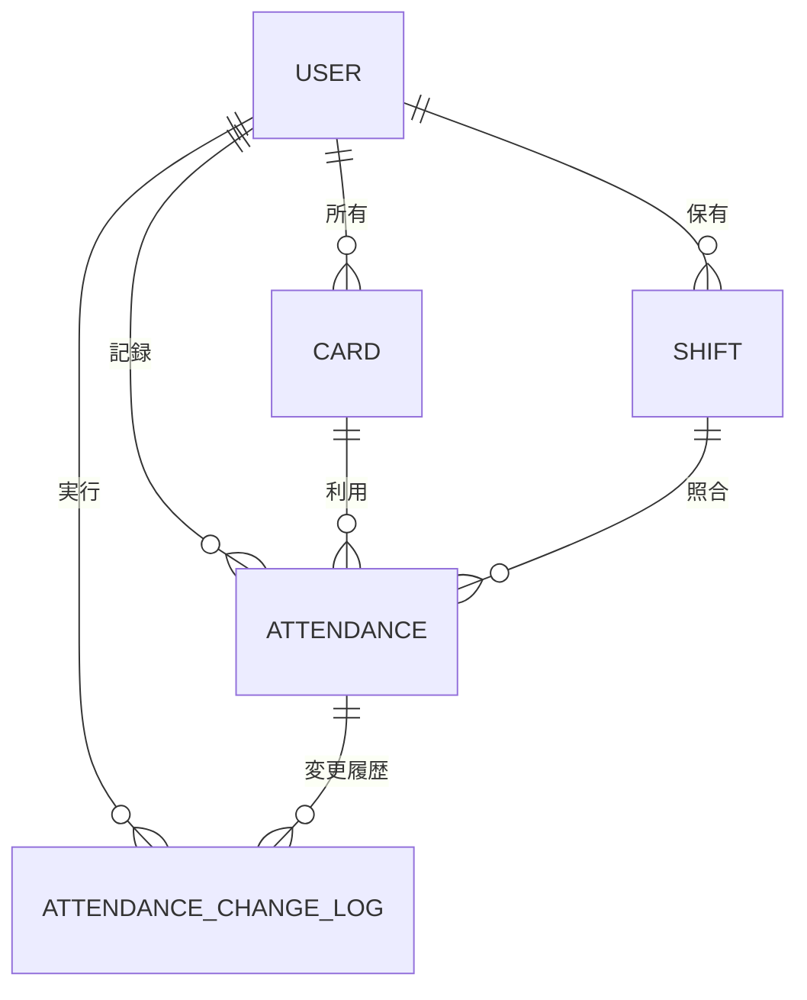
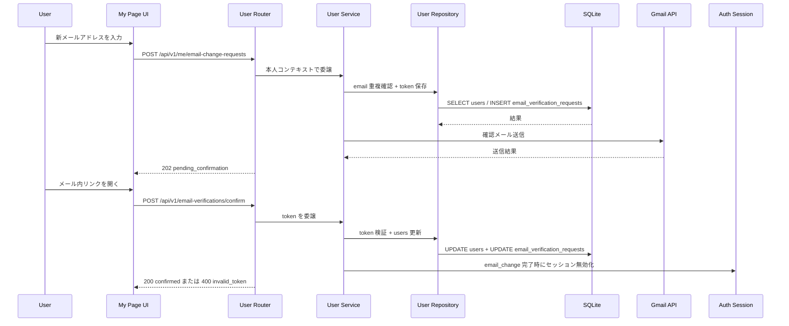

# Kint アーキテクチャ設計

## 1. 目的
Kint は、正確性、監査性、運用容易性を重視した NFC 勤怠管理システムです。
アーキテクチャは Router -> Service -> Repository を採用し、Web アプリ上で打刻機能と管理機能を提供します。
また、利用者自身による打刻修正を許可し、その際は修正理由を必須とし、変更前後の内容と実行者情報をすべて履歴として記録します。

## 2. システム構成



## 3. 各レイヤーの責務
- Router
  - HTTP 入力バリデーション、認証・認可チェック、レスポンス整形。
- Service
  - 出勤・退勤判定、勤怠修正ルール、本人所有レコードの検証、シフト照合、変更履歴の記録などの業務ロジック。
- Repository
  - データ永続化、トランザクションを伴うデータアクセス、勤怠変更履歴の追記保存。
- Calendar Adapter
  - iCal フィードの取得・パース境界。
- Mail Adapter
  - Gmail API（OAuth 2.0 クライアント認証）を用いた確認メール送信の連携境界。
- Logger
  - Python `logging` モジュール + `RotatingFileHandler` で `logs/kint.log` に JSON Lines 形式で出力する。
  - `GET /api/v1/logs` エンドポイント（管理者専用）でフロントエンドから参照可能。
- Frontend(WebUSB)
  - WebUSB 経由で PaSoRi から IDm を取得し、API に打刻要求を送信する。
  - WebUSB 非対応環境では user_id 入力による代替打刻導線を提供する。

## 4. 打刻シーケンス



## 5. 概念 ER 図



## 6. 勤怠修正ポリシー
- 利用者は自分自身の勤怠記録のみ修正できる。
- 管理者は全利用者の勤怠記録を修正できる。
- 修正時は必ず reason を指定する。
- 修正のたびに、変更前値、変更後値、実行者、実行日時、修正理由を履歴として追記保存する。
- 履歴は上書きせず、監査証跡として不変のログとして扱う。

## 7. マイページ（本人プロフィール編集）
- ログイン済みユーザーはマイページで name, full_name, password を更新できる。
- ログイン済みユーザーは email 変更要求を作成できるが、email 自体は承認リンク確認後に更新する。
- Router は本人コンテキストのみを Service に渡し、他ユーザーID指定を受け付けない。
- Service は email 重複チェック、確認トークン発行、Gmail API 送信、パスワード強度検証、current_password 検証を実施する。
- Repository は users テーブル更新、verification request 記録、監査ログ記録をトランザクションで実行する。
- email 変更確定時または password 更新時は認証セッションを無効化し、再ログインを強制する。



## 8. ユーザー管理ポリシー
- 管理者はユーザーを登録/修正/削除できる。
- ユーザー削除は論理削除（`is_active=false`）で実施し、勤怠・監査データは保持する。
- 一般利用者はユーザー管理 API を実行できない。

## 9. アーキテクチャ決定事項
- ADR-001: 現段階ではモジュラモノリスを採用する。
  - 根拠: 開発速度を確保しつつ、運用複雑性を抑えられるため。
- ADR-002: 打刻 UI と管理 UI は同一 Web アプリ内で機能分離する。
  - 根拠: 運用導線を統一しつつ、権限と画面責務を明確化するため。
- ADR-003: 打刻 API は冪等キーをサポートする。
  - 根拠: 再送時の二重打刻を防ぐため。
- ADR-004: 勤怠修正では修正理由を必須にする。
  - 根拠: 監査証跡を確保するため。
- ADR-005: 利用者本人による勤怠修正を許可し、全変更履歴を不変ログとして保持する。
  - 根拠: 現場運用の柔軟性を確保しつつ、変更の追跡可能性を失わないため。
- ADR-006: カード忘れ時は user_id による打刻を許可する。
  - 根拠: 打刻機会損失を防ぎつつ、打刻元 `source` と監査ログでトレーサビリティを維持するため。
- ADR-007: NFC 読み取りは WebUSB を使ってブラウザで実行する。
  - 根拠: 専用デスクトップアプリを廃止し、配布・更新コストを削減するため。
- ADR-008: ユーザー削除は論理削除で運用する。
  - 根拠: 勤怠・監査履歴の参照整合性を維持するため。

- ADR-009: 本人プロフィール編集は管理者向けユーザー管理 API と分離する。
  - 根拠: 権限境界を明確化し、本人編集で role/is_active が変更される事故を防ぐため。

- ADR-010: メールアドレス登録・変更は即時反映せず、Gmail API で送信する確認メール承認後に確定する。
  - 根拠: 実在性確認と誤入力防止を両立し、なりすましや配送不能アドレス登録を減らすため。

- ADR-011: Gmail API 送信は OAuth クライアント（OAuth 2.0）を採用する。
  - 根拠: Google の標準的な認可方式に準拠し、トークンの失効・再認可を運用しやすくするため。

- ADR-013: バックエンドログは JSON Lines 形式で `logs/kint.log` にファイル保存し、管理者向け Web UI から参照可能にする。
  - 根拠: uvicorn の stdout だけでは運用中のログを遡れないため、ファイルに永続化する。JSON Lines にすることで API 側でのパースを単純化し、ローテーションで無制限の肥大化を防ぐ。
  - ログレベルは `DEBUG=true` 環境変数で切り替え可能。本番デフォルトは `INFO`。
  - `GET /api/v1/logs` (管理者専用) で `level` / `keyword` / `limit` によるフィルタリングが可能。

- ADR-014: 勤怠集計（サマライズ）および日別突き合わせ処理は、メモリ上で一括マージ（In-memory Map-Reduce）処理を行う。
  - 根拠: 1か月単位の範囲データは、ユーザー数・日付数が限定的（例: 従業員100人 × 31日 ＝ 3,100レコード）であり、データベースで複雑な多重アウタージョインを書くよりも、SQLite への Bulk Query 後の Python メモリ上でのマージのほうがシンプルであり、かつパフォーマンスや拡張性に優れ（N+1問題の完全な排除）、コードの可読性を格段に高められるため。

- ADR-015: 勤怠データのエクスポート（ローカル保存）における文字エンコーディングとして、BOM付き UTF-8 を指定する。
  - 根拠: 日本国内の業務フローにおいて、エクスポートされた CSV ファイルを Microsoft Excel 等の表計算ソフトで直接開くユースケースが圧倒的に多く、それによる日本語を含む文字化けの発生を完全に防止して高いユーザビリティを提供するため。

## 10. 本番デプロイ構成

### 10-1. コンテナ構成

```
[Linux サーバー]
┌──────────────────────────────────────────┐
│  docker compose up -d                    │
│                                          │
│  ┌──────────────────────────────────┐   │
│  │  api コンテナ (port 8000)         │   │
│  │  ├── uvicorn / FastAPI           │   │
│  │  ├── src/kint/static/  ← Vue SPA │   │
  │  ├── /data/kint.db  ← volume     │   │
  │  └── logs/kint.log  ← volume     │   │
│  └──────────────────────────────────┘   │
└──────────────────────────────────────────┘
```

- **シングルコンテナ**: FastAPI が REST API と SPA 静的配信を両方担う。
- **Volume**: `/data` を `kint_data` Docker volume にマウントし、SQLite ファイルを永続化する。
- **ポート**: ホスト側で `8000:8000` を公開し、必要に応じてリバースプロキシ (nginx/Caddy) を前段に置く。

### 10-2. マルチステージビルド

```
Stage 1 (node:20-slim)
  COPY frontend/ → npm ci → npm run build → dist/
        ↓
Stage 2 (python:3.12-slim)
  uv sync --frozen --no-dev
  COPY src/ alembic/ alembic.ini
  COPY --from=stage1 dist/ → src/kint/static/
  CMD: alembic upgrade head && uvicorn
```

フロントエンドの `dist/` を `src/kint/static/` に配置することで、FastAPI の
`_SPAStaticFiles` マウントが本番ビルドを配信する。

### 10-3. Google OAuth2 本番フロー

```
ブラウザ
  → Google ログイン (redirect モード)
  → Google が POST / に credential を form_post
  → FastAPI POST / が credential を sessionStorage にセットして GET / にリダイレクト
  → React useEffect が sessionStorage から credential を取得
  → POST /api/v1/auth/google で JWT 発行
  → ログイン完了
```

開発環境では Vite ミドルウェアが `POST /` をインターセプトする。
本番では FastAPI の `POST /` エンドポイントが同等の処理を行う。

### 10-4. ADR-012: 本番では FastAPI が SPA を統合配信する
- **根拠**: 別途 nginx を立てなくてもシングルコンテナで完結し、運用複雑性を最小化できるため。
- **制約**: SPA のすべてのルートで `404 → index.html` にフォールバックする `_SPAStaticFiles` が必要。
  `POST /` コールバックは静的マウントより前に登録すること。

---

## 11. トレードオフ整理
- 現時点の推奨構成はモジュラモノリス。
- 将来的に外部 API 負荷が増えた場合は、Calendar 同期を別ワーカーサービスへ分離する。
- WebUSB は HTTPS と対応ブラウザが前提となるため、クライアント環境要件の明確化が必要になる。
- 論理削除によりデータ保持量は増えるため、定期的なアーカイブ運用を検討する。

## 12. 対応ブラウザ要件（確定）

### 12-1. サポート方針
- 公式サポート（本番運用対象）:
  - Windows 11 + Google Chrome 最新安定版
  - Windows 11 + Microsoft Edge 最新安定版
- 準サポート（検証環境での動作確認対象）:
  - Windows 10 + Google Chrome / Microsoft Edge 最新安定版
- 非サポート:
  - Firefox（WebUSB 非対応）
  - Safari（WebUSB 非対応）
  - モバイルブラウザ（USB 接続運用が前提外）

### 12-2. ブラウザ機能要件
- `navigator.usb` が利用可能であること。
- 打刻ページは HTTPS で配信されること（開発時は `localhost` を許容）。
- USB デバイス選択はユーザー操作（クリック）起点で実行すること。

## 12. 運用要件（確定）

### 12-1. 現場運用要件
- 打刻端末は USB ポートを持つ Windows PC を使用すること。
- PaSoRi は 1 ブラウザインスタンスのみが利用する（同時占有を禁止）。
- 打刻画面に「接続状態（未接続/接続中/読取成功/エラー）」を常時表示する。
- WebUSB 接続失敗時は `user_id + reason` 入力による代替打刻へ遷移できる。

### 12-2. セキュリティ要件
- 打刻用 URL は社内配布 URL のみに限定する。
- ブラウザのデバイス権限は運用手順に従って管理し、不要時は解除する。
- 打刻 API は既存認証・監査ログ要件を維持する。

### 12-3. 障害時運用要件
- WebUSB 非対応ブラウザを検出した場合は即時にサポート外メッセージを表示する。
- PaSoRi 接続不可時は再接続手順（抜き差し、ブラウザ再起動）をガイド表示する。
- 復旧不能時は代替打刻（user_id）導線へ遷移し、理由入力を必須にする。

## 13. 実装計画
- 実装チケット、依存関係、スケジュール、起票用バックログは [docs/implementation-plan.md](docs/implementation-plan.md) を参照。
