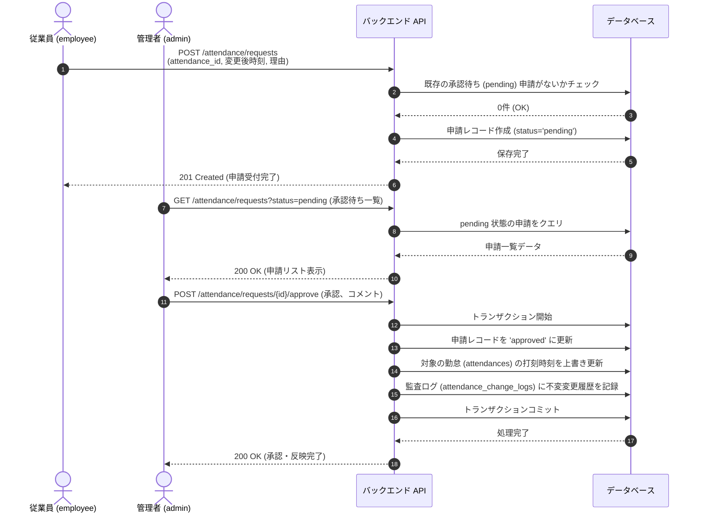

# 勤怠打刻修正・承認ワークフロー 設計仕様書

> **本文書の位置づけ**
> 本仕様書は、一般従業員が自身の勤怠記録の修正を申請し、管理者がそれを承認することで反映される「勤怠打刻修正申請・承認機能」の設計書です。
> バックエンドAPI、DBモデル、フロントエンドUI/UX（申請・承認フロー）、セキュリティ制限事項を定義します。

---

## 1. 概要

本機能により、打刻漏れ（打刻不整合）の解消や押し間違いの修正において、一般従業員による直接編集を伴わず、管理者の承認を経て安全に勤怠データを補正するためのワークフローを提供します。

### 1-1. 要件定義

1. **修正の基本プロセス**
   - **従業員（employee）**: 自身の確定した勤怠（過去レコード）を選択し、修正後の日時と修正理由を入力して「修正申請」を提出します。この時点では実際の出退勤記録は書き換わりません。
   - **管理者（admin）**: 提出された未承認の申請一覧を確認し、内容の妥当性を審査した上で「承認」または「却下」を行います。
   - **反映**: 管理者が「承認」した瞬間にのみ、勤怠レコードが申請内容に更新され、同一トランザクションで変更履歴不変ログ（監査トレール）が自動作成されます。
2. **自分の記録だけ申請できる**
   - 一般従業員（employee）は、自分自身の記録に対する修正申請のみ作成可能です。他人の記録に対する申請、また他人の申請一覧の取得・承認・却下は一切行えません（403 Forbidden）。
3. **日にちは修正できない**
   - 申請できるのは、出勤・退勤時刻（チェックイン/チェックアウト）の時、分のみであり、勤務日（日付自体、`work_date`）を別の日付にずらす申請を出すことはできません。
4. **申請と承認の履歴が監査可能であること**
   - **申請理由**の入力は必須です。また、管理者は承認/却下時に**承認コメント**を任意で入力できます。
   - 承認・却下を含むすべての申請履歴は、ステータス（pending、approved、rejected）とともにDBに永続化されます。
5. **1日に複数回の勤怠レコードの修正に対応**
   - 同一日に複数回の出退勤サイクル（スプリット勤務・中抜け等）が存在する場合、それぞれの勤怠レコード（`attendance_id` 別）を個別に修正申請することが可能です。
6. **勤務時間帯の重複（オーバーラップ）防止**
   - 新規修正申請時、管理者による勤怠の直接編集時、および管理者による申請承認時のいずれにおいても、同一ユーザーに属する他の勤怠レコードと時間帯が重複（オーバーラップ）するような変更は拒否されます（`ATTENDANCE_OVERLAP` エラー）。これにより、データの二重計上をシステム的に防御します。

---

## 2. データベース設計（DB）

一般従業員からの申請状態を管理するため、独立した申請管理用テーブル `attendance_correction_requests` を追加します。

### 2-1. `attendance_correction_requests` テーブル設計

| カラム名                 | 型       | 制約                                                            | 説明                             |
|-------------------------|----------|-----------------------------------------------------------------|----------------------------------|
| `id`                    | TEXT     | PK                                                              | UUID v4                          |
| `attendance_id`         | TEXT     | NOT NULL, FK → attendances.id ON DELETE CASCADE                 | 修正対象の勤怠レコード           |
| `user_id`               | TEXT     | NOT NULL, FK → users.id ON DELETE RESTRICT                     | 申請者（従業員）                 |
| `requested_check_in`    | DATETIME | NULL                                                            | 申請する新しい出勤日時           |
| `requested_check_out`   | DATETIME | NULL                                                            | 申請する新しい退勤日時           |
| `reason`                | TEXT     | NOT NULL                                                        | 修正申請理由（空文字不可）       |
| `status`                | TEXT     | NOT NULL, CHECK(status IN ('pending', 'approved', 'rejected')) | 申請ステータス（デフォルト: pending） |
| `approved_by_user_id`   | TEXT     | NULL, FK → users.id ON DELETE SET NULL                         | 審査した管理者                   |
| `approval_comment`      | TEXT     | NULL                                                            | 承認・却下時のコメント           |
| `created_at`            | DATETIME | NOT NULL, DEFAULT CURRENT_TIMESTAMP                             | 申請日時                         |
| `updated_at`            | DATETIME | NOT NULL, DEFAULT CURRENT_TIMESTAMP                             | 更新/審査日時                     |

#### ユニーク制約・状態整合性ルール
1. **二重申請 of pending の禁止**:
   - `attendance_id` に対してステータスが `pending`（承認待ち）の申請は、**1件しか存在できない**ものとします。すでに承認待ちの申請が存在する場合、新たな申請提出はエラー（400 Bad Request / 409 Conflict）とします。
2. **日付の固定**:
   - 申請時の `requested_check_in` と `requested_check_out` の日付値は、対象勤怠の `work_date` と一致（または日跨ぎ時は work_date+1 日）している必要があります。
3. **時間帯重複（Overlap）チェック**:
   - 期間 `[req_in, req_out]` が、他の有効な勤怠レコードと重ならないことを確認します。
   - 重複判定式: `(A.check_in < B.check_out OR B.check_out IS NULL) AND (B.check_in < A.check_out OR A.check_out IS NULL)`
   - 重複が認められた場合、コード `ATTENDANCE_OVERLAP` の `400 Bad Request` エラーを送出します。

---

## 3. バックエンド API 仕様

### 3-1. 従業員向け：修正申請 API (POST)

- **パス**: `/api/v1/attendance/requests`
- **認証**: 必須
- **ロール**: employee / admin
- **リクエストボディ (JSON)**: `AttendanceCorrectionRequestCreate`
  - `attendance_id`: string (必須) — 修正対象のID
  - `requested_check_in`: string (ISO 8601 または null)
  - `requested_check_out`: string (ISO 8601 または null)
  - `reason`: string (必須、理由が10文字未満などの制限も可)
- **処理ロジック**:
  - 対象の `attendance.user_id` と `current_user.id` が一致していることを保証（または `admin`）。
  - 同一 `attendance_id` に `pending` 状態の既存申請がないかチェック（あれば 409 Conflict）。
  - 状態が正常であれば、`status='pending'` でレコードをインサート。

### 3-2. 管理者向け：申請審査 API (POST)

#### 承認エンドポイント
- **パス**: `/api/v1/attendance/requests/{request_id}/approve`
- **認証**: 必須
- **ロール**: admin のみ (employee が叩いた場合は 403 Forbidden)
- **リクエストボディ (JSON)**: `RequestApprovalBody`
  - `approval_comment`: string | null (オプション)
- **処理ロジック (同一トランザクション内で実行)**:
  1. 申請レコード（`request_id`）を取得。ステータスが `pending` でない場合は 400 Bad Request。
  2. 対象の勤怠 `attendance` を取得。
  3. `attendance.check_in` と `check_out` を、申請された `requested_check_in` / `requested_check_out` に更新。
  4. `attendance.last_updated_by_user_id = admin.id` / `last_updated_at = now` に更新。
  5. 監査履歴テーブル `attendance_change_logs` に変更ログ（申請理由・承認コメント記載）をインサート。
  6. 申請の `status` を `approved` に変更し、`approved_by_user_id`、`approval_comment`、`updated_at` を保存。

#### 却下エンドポイント
- **パス**: `/api/v1/attendance/requests/{request_id}/reject`
- **認証**: 必須
- **ロール**: admin のみ
- **リクエストボディ (JSON)**: `RequestRejectionBody`
  - `approval_comment`: string (必須、却下理由は入力推奨)
- **処理ロジック**:
  1. 申請レコードの status を `rejected` に変更し、審査管理者の情報を保存。勤怠レコード自体は変更しない。

### 3-3. 申請一覧取得 API (GET)

- **パス**: `/api/v1/attendance/requests`
- **認証**: 必須
- **クエリパラメータ**:
  - `status`: 'pending' | 'approved' | 'rejected' | null (ステータスフィルタ)
  - `user_id`: string | null (従業員別のフィルタ。employee ロールの場合は強制的に自分自身のIDに書き換え)
- **レスポンス**: 申請一覧データの配列

---

## 4. シーケンス図 (申請から承認・反映まで)



---

## 5. フロントエンド UI/UX 仕様

### 5-1. 従業員画面：申請手順と進捗

1. **日別カレンダーと複数回打刻の個修**:
   - 自身の詳細カレンダー（[AttendancePage.tsx](frontend/src/components/Attendance/AttendancePage.tsx)）の各日付に、申請状況を示すインジケーター/バッジを表示します。
     - 🕒 `承認待ち` バッジ、✅ `変更済` バッジ、❌ `却下` バッジ
   - 1日に複数回の打刻が存在する場合、それぞれの打刻レコードの右端に「修正申請」ボタンが配置され、特定の打刻レコードだけをピンポイントで修正申請に出すことが可能です。
   - すでにそのレコード・IDに対して `pending`（承認待ち）の申請が存在する場合は、「修正申請」ボタンを **disabled** にし、過剰な多重申請を防ぎます。
2. **申請モーダル（ローカル時刻入力 & 計算プレビュー搭載）**:
   - バックエンドと安全に通信するために、端末のローカルタイムゾーンを基準とした日付および時刻選択コントロール（`type="date"`, `type="time"`）を表示します（API送信時にはUTC ISO形式に内部変換）。
   - **クリア / リセットショートカット**:
     - 出退勤を空欄（未打刻）した申請を出せるよう「クリア」ボタンがあり、押し間違いを元に戻す「リセット」ボタンですばやく初期値に巻き戻せます。
   - **勤務時間の差分変動の即時プレビュー**:
     - 元の打刻（変更前）と希望（変更後）の比較および、差し引き勤務時間の差（例: `+1.50h`, `-2.30h` など）がバッジカラー（グリーンやレッド）を用いて視覚的に変化し、確定前に意図しない入力がないか確認できます。

### 5-2. 管理者画面：承認ダッシュボード

1. **未承認一覧ビュー**:
   - 管理画面に「打刻承認」タブを新設、または「勤怠管理（管理者用）」ページの上部、あるいは独立したダッシュボード欄に「未承認の勤怠修正申請があります（N件）」という案内パネルを表示します。
   - 承認待ちの一覧表を表示し、対象日付、申請者、変更前の時刻 ➔ 変更後の時刻、および申請者の理由をわかりやすく並べます。
2. **詳細プレビュー＆対比表示付き承認確認ダイアログ**:
   - 単に承認するだけでなく、**「承認」または「却下」ボタンを押した際に対比プレビュー・確認用ダイアログ**が開きます。
   - 承認ダイアログ内では、以下の重要情報がサイド・バイ・サイドで可視化されます：
     - **申請の基本情報**: 申請者の氏名、対象日、従業員による申請理由。
     - **変更前**: 出勤、退勤時刻、合計勤務時間の明細。
     - **変更希望内容**: 出勤、退勤時刻、およびその希望に基づき再計算される合計勤務時間。
     - **変更差分（増減時間）**: 勤務時間がどれだけ増えるか、または減るかをバッジ（例：青バッジで `+1.20h`）で一目で分かるように可視化。
   - **一言で応じるインラインアクション**:
     - 各申請行の横に **「承認する」** ボタンと **「却下する」** ボタンを設置。
     - 「承認」クリック時は、コメント（任意）を求める小さなテキスト入力と共に実行。
     - 「却下」クリック時は、フィードバックコメント（必須）を入力させて却下を実行。

```
┌────────────────────────────────────────────────────────┐
│ 👮  勤怠修正申請 承認ダッシュボード                       │
├────────────────────────────────────────────────────────┤
│ 申請者    | 対象日     | 修正内容         | 従業員理由 | アクション
├────────────────────────────────────────────────────────┤
│ 山田 太郎 | 2026/06/01 | 退 18:00➔19:30   | 残業の     | [ 承認 ] / [ 却下 ]
│           |            |                  | 押し忘れ   |
├────────────────────────────────────────────────────────┤
│ 鈴木 花子 | 2026/05/28 | 出 --:--➔08:55   | NFCカード  | [ 承認 ] / [ 却下 ]
│           |            |                  | 忘れのため |
└────────────────────────────────────────────────────────┘
```

---

## 6. セキュリティとビジネスルール

1. **本人以外の申請の完全排除**:
   - APIエンドポイントは、受信したトークンの `user_id` と、申請対象となる `attendance.user_id` の照合を強制します。これにより、別人の勤怠レコードを勝手に申請することをAPIレイヤーで防ぎます。
2. **管理者の自己承認許可**:
   - 管理者（admin）自身も打刻を行う場合、自分が提出した自身の勤怠修正申請であっても、自分自身の権限で承認・反映できるように設計します。これは、少人数の現場におけるスムーズな運用と、管理者に対する全幅の信頼を前提とするためです。
3. **却下理由の必須化**:
   - 却下（reject）時には、従業員がなぜ通らなかったかを理解できるように「却下理由コメント」を必須とします。
4. **ロック期間 (勤怠締め処理の適用)**:
   - 管理者による勤怠締め処理（締め（ロック）実行）が行われた後は、一般従業員による修正申請・申請キャンセルおよび管理者による直接編集（PATCH）、申請の承認・却下が完全にロックされます。
   - 締められた月は管理者による「締め解除」を行わない限り、一切の変更ができません。

---

## 7. 勤怠締め処理の設計仕様 (Month-end Closing / Lock Process)

本セクションでは、勤怠データの整合性を保ち、給与計算フェーズでの誤った修正を防止するための「勤怠締め処理」について仕様を定義します。

### 7-1. 締め処理用データベース設計 (`attendance_locks` テーブル)

締め状況を一元かつ監査可能に管理するため、`attendance_locks` テーブルを追加します。

| カラム名            | 型       | 制約                                      | 説明                                       |
|-------------------|----------|-------------------------------------------|--------------------------------------------|
| `year_month`      | TEXT     | PK, パターン `^\d{4}-\d{2}$` (例: "2026-05") | 締め対象の年月（キー）                     |
| `locked_at`       | DATETIME | NOT NULL, DEFAULT CURRENT_TIMESTAMP       | 締め処理が実行された日時                   |
| `locked_by_user_id`| TEXT     | NOT NULL, FK → users.id ON DELETE RESTRICT | 締め処理を実行した管理者ID                  |

### 7-2. バックエンド API 仕様

#### 1. 締め処理（ロック実行） API
- **パス**: `POST /api/v1/attendance/locks`
- **ロール**: admin のみ
- **リクエストボディ (JSON)**:
  ```json
  {
    "year_month": "2026-05"
  }
  ```
- **バリデーション・ロジック**:
  - `year_month` が `YYYY-MM` フォーマットであることを検証。
  - すでに該当年月がロックされている場合は `400 Bad Request`（二重ロック防止）。
  - ロック情報を `attendance_locks` テーブルに保存。
  - **保留中の修正申請への自動処理**:
    - ロック対象月（`work_date` が該当年月内）の `pending` 状態の修正申請を自動的に `rejected` に変更し、却下コメントに「当月の締め処理が完了したため、システムにより自動的に却下されました。」を記録します（これにより安全に締め状態に移行可能にします）。

#### 2. 締め解除（ロック削除） API
- **パス**: `DELETE /api/v1/attendance/locks/{year_month}`
- **ロール**: admin のみ
- **処理ロジック**:
  - 指定された `year_month` のロック情報が存在しなければ `404 Not Found`。
  - ロック情報を削除。

#### 3. 締め状況一覧取得 API
- **パス**: `GET /api/v1/attendance/locks`
- **ロール**: ログインユーザー全員 (employee / admin)
- **レスポンス (JSON)**: 締められている年月のリスト。
  ```json
  [
    {
      "year_month": "2026-05",
      "locked_at": "2026-06-01T10:00:00Z",
      "locked_by_user_id": "usr_admin01"
    }
  ]
  ```

### 7-3. ロック適用に伴うガード仕様 (バリデーション強化一覧)

勤怠の締め処理をトリガーすると、バックエンドは対象年月（`work_date` または `check_in/check_out` の日付が該当月）に属する以下の操作を拒否します。

| 対象エンドポイント | ロック対象操作 | ロック時の挙動 |
| :--- | :--- | :--- |
| `POST /api/v1/attendance/requests` | 新規修正申請の作成 | `400 Bad Request`、対象年月の勤怠は締められています |
| `PATCH /api/v1/attendance/requests/{id}/approve` | 修正申請の承認 | `400 Bad Request`、対象年月の勤怠は締められています |
| `PATCH /api/v1/attendance/requests/{id}/reject` | 修正申請の却下 | `400 Bad Request`、対象年月の勤怠は締められています |
| `DELETE /api/v1/attendance/requests/{id}` | 申請のキャンセル (本人) | `400 Bad Request`、対象年月の勤怠は締められています |
| `PATCH /api/v1/attendance/{attendance_id}` | 管理者による直接編集 | `400 Bad Request`、対象年月の勤怠は締められています |
| `POST /api/v1/punch` | 打刻処理 | `400 Bad Request` (過去日を打刻する例外的な操作、または日跨ぎ時の打刻が締め月に含まれる場合をガード) |

### 7-4. フロントエンド UI/UX 連携

1. **カレンダー画面および一覧表示**:
   - `GET /api/v1/attendance/summary` または `GET /api/v1/attendance/monthly` のレスポンスに `is_locked: boolean` フラグを付与。
   - 表示する年月が `is_locked = true` の場合, カレンダーヘッダーに 🔒 `締め済`（Locked）のステータスバッジを表示。
   - 一般社員の「修正を申請する」ボタン等、変更に関わる全要素を非活性（disabled）化。
2. **管理者管理画面**:
   - サマリーおよびCSVエクスポートの隣に「締め処理の実行/解除」を行えるボタンとコントロールを設置。
   - 締めが完了している年月については「締め処理解除」、開いている年月については「締め処理実行」を表示。
