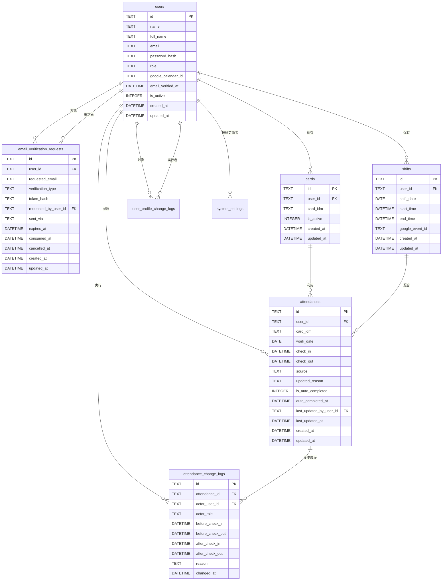
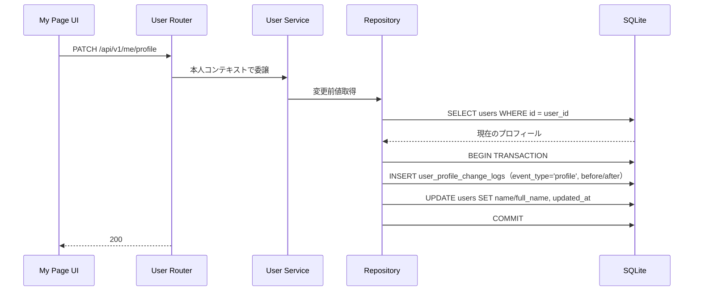
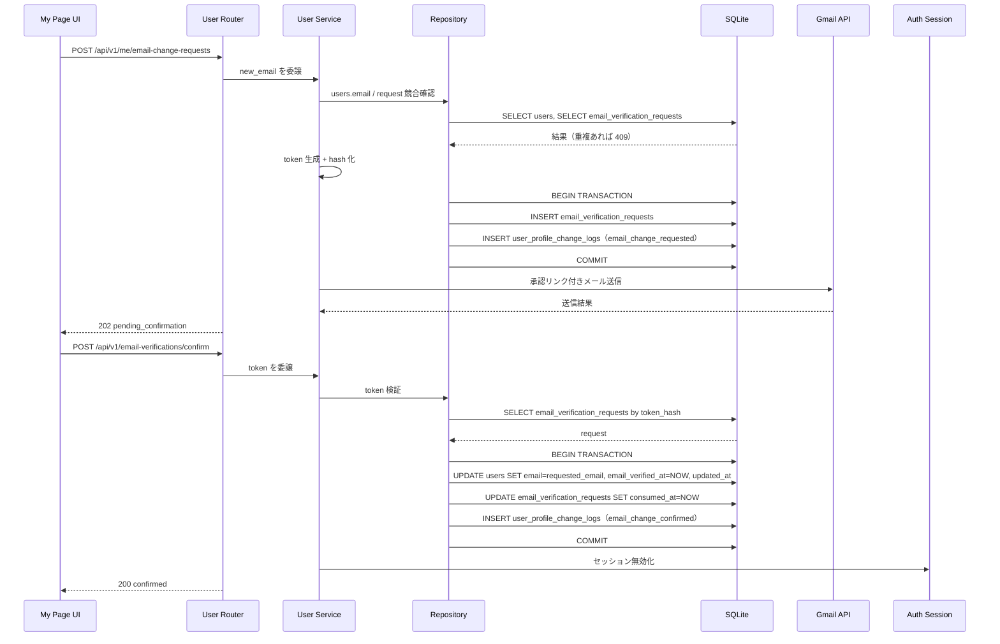
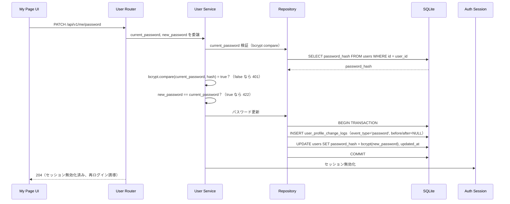
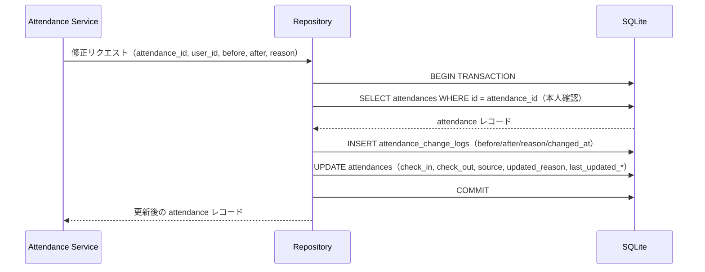

# Kint データベース設計

> **本文書の位置づけ**
> アーキテクト担当の物理モデル設計仕様です。
> SQLAlchemy モデル実装・Alembic マイグレーション作成は `@database` に委譲します。

## 1. テーブル一覧

| テーブル名                  | 役割                                     |
|-----------------------------|------------------------------------------|
| `users`                     | 管理者・従業員のアカウント               |
| `cards`                     | NFC カード（FeliCa IDm）とユーザーの紐付け |
| `attendances`               | 出退勤記録                               |
| `attendance_change_logs`    | 勤怠修正の変更履歴（不変ログ）           |
| `user_profile_change_logs`  | ユーザープロフィール変更の監査ログ（不変ログ） |
| `email_verification_requests` | メール確認リクエスト（signup / email_change） |
| `shifts`                    | iCal から取得したシフト情報              |
| `system_settings`           | 管理画面から変更可能なシステム設定値     |

---

## 2. 各テーブルの物理モデル

### 2-1. `users`

| カラム名            | 型            | 制約                          | 説明                         |
|---------------------|---------------|-------------------------------|------------------------------|
| `id`                | TEXT          | PK                            | メールアドレス（または手動指定の email） |
| `name`              | TEXT          | NOT NULL                      | 表示名                       |
| `full_name`         | TEXT          | NOT NULL                      | 本名（氏名）                 |
| `email`             | TEXT          | NOT NULL, UNIQUE              | ログイン用メールアドレス     |
| `password_hash`     | TEXT          | NOT NULL                      | bcrypt ハッシュ              |
| `role`              | TEXT          | NOT NULL, CHECK(role IN ('admin','employee')) | ロール |
| `google_calendar_id`| TEXT          | NULL                          | 外部カレンダー ID           |
| `email_verified_at` | DATETIME      | NULL                          | メール確認完了日時           |
| `is_active`         | INTEGER       | NOT NULL, DEFAULT 1           | 有効フラグ（1=有効）         |
| `created_at`        | DATETIME      | NOT NULL, DEFAULT CURRENT_TIMESTAMP | 作成日時           |
| `updated_at`        | DATETIME      | NOT NULL, DEFAULT CURRENT_TIMESTAMP | 更新日時           |

インデックス:
- `ix_users_email` — UNIQUE インデックス（ログイン検索）

運用ルール:
- ユーザー削除は物理削除ではなく `is_active=0` への更新（論理削除）で扱う。
- 論理削除済みユーザーは新規打刻・ログインを禁止する。
- `email_verified_at IS NULL` のユーザーはログインを禁止する。

---

### 2-2. `cards`

| カラム名     | 型       | 制約                        | 説明                     |
|--------------|----------|-----------------------------|--------------------------|
| `id`         | TEXT     | PK                          | UUID v4                  |
| `user_id`    | TEXT     | NOT NULL, FK → users.id ON DELETE CASCADE | 所有ユーザー |
| `card_idm`   | TEXT     | NOT NULL, UNIQUE            | FeliCa IDm（16進文字列）。ユーザー間の共有禁止 |
| `is_active`  | INTEGER  | NOT NULL, DEFAULT 1         | 有効フラグ（1=有効）     |
| `created_at` | DATETIME | NOT NULL, DEFAULT CURRENT_TIMESTAMP | 作成日時       |
| `updated_at` | DATETIME | NOT NULL, DEFAULT CURRENT_TIMESTAMP | 更新日時       |

> **カード所有ルール**
> - 1ユーザーが複数の IDm カードを登録できる（`user_id` 単独の UNIQUE 制約なし）。
> - 同一 IDm を複数ユーザーで共有することは禁止（`card_idm` に UNIQUE 制約）。
> - 打刻時は `card_idm` で一意にユーザーを特定できる。

インデックス:
- `ix_cards_card_idm` — UNIQUE インデックス（打刻時のカード検索）
- `ix_cards_user_id` — 通常インデックス（ユーザー別カード一覧）

---

### 2-3. `attendances`

| カラム名                   | 型       | 制約                                                   | 説明                                 |
|----------------------------|----------|--------------------------------------------------------|--------------------------------------|
| `id`                       | TEXT     | PK                                                     | UUID v4                              |
| `user_id`                  | TEXT     | NOT NULL, FK → users.id ON DELETE RESTRICT             | 対象ユーザー                         |
| `card_idm`                 | TEXT     | NULL                                                   | 打刻に使用したカードの IDm（スナップショット） |
| `work_date`                | DATE     | NOT NULL                                               | 勤務日（YYYY-MM-DD）                 |
| `check_in`                 | DATETIME | NULL                                                   | 出勤日時                             |
| `check_out`                | DATETIME | NULL                                                   | 退勤日時                             |
| `work_start`               | DATETIME | NULL                                                   | 勤務出勤日時（手動修正時等に使用）   |
| `work_end`                 | DATETIME | NULL                                                   | 勤務退勤日時（手動修正時等に使用）   |
| `is_manual_work_time`      | INTEGER  | NOT NULL, DEFAULT 0                                    | 手動勤務時間修正フラグ（1=手動）     |
| `overtime_reason`          | TEXT     | NULL                                                   | 残業理由                             |
| `source`                   | TEXT     | NOT NULL, CHECK(source IN ('webusb_nfc','web_user_id','admin_manual','self_service')) | 打刻元 |
| `device_name`              | TEXT     | NULL                                                   | 打刻端末の登録名 |
| `updated_reason`           | TEXT     | NULL                                                   | 最新修正理由（最終 log の reason を参照用にコピー） |
| `last_updated_by_user_id`  | TEXT     | NULL, FK → users.id ON DELETE SET NULL                 | 最終修正者                           |
| `last_updated_at`          | DATETIME | NULL                                                   | 最終修正日時                         |
| `is_auto_completed`        | INTEGER  | NOT NULL, DEFAULT 0                                    | 退勤忘れによるシステム自動補完フラグ（1=自動補完） |
| `auto_completed_at`        | DATETIME | NULL                                                   | 自動補完実行日時                     |
| `created_at`               | DATETIME | NOT NULL, DEFAULT CURRENT_TIMESTAMP                    | 作成日時                             |
| `updated_at`               | DATETIME | NOT NULL, DEFAULT CURRENT_TIMESTAMP                    | 更新日時                             |

運用ルール:
- 通常打刻: `source = 'webusb_nfc'`（WebUSB で取得した `card_idm` を解決）
- カード忘れ打刻: `source = 'web_user_id'`（`user_id` 直接指定、理由必須）

制約:
- `uq_attendances_user_work_date` — (user_id, work_date) UNIQUE（1日1レコード）
- `ck_attendances_checkout_after_checkin` — check_out IS NULL OR check_out > check_in

インデックス:
- `ix_attendances_user_id` — 通常インデックス（ユーザー別勤怠一覧）
- `ix_attendances_work_date` — 通常インデックス（日付範囲検索）

---

### 2-4. `attendance_change_logs`

不変ログテーブルです。レコードの INSERT のみ許可し、UPDATE・DELETE は行わない運用とします。

| カラム名          | 型       | 制約                                                            | 説明                         |
|-------------------|----------|-----------------------------------------------------------------|------------------------------|
| `id`              | TEXT     | PK                                                              | UUID v4                      |
| `attendance_id`   | TEXT     | NOT NULL, FK → attendances.id ON DELETE RESTRICT               | 対象勤怠レコード             |
| `actor_user_id`   | TEXT     | NOT NULL, FK → users.id ON DELETE RESTRICT                     | 修正を実行したユーザー       |
| `actor_role`      | TEXT     | NOT NULL, CHECK(actor_role IN ('admin','employee'))             | 実行時のロール               |
| `before_check_in`   | DATETIME | NULL                                                            | 変更前の出勤日時             |
| `before_check_out`  | DATETIME | NULL                                                            | 変更前の退勤日時             |
| `after_check_in`    | DATETIME | NULL                                                            | 変更後の出勤日時             |
| `after_check_out`   | DATETIME | NULL                                                            | 変更後の退勤日時             |
| `before_work_start` | DATETIME | NULL                                                            | 変更前の勤務出勤日時         |
| `before_work_end`   | DATETIME | NULL                                                            | 変更前の勤務退勤日時         |
| `after_work_start`  | DATETIME | NULL                                                            | 変更後の勤務出勤日時         |
| `after_work_end`    | DATETIME | NULL                                                            | 変更後の勤務退勤日時         |
| `reason`          | TEXT     | NOT NULL                                                        | 修正理由（空文字不可）       |
| `changed_at`      | DATETIME | NOT NULL, DEFAULT CURRENT_TIMESTAMP                             | 修正日時                     |

> `created_at` / `updated_at` は不変ログのため `changed_at` 1 カラムとする。

インデックス:
- `ix_attendance_change_logs_attendance_id` — 通常インデックス（勤怠別履歴取得）
- `ix_attendance_change_logs_actor_user_id` — 通常インデックス（実行者別監査）
- `ix_attendance_change_logs_changed_at` — 通常インデックス（時系列ソート）

---

### 2-5. `user_profile_change_logs`

ユーザープロフィール変更（email, name, full_name, password）の監査ログ。
不変ログテーブルです。レコードの INSERT のみ許可し、UPDATE・DELETE は行わない運用とします。

| カラム名           | 型       | 制約                                              | 説明                           |
|--------------------|----------|---------------------------------------------------|--------------------------------|
| `id`               | TEXT     | PK                                                | UUID v4                        |
| `user_id`          | TEXT     | NOT NULL, FK → users.id ON DELETE RESTRICT       | 対象ユーザー（変更されたプロフィール） |
| `actor_user_id`    | TEXT     | NOT NULL, FK → users.id ON DELETE RESTRICT       | 実行者（通常は user_id と同じ） |
| `actor_role`       | TEXT     | NOT NULL, CHECK(actor_role IN ('admin','employee')) | 実行時のロール |
| `event_type`       | TEXT     | NOT NULL, CHECK(event_type IN ('profile','password','email_change_requested','email_change_confirmed')) | イベント種別 |
| `before_email`     | TEXT     | NULL                                              | 変更前メール（profile のみ） |
| `after_email`      | TEXT     | NULL                                              | 変更後メール（profile のみ） |
| `before_name`      | TEXT     | NULL                                              | 変更前表示名（profile のみ） |
| `after_name`       | TEXT     | NULL                                              | 変更後表示名（profile のみ） |
| `before_full_name` | TEXT     | NULL                                              | 変更前氏名（profile のみ） |
| `after_full_name`  | TEXT     | NULL                                              | 変更後氏名（profile のみ） |
| `reason`           | TEXT     | NOT NULL                                          | 変更理由（"プロフィール編集" または "パスワード変更") |
| `changed_at`       | DATETIME | NOT NULL, DEFAULT CURRENT_TIMESTAMP               | 変更日時 |

> profile イベント時は before/after の name, full_name を記録する。
> email_change_requested / email_change_confirmed イベント時は before/after の email を記録する。
> password イベント時は before/after は NULL（パスワード値そのものは保存しない）。

インデックス:
- `ix_user_profile_change_logs_user_id` — 通常インデックス（対象ユーザー別） 
- `ix_user_profile_change_logs_actor_user_id` — 通常インデックス（実行者別監査）
- `ix_user_profile_change_logs_changed_at` — 通常インデックス（時系列ソート）
- `ix_user_profile_change_logs_event_type` — 通常インデックス（イベント種別別）

---

### 2-6. `email_verification_requests`

signup と email_change の確認トークンを管理するテーブル。
token は平文では保存せず、ハッシュ値のみ保持する。

| カラム名             | 型       | 制約                                                         | 説明 |
|----------------------|----------|--------------------------------------------------------------|------|
| `id`                 | TEXT     | PK                                                           | UUID v4 |
| `user_id`            | TEXT     | NOT NULL, FK → users.id ON DELETE CASCADE                   | 対象ユーザー |
| `requested_email`    | TEXT     | NOT NULL                                                     | 確認対象メールアドレス |
| `verification_type`  | TEXT     | NOT NULL, CHECK(verification_type IN ('signup','email_change')) | 確認種別 |
| `token_hash`         | TEXT     | NOT NULL, UNIQUE                                             | 確認トークンのハッシュ |
| `requested_by_user_id` | TEXT   | NULL, FK → users.id ON DELETE SET NULL                      | 要求者（admin 作成時は管理者、signup は作成者） |
| `sent_via`           | TEXT     | NOT NULL, CHECK(sent_via IN ('gmail_api'))                   | 送信手段 |
| `expires_at`         | DATETIME | NOT NULL                                                     | 期限日時 |
| `consumed_at`        | DATETIME | NULL                                                         | 使用日時 |
| `cancelled_at`       | DATETIME | NULL                                                         | 取消日時 |
| `created_at`         | DATETIME | NOT NULL, DEFAULT CURRENT_TIMESTAMP                          | 作成日時 |
| `updated_at`         | DATETIME | NOT NULL, DEFAULT CURRENT_TIMESTAMP                          | 更新日時 |

運用ルール:
- `consumed_at` / `cancelled_at` のいずれかが設定された request は再利用不可。
- email_change は users.email を即時更新せず、本テーブルで保留管理する。
- signup は確認完了時に users.email_verified_at を設定する。

インデックス:
- `ix_email_verification_requests_user_id` — 通常インデックス（ユーザー別確認状態）
- `ix_email_verification_requests_requested_email` — 通常インデックス（メール別競合確認）
- `ix_email_verification_requests_expires_at` — 通常インデックス（期限切れ掃除）

---

### 2-7. `shifts`

| カラム名           | 型       | 制約                                              | 説明                           |
|--------------------|----------|---------------------------------------------------|--------------------------------|
| `id`               | TEXT     | PK                                                | UUID v4                        |
| `user_id`          | TEXT     | NOT NULL, FK → users.id ON DELETE CASCADE         | 対象ユーザー                   |
| `shift_date`       | DATE     | NOT NULL                                          | シフト日（YYYY-MM-DD）         |
| `start_time`       | DATETIME | NOT NULL                                          | シフト開始日時                 |
| `end_time`         | DATETIME | NOT NULL                                          | シフト終了日時                 |
| `google_event_id`  | TEXT     | NOT NULL, UNIQUE                                  | iCal イベント ID（互換のため既存カラム名を維持） |
| `created_at`       | DATETIME | NOT NULL, DEFAULT CURRENT_TIMESTAMP               | 作成日時                       |
| `updated_at`       | DATETIME | NOT NULL, DEFAULT CURRENT_TIMESTAMP               | 更新日時                       |

制約:
- `uq_shifts_google_event_id` — UNIQUE（同一イベントの重複同期防止）

インデックス:
- `ix_shifts_user_id` — 通常インデックス
- `ix_shifts_shift_date` — 通常インデックス（シフト日範囲検索）

---

### 2-8. `system_settings`

管理画面から変更可能なシステム設定値を保持するテーブル。  
サービス層は DB 値 → 環境変数 → コードデフォルトの優先順位で値を解決する。

| カラム名 | 型 | 制約 | 説明 |
|---|---|---|---|
| `id` | INTEGER | PK, AUTOINCREMENT | — |
| `key` | TEXT | NOT NULL, UNIQUE | 設定キー |
| `value` | TEXT | NOT NULL | 設定値（文字列として格納） |
| `description` | TEXT | NULL | 設定の説明（任意）|
| `updated_at` | DATETIME | NOT NULL, DEFAULT CURRENT_TIMESTAMP | 最終更新日時 |
| `updated_by_user_id` | TEXT | NOT NULL, FK → users.id ON DELETE RESTRICT | 最終更新者 |

許容キー一覧:

| key | 格納型 | デフォルト | 説明 |
|---|---|---|---|
| `punch_cooldown_seconds` | integer (文字列) | 60 | 連続打刻防止クールダウン（秒） |
| `shift_checkin_early_minutes` | integer (文字列) | 15 | シフト開始前チェックイン許容（分） |
| `shift_ical_url` | string (文字列) | null | シフト iCal 同期 URL |
| `site_name` | string (文字列) | `"Kint"` | サイト名 |
| `site_subtitle` | string (文字列) | `"NFC 勤怠管理システム"` | サイトのサブタイトル |
| `punch_result_display_seconds` | integer (文字列) | 30 | 打刻結果表示時間（秒） |
| `monthly_report_time` | string (文字列) | `"20:00"` | 月次勤怠レポートの自動メール通知時刻（HH:MM、24時間表記） |
| `login_token_expire_hours` | integer (文字列) | 168 | ログイン継続時間（時間） |

運用ルール:
- `key` は `ALLOWED_SETTING_KEYS = {"punch_cooldown_seconds", "shift_checkin_early_minutes", "shift_ical_url", "shift_sync_time", "site_name", "site_subtitle", "punch_result_display_seconds", "monthly_report_time", "login_token_expire_hours"}` のみ許容する。
- `value` はすべて文字列として格納し、サービス層で型変換する。

- `shift_ical_url` の空文字列 `""` は null（未設定）として扱う。
- `monthly_report_time` の空文字列 `""` は null（自動通知 OFF）として扱う。

インデックス:
- `ix_system_settings_key` — UNIQUE インデックス（キー検索）

---

## 3. ERD（物理モデル）

---

## 4. プロフィール変更トランザクションの流れ

### 4-1. プロフィール更新（表示名・氏名）

- フィールド更新前に変更前値をキャプチャ
- 履歴 INSERT と本体 UPDATE を同一トランザクション内で実行

### 4-2. メールアドレス変更要求と確認

- email_change は確認完了まで users.email を更新しない
- token はハッシュ化保存し、平文比較は行わない
- users 更新、request 消費、監査ログ追記は同一トランザクションで実行

### 4-3. パスワード変更

- current_password の検証（bcrypt compare）
- パスワード値は監査ログに保存しない（イベントのみ）
- パスワード変更後は認証セッション無効化 → 再ログイン強制

---

## 5. 勤怠修正トランザクションの流れ

トランザクションで履歴 INSERT と本体 UPDATE を必ず同時にコミットすること。
どちらか一方のみが成功する状態を作らない。

---

## 6. @database への委譲事項

- SQLAlchemy モデル（`src/kint/models/`）の実装
- Alembic 初期マイグレーションの作成
- `render_as_batch=True` を `alembic/env.py` に設定（SQLite 制約対応）
- `updated_at` 自動更新トリガーまたは SQLAlchemy `onupdate` の設定
- `attendance_change_logs` への UPDATE・DELETE が発生しない運用をアプリ層で保証する実装
