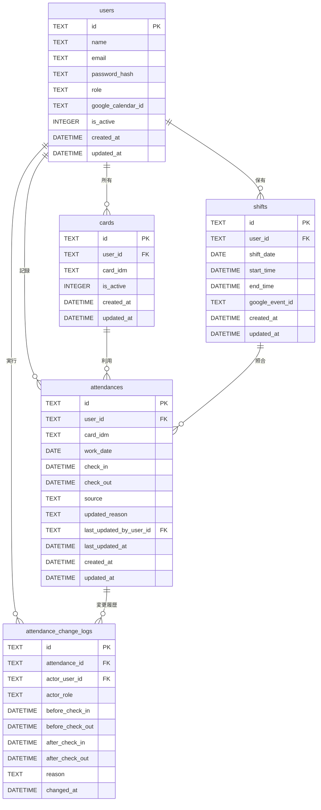
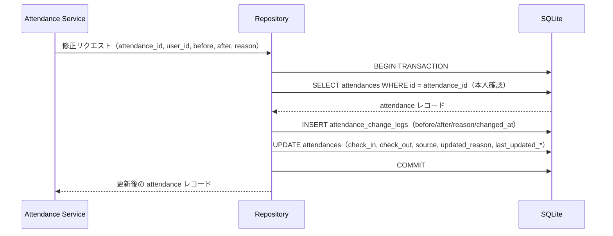

# Kint データベース設計

> **本文書の位置づけ**
> アーキテクト担当の物理モデル設計仕様です。
> SQLAlchemy モデル実装・Alembic マイグレーション作成は `@database` に委譲します。

## 1. テーブル一覧

| テーブル名                  | 役割                                     |
|-----------------------------|------------------------------------------|
| `users`                     | 管理者・従業員のアカウント               |
| `cards`                     | NFC カード（FeliCa IDm）とユーザーの紐付け |
| `attendances`               | 出退勤記録                               |
| `attendance_change_logs`    | 勤怠修正の変更履歴（不変ログ）           |
| `shifts`                    | Google Calendar から取得したシフト情報   |

---

## 2. 各テーブルの物理モデル

### 2-1. `users`

| カラム名            | 型            | 制約                          | 説明                         |
|---------------------|---------------|-------------------------------|------------------------------|
| `id`                | TEXT          | PK                            | UUID v4                      |
| `name`              | TEXT          | NOT NULL                      | 表示名                       |
| `email`             | TEXT          | NOT NULL, UNIQUE              | ログイン用メールアドレス     |
| `password_hash`     | TEXT          | NOT NULL                      | bcrypt ハッシュ              |
| `role`              | TEXT          | NOT NULL, CHECK(role IN ('admin','employee')) | ロール |
| `google_calendar_id`| TEXT          | NULL                          | Google Calendar ID           |
| `is_active`         | INTEGER       | NOT NULL, DEFAULT 1           | 有効フラグ（1=有効）         |
| `created_at`        | DATETIME      | NOT NULL, DEFAULT CURRENT_TIMESTAMP | 作成日時           |
| `updated_at`        | DATETIME      | NOT NULL, DEFAULT CURRENT_TIMESTAMP | 更新日時           |

インデックス:
- `ix_users_email` — UNIQUE インデックス（ログイン検索）

---

### 2-2. `cards`

| カラム名     | 型       | 制約                        | 説明                     |
|--------------|----------|-----------------------------|--------------------------|
| `id`         | TEXT     | PK                          | UUID v4                  |
| `user_id`    | TEXT     | NOT NULL, FK → users.id ON DELETE CASCADE | 所有ユーザー |
| `card_idm`   | TEXT     | NOT NULL, UNIQUE            | FeliCa IDm（16進文字列） |
| `is_active`  | INTEGER  | NOT NULL, DEFAULT 1         | 有効フラグ（1=有効）     |
| `created_at` | DATETIME | NOT NULL, DEFAULT CURRENT_TIMESTAMP | 作成日時       |
| `updated_at` | DATETIME | NOT NULL, DEFAULT CURRENT_TIMESTAMP | 更新日時       |

インデックス:
- `ix_cards_card_idm` — UNIQUE インデックス（打刻時のカード検索）
- `ix_cards_user_id` — 通常インデックス（ユーザー別カード一覧）

---

### 2-3. `attendances`

| カラム名                   | 型       | 制約                                                   | 説明                                 |
|----------------------------|----------|--------------------------------------------------------|--------------------------------------|
| `id`                       | TEXT     | PK                                                     | UUID v4                              |
| `user_id`                  | TEXT     | NOT NULL, FK → users.id ON DELETE RESTRICT             | 対象ユーザー                         |
| `card_idm`                 | TEXT     | NULL                                                   | 打刻に使用したカードの IDm（スナップショット） |
| `work_date`                | DATE     | NOT NULL                                               | 勤務日（YYYY-MM-DD）                 |
| `check_in`                 | DATETIME | NULL                                                   | 出勤日時                             |
| `check_out`                | DATETIME | NULL                                                   | 退勤日時                             |
| `source`                   | TEXT     | NOT NULL, CHECK(source IN ('desktop_nfc','admin_manual','self_service')) | 打刻元 |
| `updated_reason`           | TEXT     | NULL                                                   | 最新修正理由（最終 log の reason を参照用にコピー） |
| `last_updated_by_user_id`  | TEXT     | NULL, FK → users.id ON DELETE SET NULL                 | 最終修正者                           |
| `last_updated_at`          | DATETIME | NULL                                                   | 最終修正日時                         |
| `created_at`               | DATETIME | NOT NULL, DEFAULT CURRENT_TIMESTAMP                    | 作成日時                             |
| `updated_at`               | DATETIME | NOT NULL, DEFAULT CURRENT_TIMESTAMP                    | 更新日時                             |

制約:
- `uq_attendances_user_work_date` — (user_id, work_date) UNIQUE（1日1レコード）
- `ck_attendances_checkout_after_checkin` — check_out IS NULL OR check_out > check_in

インデックス:
- `ix_attendances_user_id` — 通常インデックス（ユーザー別勤怠一覧）
- `ix_attendances_work_date` — 通常インデックス（日付範囲検索）

---

### 2-4. `attendance_change_logs`

不変ログテーブルです。レコードの INSERT のみ許可し、UPDATE・DELETE は行わない運用とします。

| カラム名          | 型       | 制約                                                            | 説明                         |
|-------------------|----------|-----------------------------------------------------------------|------------------------------|
| `id`              | TEXT     | PK                                                              | UUID v4                      |
| `attendance_id`   | TEXT     | NOT NULL, FK → attendances.id ON DELETE RESTRICT               | 対象勤怠レコード             |
| `actor_user_id`   | TEXT     | NOT NULL, FK → users.id ON DELETE RESTRICT                     | 修正を実行したユーザー       |
| `actor_role`      | TEXT     | NOT NULL, CHECK(actor_role IN ('admin','employee'))             | 実行時のロール               |
| `before_check_in` | DATETIME | NULL                                                            | 変更前の出勤日時             |
| `before_check_out`| DATETIME | NULL                                                            | 変更前の退勤日時             |
| `after_check_in`  | DATETIME | NULL                                                            | 変更後の出勤日時             |
| `after_check_out` | DATETIME | NULL                                                            | 変更後の退勤日時             |
| `reason`          | TEXT     | NOT NULL                                                        | 修正理由（空文字不可）       |
| `changed_at`      | DATETIME | NOT NULL, DEFAULT CURRENT_TIMESTAMP                             | 修正日時                     |

> `created_at` / `updated_at` は不変ログのため `changed_at` 1 カラムとする。

インデックス:
- `ix_attendance_change_logs_attendance_id` — 通常インデックス（勤怠別履歴取得）
- `ix_attendance_change_logs_actor_user_id` — 通常インデックス（実行者別監査）
- `ix_attendance_change_logs_changed_at` — 通常インデックス（時系列ソート）

---

### 2-5. `shifts`

| カラム名           | 型       | 制約                                              | 説明                           |
|--------------------|----------|---------------------------------------------------|--------------------------------|
| `id`               | TEXT     | PK                                                | UUID v4                        |
| `user_id`          | TEXT     | NOT NULL, FK → users.id ON DELETE CASCADE         | 対象ユーザー                   |
| `shift_date`       | DATE     | NOT NULL                                          | シフト日（YYYY-MM-DD）         |
| `start_time`       | DATETIME | NOT NULL                                          | シフト開始日時                 |
| `end_time`         | DATETIME | NOT NULL                                          | シフト終了日時                 |
| `google_event_id`  | TEXT     | NOT NULL, UNIQUE                                  | Google Calendar イベント ID    |
| `created_at`       | DATETIME | NOT NULL, DEFAULT CURRENT_TIMESTAMP               | 作成日時                       |
| `updated_at`       | DATETIME | NOT NULL, DEFAULT CURRENT_TIMESTAMP               | 更新日時                       |

制約:
- `uq_shifts_google_event_id` — UNIQUE（同一イベントの重複同期防止）

インデックス:
- `ix_shifts_user_id` — 通常インデックス
- `ix_shifts_shift_date` — 通常インデックス（シフト日範囲検索）

---

## 3. ERD（物理モデル）

---

## 4. 勤怠修正トランザクションの流れ

トランザクションで履歴 INSERT と本体 UPDATE を必ず同時にコミットすること。
どちらか一方のみが成功する状態を作らない。

---

## 5. @database への委譲事項

- SQLAlchemy モデル（`src/kint/models/`）の実装
- Alembic 初期マイグレーションの作成
- `render_as_batch=True` を `alembic/env.py` に設定（SQLite 制約対応）
- `updated_at` 自動更新トリガーまたは SQLAlchemy `onupdate` の設定
- `attendance_change_logs` への UPDATE・DELETE が発生しない運用をアプリ層で保証する実装
