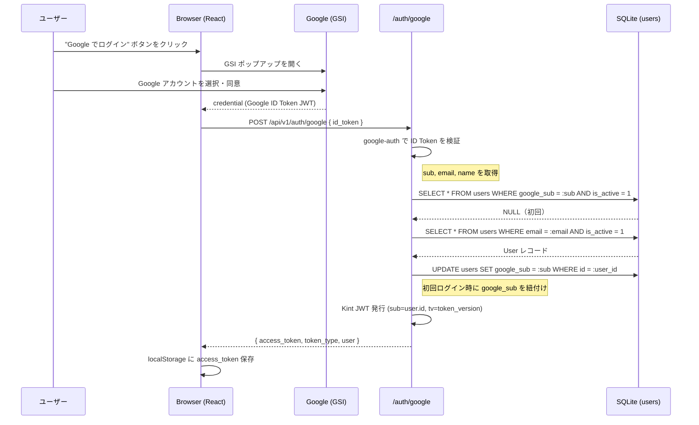
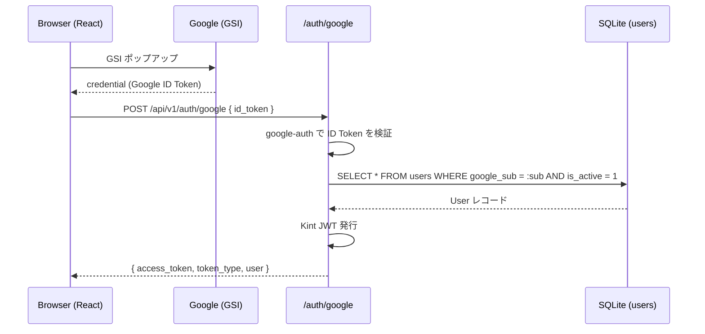
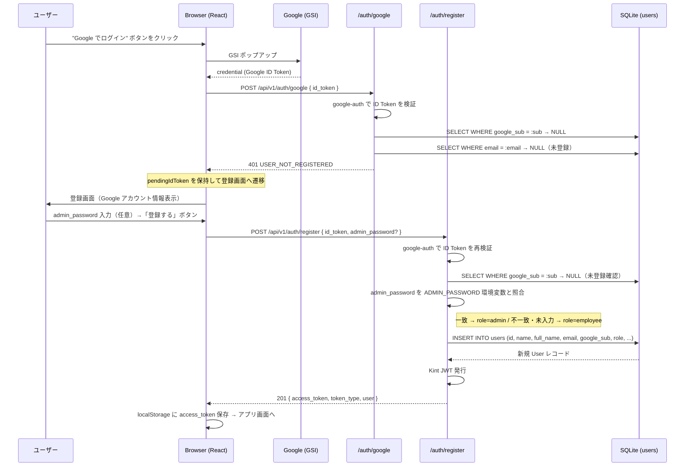
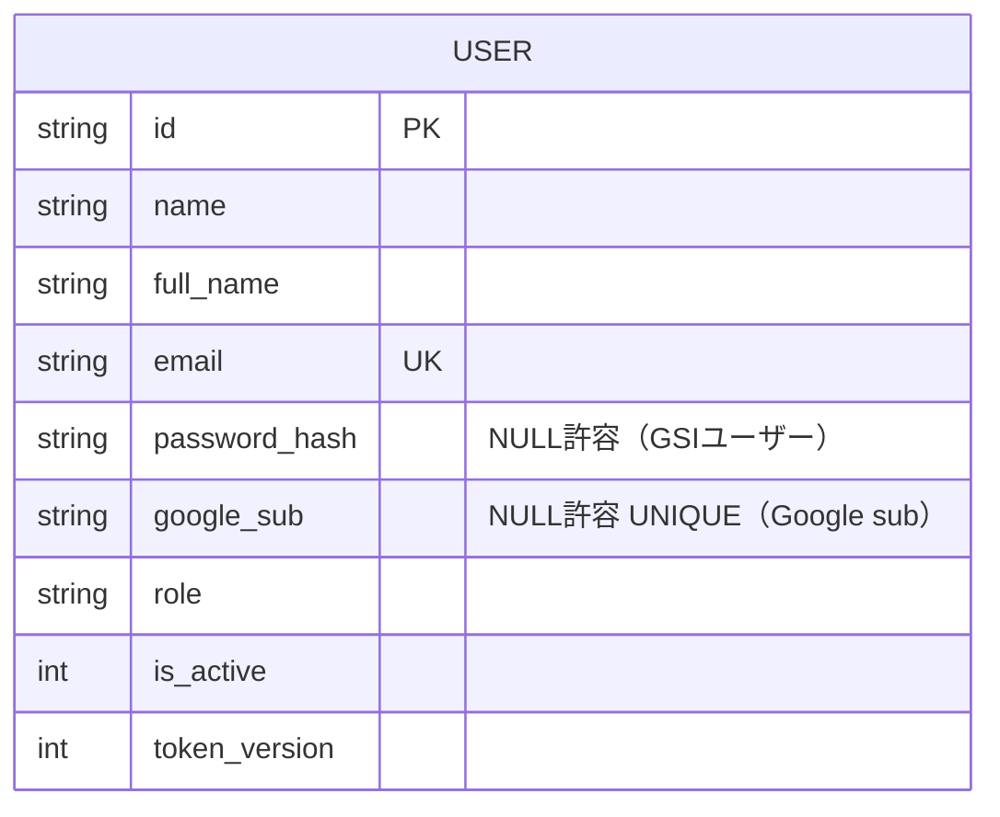

# Google Identity Services (GSI) 認証移行設計

## 1. 概要

現在の「アカウントID + パスワード」認証を **Google Identity Services (GSI) の OAuth 2.0 ID トークン** ベース認証に置き換える。

- ユーザーはパスワード不要。Google アカウントでサインイン。
- バックエンドが Google ID トークンを検証し、内部 Kint JWT を発行する。
- 既存の JWT ベースの認可・セッション管理フロー（Bearer トークン）は維持する。
- **未登録の Google アカウントは、ログイン失敗後に表示される登録画面からアカウント登録できる。**
- 管理者として登録するには、`.env` の `ADMIN_PASSWORD` と一致するパスワードを登録画面で入力する。

---

## 2. 変更後のアーキテクチャ

```mermaid
flowchart LR
  subgraph Browser[Web ブラウザ]
    LoginUI[ログイン UI\nGSI Button]
    GSI[Google Identity Services\nJS SDK]
    AppUI[アプリ UI]
  end

  subgraph Google[Google]
    GAccounts[accounts.google.com/gsi]
    GTokenAPI[Google Token 検証エンドポイント]
  end

  subgraph Server[Linux サーバー]
    AuthRouter[POST /auth/google\nPOST /auth/register]
    GoogleVerify[google-auth ライブラリ]
    UserRepo[Users テーブル]
    JWTIssue[Kint JWT 発行]
  end

  LoginUI -->|Sign in with Google| GSI
  GSI <-->|OAuth2 フロー| GAccounts
  GSI -->|credential\n(Google ID Token)| LoginUI
  LoginUI -->|POST /api/v1/auth/google\n{ id_token }| AuthRouter
  AuthRouter --> GoogleVerify
  GoogleVerify <-->|公開鍵取得| GTokenAPI
  GoogleVerify -->|sub, email, name| AuthRouter
  AuthRouter --> UserRepo
  UserRepo -->|User レコード| AuthRouter
  AuthRouter --> JWTIssue
  JWTIssue -->|Kint JWT| LoginUI
  LoginUI --> AppUI
```

---

## 3. 認証シーケンス

### 3-1. 初回 GSI ログイン（既存ユーザー・メール照合 → google_sub リンク）



### 3-2. 2 回目以降のログイン（google_sub 照合）



### 3-3. 未登録 Google アカウント（登録画面からサインアップ）

未登録の Google アカウントでログインしようとすると `USER_NOT_REGISTERED` エラーが返り、フロントエンドが登録画面へ遷移する。  
登録画面で「登録する」を押すと `POST /auth/register` が呼ばれ、User レコードが作成される。



#### 登録時のロール決定ルール

| 条件 | 登録ロール |
|---|---|
| `admin_password` が `ADMIN_PASSWORD` 環境変数と一致 | `admin` |
| `admin_password` が未入力 / 不一致 | `employee` |
| `ADMIN_PASSWORD` 環境変数が空 | 常に `employee` |

---

## 4. API 変更

### 4-1. エンドポイント

#### `POST /auth/google` — ログイン専用

```yaml
/auth/google:
  post:
    tags: [Auth]
    summary: Google ID Token でログイン
    description: >-
      GSI から取得した Google ID Token を受け取り、検証後に Kint JWT を返す。
      未登録ユーザーは USER_NOT_REGISTERED (401) を返す。登録は /auth/register を使用。
    security: []
    requestBody:
      required: true
      content:
        application/json:
          schema:
            $ref: '#/components/schemas/GoogleLoginRequest'
    responses:
      '200':
        description: ログイン成功
        content:
          application/json:
            schema:
              $ref: '#/components/schemas/LoginResponse'
      '401':
        description: Google ID Token が無効 / アカウント未登録 / アカウント無効
        content:
          application/json:
            schema:
              $ref: '#/components/schemas/ErrorResponse'

components:
  schemas:
    GoogleLoginRequest:
      type: object
      required: [id_token]
      properties:
        id_token:
          type: string
          description: GSI から取得した Google ID Token (JWT)
```

#### `POST /auth/register` — 新規ユーザー登録

```yaml
/auth/register:
  post:
    tags: [Auth]
    summary: Google アカウントで新規ユーザー登録
    description: >-
      /auth/google で USER_NOT_REGISTERED を受け取った後に呼ぶ。
      admin_password が ADMIN_PASSWORD 環境変数と一致する場合 role=admin で登録される。
      既登録の場合は USER_ALREADY_EXISTS (409) を返す。
    security: []
    requestBody:
      required: true
      content:
        application/json:
          schema:
            $ref: '#/components/schemas/RegisterRequest'
    responses:
      '201':
        description: 登録成功
        content:
          application/json:
            schema:
              $ref: '#/components/schemas/LoginResponse'
      '401':
        description: Google ID Token が無効
      '409':
        description: USER_ALREADY_EXISTS（すでに登録済み）

components:
  schemas:
    RegisterRequest:
      type: object
      required: [id_token]
      properties:
        id_token:
          type: string
          description: GSI から取得した Google ID Token (JWT)
        admin_password:
          type: string
          nullable: true
          description: >-
            管理者として登録する場合のみ入力。
            ADMIN_PASSWORD 環境変数と一致した場合に role=admin で登録される。
```

### 4-2. 廃止エンドポイント

| エンドポイント | 変更 |
|---|---|
| `POST /auth/login` | **廃止**（Desktop アプリ後方互換のため移行期間中は残す、後日削除） |

> **Desktop アプリへの影響**: `desktop/` は「旧デスクトップ打刻アプリの新規機能追加は対象外」のため、移行期間中は `POST /auth/login` を維持する。完全廃止は別途検討。

### 4-3. ユーザー作成 API の変更

```yaml
# UserCreateRequest の変更
components:
  schemas:
    UserCreateRequest:
      type: object
      required: [id, name, full_name, email, role]
      properties:
        id:
          type: string
        name:
          type: string
        full_name:
          type: string
        email:
          type: string
          format: email
        role:
          type: string
          enum: [admin, employee]
        # password フィールドを削除
        # ユーザーは Google アカウントで初回ログイン時に自動リンクされる
```

---

## 5. データモデル変更

### 5-1. users テーブル

| カラム | 変更前 | 変更後 | 備考 |
|---|---|---|---|
| `password_hash` | `TEXT NOT NULL` | `TEXT NULL` | GSI ユーザーはパスワード不要 |
| `google_sub` | なし | `TEXT NULL UNIQUE` | Google ユーザー識別子 (sub クレーム) |

### 5-2. 概念 ER（変更部分のみ）



> 物理モデル詳細・インデックス設計は `@database` に委譲する。  
> Alembic マイグレーション作成は `@database` に委譲する。

---

## 6. 設定変更

```python
# config.py に追加
google_client_id: str = ""   # GSI Client ID (Google Cloud Console で発行)
admin_password: str = ""     # 管理者ロールで自動登録を許可するパスワード
```

```env
# .env に追加
GOOGLE_CLIENT_ID=your-client-id.apps.googleusercontent.com

# 管理者として自動登録を許可するパスワード（初回ログイン時のみ有効）
# 空の場合は管理者として登録できない（全員が従業員として登録される）
ADMIN_PASSWORD=your-admin-password
```

---

## 7. 依存ライブラリ変更

### Backend (Python)

| パッケージ | 変更 | 用途 |
|---|---|---|
| `google-auth` | **追加** | Google ID Token 検証 |
| `bcrypt` | 維持 | 移行期間中の旧ログイン後方互換 |

### Frontend (Node.js)

| パッケージ | 変更 | 用途 |
|---|---|---|
| `@react-oauth/google` | **追加** | GSI React ラッパー / Sign-In ボタン |

---

## 8. フロントエンド変更コンポーネント

| ファイル | 変更内容 |
|---|---|
| `frontend/src/main.tsx` | `GoogleOAuthProvider` でアプリをラップ |
| `frontend/src/hooks/useAuth.ts` | `loginWithGoogle(idToken)`, `register(adminPassword?)`, `cancelRegister()`, `pendingIdToken` を実装 |
| `frontend/src/api/auth.ts` | `postGoogleLogin(idToken)`, `postRegister(idToken, adminPassword?)` を追加 |
| `frontend/src/types/auth.ts` | `UserProfile`, `LoginResponse` のみ残す（`GoogleLoginRequest` 削除） |
| `frontend/src/components/Login/LoginPage.tsx` | accountId/password フォームを削除、GSI ボタンのみに置き換え |
| `frontend/src/components/Register/RegisterPage.tsx` | **新規作成** Google アカウント情報表示 + 管理者パスワード入力 + 登録/戻るボタン |
| `frontend/src/App.tsx` | `pendingIdToken` が存在する場合 `RegisterPage` を表示、それ以外は `LoginPage` |
| `frontend/src/components/Users/UserManagementPage.tsx` | ユーザー作成フォームから `password` フィールドを削除 |

> 詳細実装は `@frontend` に委譲する。

---

## 9. バックエンド変更ファイル

| ファイル | 変更内容 |
|---|---|
| `src/kint/config.py` | `google_client_id: str`, `admin_password: str` を追加 |
| `src/kint/models/user.py` | `password_hash` を nullable 化、`google_sub` カラム追加 |
| `src/kint/schemas/auth.py` | `GoogleLoginRequest`, `RegisterRequest` スキーマ追加 |
| `src/kint/schemas/user.py` | `UserCreateRequest` から `password` フィールドを削除 |
| `src/kint/routers/auth.py` | `POST /auth/google`（ログイン専用）、`POST /auth/register`（新規登録）を追加 |
| `src/kint/services/user.py` | `create_user` からパスワードハッシュ生成を削除（`password_hash=None`） |
| `alembic/versions/` | `password_hash` nullable 化・`google_sub` 追加マイグレーション |

> 詳細実装は `@backend`、マイグレーション作成は `@database` に委譲する。

---

## 10. エラーコード定義

| エラーコード | HTTP | 発生条件 |
|---|---|---|
| `INVALID_GOOGLE_TOKEN` | 401 | ID Token の検証失敗（期限切れ・改ざん・audience 不一致） |
| `USER_NOT_REGISTERED` | 401 | `/auth/google` で未登録アカウントがログインしようとした |
| `USER_INACTIVE` | 401 | 対応ユーザーが無効化されている (`is_active=0`) |
| `USER_ALREADY_EXISTS` | 409 | `/auth/register` で既に登録済みのアカウントが再登録しようとした |

---

## 11. セキュリティ考慮事項

1. **ID Token の検証**: `google-auth` ライブラリの `verify_oauth2_token` を使用し、`audience`（`GOOGLE_CLIENT_ID`）を必ず検証する。自前のデコードは禁止。
2. **HTTPS 必須**: ID Token は通信経路で保護されること。開発時は `localhost` を許容する。
3. **google_sub の優先**: ユーザー照合は `google_sub` を優先し、メール照合は初回リンク時のみに限定する。メール変更によるなりすまし防止。
4. **Kint JWT は変更なし**: `token_version` によるトークン無効化機能はそのまま維持する。
5. **password_hash の残留**: NULL 許容にするだけで既存ハッシュは削除しない。移行期間中の後方互換を維持する。

---

## 12. 移行手順

```
1. Google Cloud Console で OAuth 2.0 Client ID を発行（Web アプリ用）
   - Authorized JavaScript origins: http://localhost:5173 / https://tukumana.si.aoyama.ac.jp
   - Authorized redirect URIs:     http://localhost:5173 / https://tukumana.si.aoyama.ac.jp/kintai/

2. 環境変数を設定する
   .env:
     GOOGLE_CLIENT_ID=xxx.apps.googleusercontent.com
     ADMIN_PASSWORD=任意の文字列
   frontend/.env.local:
     VITE_GOOGLE_CLIENT_ID=xxx.apps.googleusercontent.com

3. DB マイグレーションを適用する
     uv run alembic upgrade head

4. サーバー・フロントエンドを再起動する

5. 管理者アカウントを作成する
   - ログインページで「管理者パスワード」欄に ADMIN_PASSWORD を入力
   - Google でサインイン → admin ロールで自動登録される

6. 動作確認後、旧 POST /auth/login の廃止スケジュールを検討
```

---

## 13. 判断根拠

| 選択 | 根拠 |
|---|---|
| GSI Popup フロー（`@react-oauth/google`） | SPA 向けに最も実装コストが低い。リダイレクトフロー不要でルーティング変更なし。 |
| バックエンドでの ID Token 検証 | フロントエンドのみの検証は不十分（OWASP: 信頼境界）。サーバーで `audience` を検証することで偽造を防ぐ。 |
| 未登録ユーザーを自動サインアップ | 管理者による事前ユーザー作成を不要にし、招待・承認フロー実装を省略できる。 |
| 管理者はパスワードで制御 | 自動サインアップを許容しつつ、管理者権限昇格を `.env` のシークレットで制御。追加 UI 不要。 |
| メール照合による自動 google_sub リンク | 既存ユーザーの再登録不要。管理者がメールで作成済みのユーザーは初回 Google ログイン時に自動紐付け。 |
| password_hash を NULL 許容維持 | Desktop アプリの後方互換。強制移行は別フェーズで実施。 |
| UserCreateRequest から password 削除 | 管理者が新規ユーザーを作成する際にパスワード設定は不要になるため。 |
