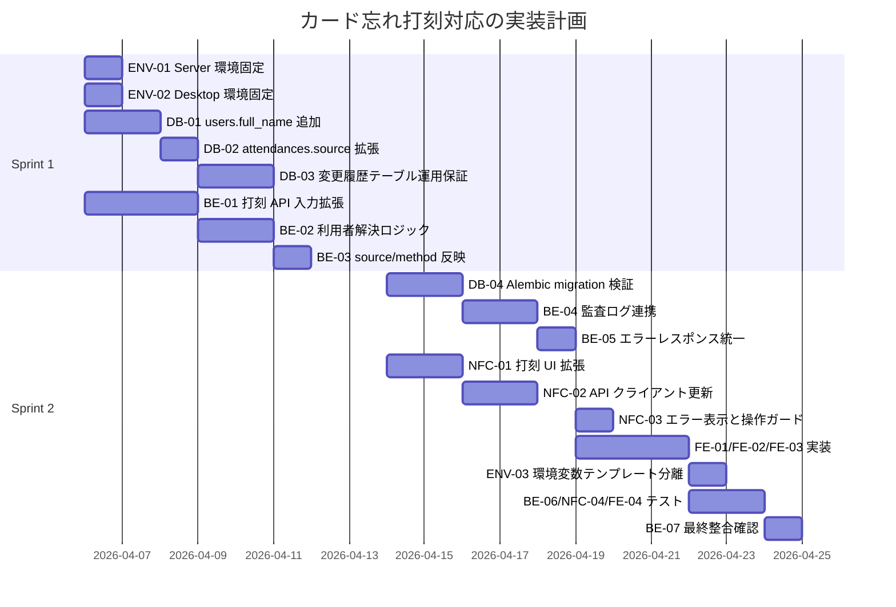

# Kint 実装計画

## 0. Python 実行環境分離方針
- Server（FastAPI）と NFC打刻クライアント（PySide6）は別環境で実行する。
- 依存関係は Server と Desktop で分離し、同一 virtualenv を共有しない。
- 環境変数ファイルも分離し、Server 側は `.env`、Desktop 側は `desktop/.env` を使用する。
- 運用コマンドは以下を基準とする。
  - Server: `uv sync` / `uv run ...`
  - Desktop: `cd desktop && uv sync` / `cd desktop && uv run ...`

## 0-1. 環境分離タスク（横断）

### ENV-01: Server Python 環境固定
- 担当: @backend
- 実装範囲:
  - Server 側依存をルート `pyproject.toml` のみに定義。
  - Desktop 依存をルート側に混在させない。
- 受け入れ条件:
  - Linux Server で `uv sync` 後、Backend が単体起動できる。

### ENV-02: Desktop Python 環境固定
- 担当: @nfc
- 実装範囲:
  - Desktop 側依存を `desktop/pyproject.toml` のみに定義。
  - nfcpy / PySide6 系を Server 環境へ持ち込まない。
- 受け入れ条件:
  - Windows 端末で `cd desktop && uv sync` 後、Desktop が単体起動できる。

### ENV-03: 環境変数テンプレート分離
- 担当: @devops
- 実装範囲:
  - `.env.example`（Server）と `desktop/.env.example`（Desktop）を分離管理。
  - 共通値と固有値を分けて記載する。
- 受け入れ条件:
  - 両環境で必要な変数が欠落なく定義される。

## 1. 実装チケット分解（@backend 向け）

### BE-01: 打刻 API 入力拡張（NFC / user_id 両対応）
- 目的:
  - POST /punches で card_idm と user_id のどちらでも打刻可能にする。
- 実装範囲:
  - Router の入力スキーマを oneOf 条件に合わせる。
  - user_id 打刻時は reason 必須バリデーションを追加する。
- 受け入れ条件:
  - card_idm 指定で打刻できる。
  - user_id + reason 指定で打刻できる。
  - user_id で reason 未指定の場合は 422 を返す。

### BE-02: 利用者解決ロジック実装
- 目的:
  - Service 層で card_idm / user_id の解決分岐を行う。
- 実装範囲:
  - get_user_by_card_idm と get_user_by_user_id を Repository に実装。
  - 共通の勤怠判定ロジック（check_in / check_out）に統合。
- 受け入れ条件:
  - どちらの入力方式でも同じ判定ロジックを通る。
  - 未登録 card_idm、未登録 user_id は 404 を返す。

### BE-03: 打刻ソース保存とレスポンス拡張
- 目的:
  - 打刻方法の追跡性を担保する。
- 実装範囲:
  - attendances.source に desktop_nfc / desktop_user_id を保存。
  - PunchResponse に method（card_idm / user_id）を追加する。
- 受け入れ条件:
  - NFC 打刻で source=desktop_nfc, method=card_idm が返る。
  - user_id 打刻で source=desktop_user_id, method=user_id が返る。

### BE-04: 監査ログ連携
- 目的:
  - user_id 打刻時の理由と実行者情報を監査可能にする。
- 実装範囲:
  - 打刻更新時に attendance_change_logs へ before/after/reason/actor を保存。
  - attendances.updated_reason と最終更新者情報を同期。
- 受け入れ条件:
  - user_id 打刻時に履歴が必ず 1 件以上追加される。
  - 履歴 INSERT と本体 UPDATE が同一トランザクションで処理される。

### BE-05: エラーレスポンス統一
- 目的:
  - API 契約どおりのエラー形式を保証する。
- 実装範囲:
  - 404（カード未登録またはユーザー未登録）、409（競合）を統一。
  - code / message / detail 形式に揃える。
- 受け入れ条件:
  - 失敗時レスポンスがすべて ErrorResponse 契約を満たす。

### BE-06: テスト追加（pytest）
- 目的:
  - 仕様追加による回帰を防止する。
- 実装範囲:
  - 正常系: card_idm 打刻、user_id + reason 打刻。
  - 異常系: reason 欠落、対象不在、二重打刻。
  - 監査系: user_id 打刻で履歴追記と source 保存を検証。
- 受け入れ条件:
  - 追加ケースが自動テストで再現・検証される。

### BE-07: リリース前整合確認
- 目的:
  - API 契約・DB 設計とのズレを排除する。
- 実装範囲:
  - docs/api-contract.openapi.yaml と docs/database-design.md を基準に差分レビュー。
  - Desktop クライアント向け仕様（入力とエラーコード）を確認。
- 受け入れ条件:
  - API 実装が契約と整合し、フロント/デスクトップ連携のブロッカーがない。

## 2. 実装チケット分解（@database 向け）

### DB-01: users への full_name 追加
- 目的:
  - 本名データを保持できるようにする。
- 実装範囲:
  - SQLAlchemy モデルへ full_name（NOT NULL）を追加。
  - 既存データがある場合は段階的 migration（暫定値投入後に NOT NULL 化）を検討。
- 受け入れ条件:
  - users.full_name が必須項目として保存・取得できる。

### DB-02: attendances.source 列挙値拡張
- 目的:
  - カード忘れ打刻を区別して保存する。
- 実装範囲:
  - CHECK 制約へ desktop_user_id を追加。
  - 既存行の整合性を確認し、制約更新時の失敗を防ぐ。
- 受け入れ条件:
  - desktop_nfc / desktop_user_id / admin_manual / self_service のみ保存可能。

### DB-03: 変更履歴テーブル運用保証
- 目的:
  - 勤怠変更の監査証跡を完全に残す。
- 実装範囲:
  - attendance_change_logs のモデル定義と FK/INDEX を実装。
  - アプリ層から UPDATE/DELETE を行わない運用を徹底。
- 受け入れ条件:
  - 勤怠修正時に履歴が追記され、履歴の欠落が発生しない。

### DB-04: Alembic マイグレーション作成（SQLite 対応）
- 目的:
  - 追加/変更したスキーマを安全に適用する。
- 実装範囲:
  - upgrade() / downgrade() を両実装。
  - SQLite の制約を考慮し render_as_batch=True 前提で migration を記述。
  - alembic downgrade -1 / upgrade head の往復検証。
- 受け入れ条件:
  - 新規環境と既存環境の両方で migration が成功する。

## 3. 実装チケット分解（@nfc 向け）

### NFC-01: 打刻 UI 拡張（カード忘れ対応）
- 目的:
  - カード忘れ時に user_id 打刻へフォールバックできるようにする。
- 実装範囲:
  - 打刻画面に user_id 入力欄と reason 入力欄を追加。
  - 通常時は NFC 読み取り導線を優先表示。
- 受け入れ条件:
  - NFC が使えない状況でも user_id 打刻が実行できる。

### NFC-02: API クライアント送信形式更新
- 目的:
  - API 契約（oneOf）に沿って打刻リクエストを送信する。
- 実装範囲:
  - 通常: card_idm + device_id + occurred_at
  - カード忘れ: user_id + reason + device_id + occurred_at
  - Idempotency-Key の再送制御を維持。
- 受け入れ条件:
  - 2 方式の送信がともに成功し、レスポンス method を正しく処理できる。

### NFC-03: エラー表示と操作ガード
- 目的:
  - 現場運用での入力ミスと誤解を減らす。
- 実装範囲:
  - reason 未入力時の送信抑止。
  - 404/409 応答時のメッセージ出し分け。
- 受け入れ条件:
  - 操作ミス時に UI 上で修正手順を案内できる。

### NFC-04: デスクトップテスト更新
- 目的:
  - 新仕様の回帰を防止する。
- 実装範囲:
  - API クライアント単体テストに user_id 打刻ケースを追加。
  - UI テストまたはイベントハンドラテストで必須入力を検証。
- 受け入れ条件:
  - user_id 打刻経路の主要ケースが自動テストで担保される。

## 4. 実装チケット分解（@frontend 向け）

### FE-01: 型定義と API クライアント更新
- 目的:
  - 追加された打刻契約に追従し、型安全に UI 実装できる状態を作る。
- 実装範囲:
  - UserProfile.full_name の型を反映。
  - PunchRequest の oneOf 条件（card_idm または user_id+reason）を型で表現。
  - PunchResponse.method と AttendanceRecord.source=desktop_user_id を反映。
- 受け入れ条件:
  - 型チェックで契約差分エラーが発生しない。

### FE-02: 管理画面の勤怠表示更新
- 目的:
  - 打刻方法の識別情報を管理画面で確認可能にする。
- 実装範囲:
  - 勤怠一覧に打刻元 source を表示。
  - desktop_user_id の場合は「カード忘れ（user_id）」とラベル表示。
- 受け入れ条件:
  - 管理者がカード打刻と user_id 打刻を画面上で判別できる。

### FE-03: 変更履歴画面の拡張
- 目的:
  - 監査要件として変更履歴を確認できるようにする。
- 実装範囲:
  - /attendance/{attendance_id}/history の取得 UI を追加。
  - 変更前/変更後/理由/実行者/実行日時を表示。
- 受け入れ条件:
  - 対象勤怠に対して時系列の変更履歴を閲覧できる。

### FE-04: フロントエンドテスト更新
- 目的:
  - 契約変更に伴う表示回帰を防止する。
- 実装範囲:
  - full_name 表示テストを追加。
  - source 表示ラベル変換テストを追加。
  - 変更履歴表示コンポーネントのレンダリングテストを追加。
- 受け入れ条件:
  - 主要 UI ケースが自動テストで担保される。

## 5. 依存関係と着手順

### 5-1. 依存マトリクス
- ENV-01/ENV-02 は全実装の前提タスクとして最優先で着手する。
- ENV-03 は BE-07 の前に完了させる。
- BE-01 は DB-02 完了前でも実装開始可能（ただし結合試験は DB-02 後）。
- BE-03 は DB-03 と同時進行可能だが、最終確認は DB-04 後。
- NFC-02 は BE-01 と API 契約確定後に実装開始。
- NFC-03 は BE-05 のエラーコード確定後に文言最終化。
- FE-01 は BE-01 と API 契約確定後に着手可能。
- FE-02 は BE-03（source 保存）完了後に結合確認。
- FE-03 は BE-04（履歴保存）と /attendance/{attendance_id}/history 実装完了後に結合確認。
- FE-04 は FE-01〜03 の完了後に実施。

### 5-2. 推奨スケジュール（2 スプリント）

## 6. 統合受け入れ条件（全チーム）
- 通常打刻: NFC で打刻でき、source=desktop_nfc で保存される。
- カード忘れ打刻: user_id + reason で打刻でき、source=desktop_user_id で保存される。
- 修正監査: 勤怠修正時に履歴が欠落なく追記される。
- 表示整合: 管理画面で full_name、打刻元、変更履歴が正しく表示される。
- 契約整合: API 実装、Desktop、Frontend が docs/api-contract.openapi.yaml と一致する。

## 7. 起票用バックログ（このまま Issue 化可能）

### P0-0: Python 実行環境分離の固定化
- 担当: @backend, @nfc, @devops
- 依存: なし
- 完了条件:
  - Server と Desktop の依存定義が分離される。
  - Server はルート環境のみで起動し、Desktop は `desktop/` 環境のみで起動する。
  - `.env.example` と `desktop/.env.example` が分離管理される。

### P0-1: DB マイグレーション実装（full_name と source 拡張）
- 担当: @database
- 依存: P0-0
- 完了条件:
  - users.full_name が追加される。
  - attendances.source に desktop_user_id が追加される。
  - upgrade/downgrade の往復が成功する。

### P0-2: 打刻 API 拡張（card_idm / user_id oneOf）
- 担当: @backend
- 依存: P0-1
- 完了条件:
  - POST /punches が card_idm と user_id+reason の双方を受理する。
  - reason 欠落時は 422 を返す。
  - 未登録 card_idm/user_id で 404 を返す。

### P0-3: 打刻保存と監査ログ連動
- 担当: @backend
- 依存: P0-2
- 完了条件:
  - source=desktop_nfc / source=desktop_user_id が正しく保存される。
  - attendance_change_logs が打刻変更時に追記される。
  - 本体更新と履歴保存が同一トランザクションで処理される。

### P0-4: Desktop のカード忘れ打刻 UI と送信対応
- 担当: @nfc
- 依存: P0-2
- 完了条件:
  - 打刻画面で user_id と reason の入力打刻が可能。
  - 通常打刻とカード忘れ打刻の送信を切替できる。
  - 404/409 のメッセージ表示が適切。

### P1-1: 管理画面の表示追従（full_name / source）
- 担当: @frontend
- 依存: P0-3
- 完了条件:
  - full_name が表示される。
  - desktop_user_id 打刻が識別可能なラベルで表示される。

### P1-2: 変更履歴画面の実装
- 担当: @frontend
- 依存: P0-3
- 完了条件:
  - /attendance/{attendance_id}/history の結果を一覧表示できる。
  - 変更前後、理由、実行者、実行日時を確認できる。

### P1-3: 結合テストと最終整合チェック
- 担当: @reviewer（実装担当と共同）
- 依存: P0-1〜P1-2
- 完了条件:
  - 契約・DB・Desktop・Frontend の整合が確認できる。
  - 主要シナリオ（通常打刻、カード忘れ打刻、履歴表示）が通る。

## 8. 実行開始の指示文（各担当へ貼り付け用）

### @database へ
- docs/database-design.md を基準に、P0-1 を実装してください。
- Alembic は SQLite 前提で render_as_batch=True を考慮してください。

### @backend へ
- docs/api-contract.openapi.yaml と docs/architecture.md の設計方針に従い、まず P0-0（Server 環境固定）を実施し、その後 P0-2/P0-3 を実装してください。
- 特に POST /punches の oneOf 入力条件と監査ログ連動を厳守してください。

### @nfc へ
- docs/api-contract.openapi.yaml の PunchRequest に合わせ、まず P0-0（Desktop 環境固定）を実施し、その後 P0-4 を実装してください。
- user_id 打刻時は reason を必須にしてください。

### @devops へ
- P0-0 の一部として `.env.example`（Server）と `desktop/.env.example`（Desktop）を分離してください。
- CI でも Server/Desktop の依存解決とテストを分離実行してください。

### @frontend へ
- P1-1/P1-2 を実装してください。
- full_name、source 表示、履歴表示の 3 点を優先してください。

## 9. P0-0 実施手順（着手用チェックリスト）

### 9-1. @backend（ENV-01）
- 実施項目:
  - ルート `pyproject.toml` に Server 用依存のみを保持する。
  - Desktop 専用依存（例: nfcpy, PySide6, pyinstaller）がルートに混在していないことを確認する。
- 検証コマンド:
  - `uv sync`
  - `uv run uvicorn src.kint.main:app --reload --host 0.0.0.0 --port 8000`
  - `uv run pytest tests/ -v`
- 完了判定:
  - ルート環境だけで Server の起動と Backend テストが通る。

### 9-2. @nfc（ENV-02）
- 実施項目:
  - `desktop/pyproject.toml` に Desktop 用依存のみを保持する。
  - Server 専用依存（例: FastAPI, Alembic）が Desktop 側へ不要混在していないことを確認する。
- 検証コマンド:
  - `cd desktop && uv sync`
  - `cd desktop && uv run python -m kint_desktop.main`
  - `cd desktop && uv run pytest tests/ -v`
- 完了判定:
  - Desktop 環境だけで打刻クライアント起動と Desktop テストが通る。

### 9-3. @devops（ENV-03）
- 実施項目:
  - ルート `.env.example` と `desktop/.env.example` を分離し、変数説明を明記する。
  - CI のジョブを Server/Frontend/Desktop で分離し、各環境で依存解決を分ける。
- 検証項目:
  - Server 用 CI: ルートで `uv sync` + Backend テストが成功。
  - Desktop 用 CI: `desktop/` で `uv sync` + Desktop テストが成功。
- 完了判定:
  - どちらか片方の依存更新が他方の CI を壊さない。

### 9-4. P0-0 完了ゲート（全体）
- ゲート条件:
  - ENV-01〜03 の完了判定を全て満たす。
  - 実装着手チケット P0-1 以降が「環境分離済み」を前提に開始できる。
