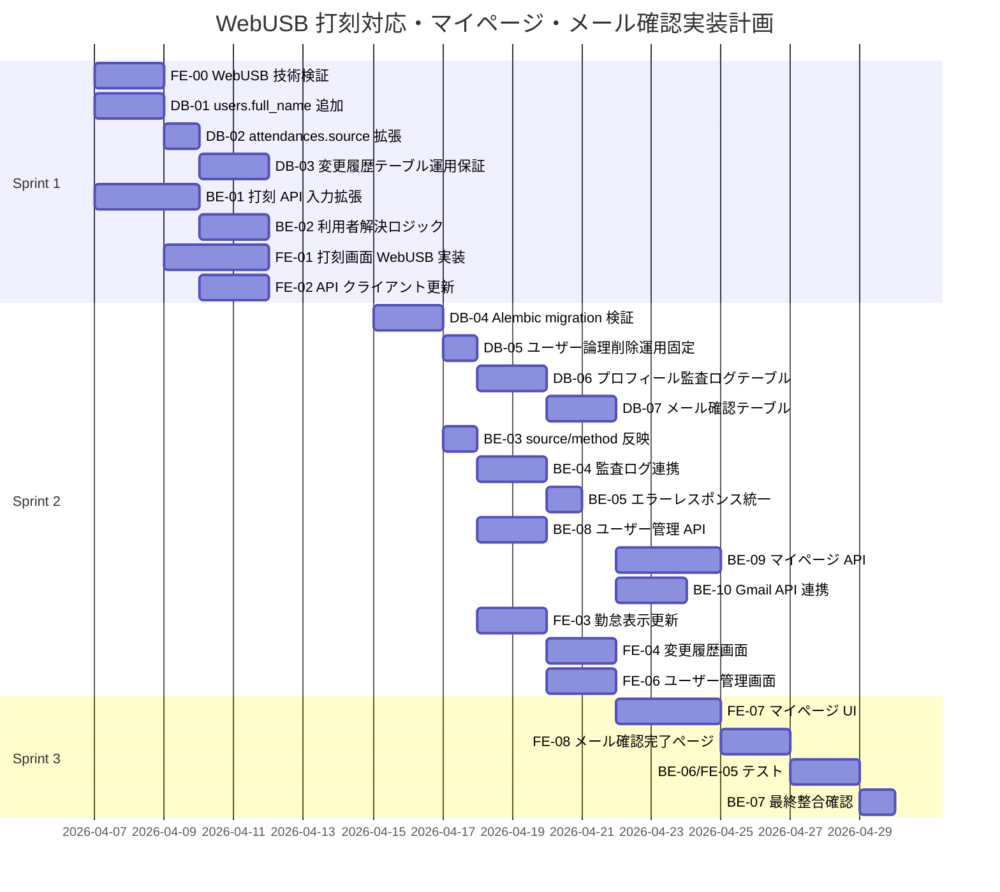

# Kint 実装計画

## 0. 実行環境方針
- Server は Linux 上で FastAPI を実行する。
- 打刻クライアントは専用 Desktop アプリではなく、Web ブラウザ上の React アプリで実行する。
- NFC 読み取りは WebUSB を利用し、PaSoRi を USB 接続して IDm を取得する。
- Python 依存は Server のみで管理し、クライアント側は Node.js 依存で管理する。

## 0-1. 対応ブラウザ確定（実装前提）
- 公式サポート: Windows 11 + Chrome / Edge（最新安定版）
- 準サポート: Windows 10 + Chrome / Edge（最新安定版）
- 非サポート: Firefox / Safari / モバイルブラウザ

## 0-2. 運用要件確定（実装前提）
- 打刻ページは HTTPS 配信（開発時 `localhost` 許容）。
- 打刻画面で WebUSB 接続状態を表示する。
- WebUSB 失敗時は user_id + reason の代替打刻へ遷移する。
- サポート外ブラウザは打刻 UI を無効化し、案内メッセージを表示する。

## 1. 実装チケット分解（@backend 向け）

### BE-01: 打刻 API 入力拡張（WebUSB NFC / user_id 両対応）
- 目的:
  - POST /punches で card_idm と user_id のどちらでも打刻可能にする。
- 実装範囲:
  - Router の入力スキーマを oneOf 条件に合わせる。
  - user_id 打刻時は reason 必須バリデーションを追加する。
- 受け入れ条件:
  - card_idm 指定で打刻できる。
  - user_id + reason 指定で打刻できる。
  - user_id で reason 未指定の場合は 422 を返す。

### BE-02: 利用者解決ロジック実装
- 目的:
  - Service 層で card_idm / user_id の解決分岐を行う。
- 実装範囲:
  - get_user_by_card_idm と get_user_by_user_id を Repository に実装。
  - 共通の勤怠判定ロジック（check_in / check_out）に統合。
- 受け入れ条件:
  - どちらの入力方式でも同じ判定ロジックを通る。
  - 未登録 card_idm、未登録 user_id は 404 を返す。

### BE-03: 打刻ソース保存とレスポンス拡張
- 目的:
  - 打刻方法の追跡性を担保する。
- 実装範囲:
  - attendances.source に webusb_nfc / web_user_id を保存。
  - PunchResponse に method（card_idm / user_id）を追加する。
- 受け入れ条件:
  - NFC 打刻で source=webusb_nfc, method=card_idm が返る。
  - user_id 打刻で source=web_user_id, method=user_id が返る。

### BE-04: 監査ログ連携
- 目的:
  - user_id 打刻時の理由と実行者情報を監査可能にする。
- 実装範囲:
  - 打刻更新時に attendance_change_logs へ before/after/reason/actor を保存。
  - attendances.updated_reason と最終更新者情報を同期。
- 受け入れ条件:
  - user_id 打刻時に履歴が必ず 1 件以上追加される。
  - 履歴 INSERT と本体 UPDATE が同一トランザクションで処理される。

### BE-05: エラーレスポンス統一
- 目的:
  - API 契約どおりのエラー形式を保証する。
- 実装範囲:
  - 404（カード未登録またはユーザー未登録）、409（競合）を統一。
  - code / message / detail 形式に揃える。
- 受け入れ条件:
  - 失敗時レスポンスがすべて ErrorResponse 契約を満たす。

### BE-06: テスト追加（pytest）
- 目的:
  - 仕様追加による回帰を防止する。
- 実装範囲:
  - 正常系: card_idm 打刻、user_id + reason 打刻。
  - 異常系: reason 欠落、対象不在、二重打刻。
  - 監査系: user_id 打刻で履歴追記と source 保存を検証。
- 受け入れ条件:
  - 追加ケースが自動テストで再現・検証される。

### BE-07: リリース前整合確認
- 目的:
  - API 契約・DB 設計とのズレを排除する。
- 実装範囲:
  - docs/api-contract.openapi.yaml と docs/database-design.md を基準に差分レビュー。
  - Frontend(WebUSB) 向け仕様（入力とエラーコード）を確認。
- 受け入れ条件:
  - API 実装が契約と整合し、フロント連携のブロッカーがない。

### BE-08: ユーザー管理 API 実装（管理者）
- 目的:
  - 管理者がユーザーを登録/修正/削除できるようにする。
- 実装範囲:
  - POST /users、PATCH /users/{user_id}、DELETE /users/{user_id} を実装。
  - DELETE は論理削除（is_active=false）で実装。
- 受け入れ条件:
  - 管理者のみ実行可能で、一般ユーザーは 403 を返す。
  - 論理削除後ユーザーは打刻・ログインができない。

### BE-09: マイページ API 実装（本人プロフィール編集）
- 目的:
  - ログイン済みユーザーが自分のプロフィール（name, full_name）とパスワードを自分で変更できるようにする。
- 実装範囲:
  - GET /api/v1/me（現在のプロフィール取得）を実装。
  - PATCH /api/v1/me/profile（name / full_name を更新）を実装。
  - POST /api/v1/me/email-change-requests を実装。
    - new_email 重複チェック、token 発行、確認メール送信受付。
    - Gmail API 送信失敗時は 502。
  - POST /api/v1/email-verifications/confirm を実装。
    - token 検証、期限判定、signup / email_change 確定。
    - email_change 完了時はセッション無効化 → 再認証。
  - PATCH /api/v1/me/password（current_password + new_password で変更）を実装。
    - current_password 検証（bcrypt compare）。
    - new_password 強度チェック（8-72 文字、英数混在）。
    - 現在のパスワードと同一の新パスワードは拒否（422）。
    - 変更成功時はセッション無効化 → 再認証指示（204）。
  - 本人コンテキストのみ処理（他ユーザー ID 指定は受け付けない）。
- 受け入れ条件:
  - GET /me で認証済みユーザーの id / role / name / full_name / email が返る。
  - PATCH /me/profile で name / full_name の各項目を単独または複数更新可能。
  - POST /me/email-change-requests で確認メール送信受付ができる。
  - POST /email-verifications/confirm で承認後に email が更新される。
  - PATCH /me/password で current_password 不一致時に 401、new_password == current_password 時に 422 を返す。
  - パスワード変更完了時に 204 で再認証が要求される。
  - API 実装は docs/api-contract.openapi.yaml の /me/profile と /me/password 仕様と整合。

### BE-10: Gmail API 確認メール送信実装
- 目的:
  - メールアドレス登録・変更時に Google Gmail API で確認メールを送信する。
- 実装範囲:
  - Gmail API クライアント層を実装（OAuth クライアント認証）。
  - OAuth クライアントの認可フロー（初回認可・リフレッシュトークン運用）を設計する。
  - 承認リンクテンプレートを実装。
  - 送信失敗時のリトライ方針とエラーコード（502）を整理。
- 受け入れ条件:
  - signup / email_change の両方で確認メールが送信される。
  - OAuth トークン期限切れ時に再取得が動作する。
  - Gmail API 障害時に API が適切なエラーを返す。

## 2. 実装チケット分解（@database 向け）

### DB-01: users への full_name 追加
- 目的:
  - 本名データを保持できるようにする。
- 実装範囲:
  - SQLAlchemy モデルへ full_name（NOT NULL）を追加。
  - 既存データがある場合は段階的 migration（暫定値投入後に NOT NULL 化）を検討。
- 受け入れ条件:
  - users.full_name が必須項目として保存・取得できる。

### DB-02: attendances.source 列挙値拡張
- 目的:
  - WebUSB 打刻と user_id 打刻を区別して保存する。
- 実装範囲:
  - CHECK 制約へ webusb_nfc / web_user_id を追加。
  - 既存行の整合性を確認し、制約更新時の失敗を防ぐ。
- 受け入れ条件:
  - webusb_nfc / web_user_id / admin_manual / self_service のみ保存可能。

### DB-03: 変更履歴テーブル運用保証
- 目的:
  - 勤怠変更の監査証跡を完全に残す。
- 実装範囲:
  - attendance_change_logs のモデル定義と FK/INDEX を実装。
  - アプリ層から UPDATE/DELETE を行わない運用を徹底。
- 受け入れ条件:
  - 勤怠修正時に履歴が追記され、履歴の欠落が発生しない。

### DB-04: Alembic マイグレーション作成（SQLite 対応）
- 目的:
  - 追加/変更したスキーマを安全に適用する。
- 実装範囲:
  - upgrade() / downgrade() を両実装。
  - SQLite の制約を考慮し render_as_batch=True 前提で migration を記述。
  - alembic downgrade -1 / upgrade head の往復検証。
- 受け入れ条件:
  - 新規環境と既存環境の両方で migration が成功する。

### DB-05: ユーザー論理削除運用の固定化
- 目的:
  - ユーザー削除時のデータ整合性を保証する。
- 実装範囲:
  - users.is_active を基準に論理削除を統一。
  - 打刻・認証・関連取得時に is_active 判定を適用。
- 受け入れ条件:
  - 論理削除ユーザーの新規業務操作が禁止される。

### DB-06: プロフィール変更監査ログテーブル実装
- 目的:
  - ユーザーのプロフィール変更（email / name / full_name / password）を監査証跡として記録する。
  - パスワードは値を記録せず、変更イベントのみ保存する。
- 実装範囲:
  - user_profile_change_logs テーブルを実装。
    - event_type = 'profile' / 'password' / 'email_change_requested' / 'email_change_confirmed' で区別。
    - profile イベント時は before/after で name / full_name を記録。
    - email_change_requested / email_change_confirmed イベント時は before/after で email を記録。
    - password イベント時は before/after = NULL（値は保存しない）。
  - SQLAlchemy モデルと Alembic マイグレーションを作成。
  - 不変ログ運用（INSERT のみ、UPDATE/DELETE は行わない）。
  - インデックス: user_id / actor_user_id / changed_at / event_type。
- 受け入れ条件:
  - user_profile_change_logs への INSERT が成功する。
  - プロフィール変更と同一トランザクション内で記録される。
  - upgrade/downgrade の往復が成功する。

### DB-07: メール確認リクエストテーブル実装
- 目的:
  - signup / email_change の確認トークンと状態を安全に管理する。
- 実装範囲:
  - email_verification_requests テーブルを実装。
  - token_hash / requested_email / verification_type / expires_at / consumed_at を保持。
  - users.email_verified_at を追加。
  - signup 完了時と email_change 完了時のトランザクション要件を満たす。
- 受け入れ条件:
  - token はハッシュ化前提で保存される。
  - 期限切れ・使用済みトークンを判定できる。
  - users.email_verified_at が確認完了時に更新される。

### DB-08: system_settings テーブル実装
- 目的:
  - 管理画面から変更可能なシステム設定値を DB に永続化する。
- 実装範囲:
  - `system_settings` テーブルを SQLAlchemy モデルとして実装。
  - Alembic マイグレーションを作成（upgrade/downgrade 両実装）。
- 受け入れ条件:
  - `system_settings` テーブルが作成される。
  - upgrade/downgrade の往復が成功する。

## 3. 実装チケット分解（@frontend 向け）

### FE-00: WebUSB-FeliCa 技術検証
- 目的:
  - ブラウザから PaSoRi を認識し、IDm を取得できることを確認する。
- 実装範囲:
  - WebUSB 対応ブラウザで接続処理を実装。
  - 参照: https://github.com/marioninc/webusb-felica/blob/gh-pages/demo.html
- 受け入れ条件:
  - サポート対象ブラウザで PaSoRi 接続と IDm 読み取りが成功する。
  - 非サポートブラウザでサポート外メッセージが表示される。

### FE-01: 打刻画面（WebUSB NFC / user_id フォールバック）
- 目的:
  - Web アプリ内で打刻を完結できるようにする。
- 実装範囲:
  - WebUSB 接続ボタン、IDm 読み取り、打刻送信 UI を実装。
  - WebUSB 非対応またはカード忘れ時の user_id + reason 入力導線を実装。
  - 接続状態（未接続/接続中/読取成功/エラー）を表示。
- 受け入れ条件:
  - 通常打刻とフォールバック打刻の両方を UI で実行できる。
  - 接続失敗時に復旧手順と代替導線が提示される。

### FE-02: API クライアント更新
- 目的:
  - 追加された打刻契約に追従する。
- 実装範囲:
  - PunchRequest の oneOf 条件を型で表現。
  - PunchResponse.method と AttendanceRecord.source=webusb_nfc/web_user_id を反映。
- 受け入れ条件:
  - 型チェックで契約差分エラーが発生しない。

### FE-03: 管理画面の勤怠表示更新
- 目的:
  - 打刻方法の識別情報を管理画面で確認可能にする。
- 実装範囲:
  - 勤怠一覧に打刻元 source を表示。
  - web_user_id の場合は「カード忘れ（user_id）」とラベル表示。
- 受け入れ条件:
  - 管理者が WebUSB 打刻と user_id 打刻を画面上で判別できる。

### FE-04: 変更履歴画面の拡張
- 目的:
  - 監査要件として変更履歴を確認できるようにする。
- 実装範囲:
  - /attendance/{attendance_id}/history の取得 UI を追加。
  - 変更前/変更後/理由/実行者/実行日時を表示。
- 受け入れ条件:
  - 対象勤怠に対して時系列の変更履歴を閲覧できる。

### FE-05: フロントエンドテスト更新
- 目的:
  - 契約変更に伴う表示回帰を防止する。
- 実装範囲:
  - full_name 表示テストを追加。
  - source 表示ラベル変換テストを追加。
  - 打刻画面の WebUSB 成功/失敗分岐テストを追加。
  - 変更履歴表示コンポーネントのレンダリングテストを追加。
- 受け入れ条件:
  - 主要 UI ケースが自動テストで担保される。

### FE-06: ユーザー管理画面実装（管理者）
- 目的:
  - 管理者がユーザーを登録/修正/削除できるようにする。
- 実装範囲:
  - ユーザー一覧、登録フォーム、編集フォーム、削除（論理削除）操作を実装。
  - 管理者以外には画面導線を表示しない。
- 受け入れ条件:
  - 管理者が UI 上でユーザー登録/修正/削除を実行できる。
  - 削除済みユーザーの状態が画面で識別できる。

### FE-07: マイページ UI 実装（本人プロフィール編集）
- 目的:
  - ログイン済みユーザーが自分のプロフィールをセルフサービスで編集できるようにする。
- 実装範囲:
  - マイページ画面の作成（route: /settings/profile または /my-profile など）。
  - 以下の 3 つのセクションを実装:
    1. プロフィール表示セクション
       - 現在の name / full_name / email / role を表示（role は読み取り専用）。
    2. プロフィール編集フォーム
       - name / full_name のテキスト入力。
       - バリデーション（文字数上限）。
       - 更新ボタン。
       - 成功時：プロフィール再表示 + メッセージ表示。
   3. メールアドレス変更フォーム
       - new_email の入力。
       - 送信ボタン。
       - 成功時：「確認メールを送信しました」表示。
       - 承認完了後の画面遷移は専用確認完了ページで扱う。
     4. パスワード変更フォーム
       - 現在のパスワード、新パスワード、新パスワード（確認）の入力。
       - バリデーション（最小文字数 8、英数混在）。
       - 現在のパスワードと新パスワード入力値のリアルタイム一致確認。
       - 変更ボタン。
       - 成功時：「パスワード変更完了。セッションが無効になりました。再度ログインしてください」→ ログイン画面へ。
       - 失敗時（current_password 不一致）：「現在のパスワードが正しくありません」エラー表示。
  - API クライアント（frontend/src/api/user.ts 等）に loadMyProfile / updateProfile / requestEmailChange / confirmEmailVerification / changePassword を追加。
  - ナビゲーション（ヘッダーなど）にマイページへのリンク追加。
- 受け入れ条件:
  - ユーザーが GET /api/v1/me でプロフィール取得可能。
  - ユーザーが PATCH /api/v1/me/profile で name / full_name 更新可能で、成功時にプロフィール再表示。
  - ユーザーが POST /api/v1/me/email-change-requests で確認メール送信を依頼できる。
  - ユーザーが確認リンクを開くと email 変更完了画面に遷移する。
  - ユーザーが PATCH /api/v1/me/password でパスワード変更可能で、成功時に自動ログアウト＆ログイン画面へ。
  - email 変更完了時 / パスワード変更時にセッション無効化が自動検知され、再ログイン画面へ遷移。
  - 入力値バリデーションが Frontend で実施され、サーバーエラー時は適切にエラーメッセージ表示。

### FE-08: メール確認完了ページ実装
- 目的:
  - 確認メールの承認リンクから遷移した利用者に、確認結果を表示する。
- 実装範囲:
  - `/email-verifications/confirm?token=...` の Frontend ルートを実装。
  - token を backend に送信して確認結果を表示。
  - 成功時は「メール確認完了」表示とログイン導線を表示。
  - 失敗時は「リンク無効・期限切れ」表示と再送導線を表示。
- 受け入れ条件:
  - token 成功時と失敗時の両画面が実装される。

### FE-09: システム設定画面実装（管理者専用）
- 目的:
  - 管理者がブラウザ上から打刻規則・シフト設定を変更できるようにする。
- 実装範囲:
  - `frontend/src/types/settings.ts` — `SystemSettings`・`SettingsPatchRequest` 型を実装。
  - `frontend/src/api/settings.ts` — `getSettings` / `patchSettings` API クライアントを実装。
  - `frontend/src/components/Settings/SettingsPage.tsx` — 設定画面コンポーネントを実装。
    - 打刻規則セクション（`punch_cooldown_seconds`・`shift_checkin_early_minutes`）。
    - シフトカレンダーセクション（`shift_ical_url`）。
    - 保存ボタン（成功トースト／エラーメッセージ）。
  - `App.tsx` に `page=settings` ルートと admin 専用ナビゲーション項目を追加。
- 受け入れ条件:
  - 管理者が設定画面を開くと現在の設定値がフォームに表示される。
  - 値を変更して「保存」すると `PATCH /api/v1/settings` が呼ばれ、成功メッセージが表示される。
  - admin 以外のユーザーにはナビゲーション項目が表示されない。
  - クライアントバリデーション（範囲外の値）でフォームがエラー表示される。

## 4. 依存関係と着手順

### 4-1. 依存マトリクス
- FE-00 は全体の前提タスクとして最優先で着手する。
- BE-01 は DB-02 完了前でも実装開始可能（ただし結合試験は DB-02 後）。
- BE-03 は DB-03 と同時進行可能だが、最終確認は DB-04 後。
- BE-08 は DB-05 と並行可能だが、最終確認は DB-05 後。
- BE-09 は DB-06 / DB-07 完了後に着手し、本人コンテキスト処理を厳守する。
- BE-10 は BE-09 と並行可能だが、結合確認は Gmail API 設定後に実施する。
- BE-10 は BE-09 と並行可能だが、結合確認は Gmail API OAuth クライアント設定後に実施する。
- FE-02 は BE-01 と API 契約確定後に着手可能。
- FE-03 は BE-03（source 保存）完了後に結合確認。
- FE-04 は BE-04（履歴保存）と /attendance/{attendance_id}/history 実装完了後に結合確認。
- FE-06 は BE-08 実装後に結合確認。
- FE-07 は BE-09 完了後に着手し、マイページ UI を実装。
- FE-08 は BE-09 完了後に着手し、確認リンクの結果表示を実装。
- FE-09 は DB-08 → BE（SET-BE-01/02）完了後に着手し、設定画面を実装。
- FE-05 は FE-01〜04 完了後に、FE-07 を含むテストに着手。

### 4-2. 推奨スケジュール（3 スプリント）

## 5. 統合受け入れ条件（全チーム）
- 通常打刻: WebUSB で IDm を読み取り打刻でき、source=webusb_nfc で保存される。
- カード忘れ打刻: user_id + reason で打刻でき、source=web_user_id で保存される。
- 修正監査: 勤怠修正時に履歴が欠落なく追記される。
- 表示整合: 管理画面で full_name、打刻元、変更履歴が正しく表示される。
- マイページ: ユーザーが自分のプロフィール（name / full_name）とパスワードを自分で変更できる。
- マイページ: ユーザーが自分のプロフィール（name / full_name）とパスワードを自分で変更できる。
- メール確認: ユーザーがメールアドレス変更要求を送信すると Gmail API 経由で確認メールが送信される。
- メール確認: ユーザーがメールアドレス変更要求を送信すると Gmail API（OAuth クライアント）経由で確認メールが送信される。
- プロフィール監査: email / name / full_name 変更が user_profile_change_logs に記録される。
- パスワード監査: パスワード変更がイベントのみ（値なし）で user_profile_change_logs に記録される。
- セッション管理: email 変更確定時またはパスワード変更時に認証セッションが無効化され、再ログインが要求される。
- 契約整合: API 実装と Frontend が docs/api-contract.openapi.yaml と一致する。
- システム設定: 管理者が UI から打刻クールダウン・シフト早着時間・iCal URL を変更でき、再起動なしで即時反映される。

## 6. 起票用バックログ（このまま Issue 化可能）

### P0-0: WebUSB 技術検証と対応ブラウザ確定
- 担当: @frontend
- 依存: なし
- 完了条件:
  - PaSoRi 接続と IDm 読み取りが再現できる。
  - 対応ブラウザ・非対応ブラウザ時の挙動を定義できる。
  - Windows 11 + Chrome / Edge で打刻動作確認が完了する。

### P0-1: DB マイグレーション実装（full_name と source 拡張）
- 担当: @database
- 依存: なし
- 完了条件:
  - users.full_name が追加される。
  - attendances.source に webusb_nfc / web_user_id が追加される。
  - upgrade/downgrade の往復が成功する。

### P0-2: 打刻 API 拡張（card_idm / user_id oneOf）
- 担当: @backend
- 依存: P0-1
- 完了条件:
  - POST /punches が card_idm と user_id+reason の双方を受理する。
  - reason 欠落時は 422 を返す。
  - 未登録 card_idm/user_id で 404 を返す。

### P0-3: Web 打刻画面（WebUSB / user_id）実装
- 担当: @frontend
- 依存: P0-0, P0-2
- 完了条件:
  - 打刻画面で WebUSB 打刻と user_id 打刻の両方が可能。
  - 404/409 のメッセージ表示が適切。

### P1-1: 打刻保存と監査ログ連動
- 担当: @backend
- 依存: P0-2
- 完了条件:
  - source=webusb_nfc / source=web_user_id が正しく保存される。
  - attendance_change_logs が打刻変更時に追記される。

### P1-2: ユーザー管理 API（管理者）
- 担当: @backend
- 依存: P0-1
- 完了条件:
  - 管理者がユーザー登録/修正/削除（論理削除）を実行できる。
  - 一般ユーザーは 403 となる。

### P1-3: 管理画面の表示追従・履歴画面・ユーザー管理
- 担当: @frontend
- 依存: P1-1, P1-2
- 完了条件:
  - source と履歴が UI で確認できる。
  - 管理者がユーザー登録/修正/削除を UI で実行できる。

### P1-4: DB マイグレーション & マイページ API 実装
- 担当: @database, @backend
- 依存: P0-1
- 完了条件:
  - user_profile_change_logs テーブルが作成される。
  - email_verification_requests テーブルが作成される。
  - GET /me / PATCH /me/profile / POST /me/email-change-requests / POST /email-verifications/confirm / PATCH /me/password が実装される。
  - email 変更確定時にセッション無効化が発生する。
  - パスワード変更時にセッション無効化が発生する。

### P2-1: マイページ UI 実装
- 担当: @frontend
- 依存: P1-4
- 完了条件:
  - ユーザーがマイページ画面でプロフィール（name / full_name）を編集できる。
  - ユーザーがマイページ画面でメールアドレス変更要求を送信できる。
  - ユーザーがマイページ画面でパスワードを変更できる。
  - email 変更完了後 / パスワード変更後に自動ログアウト＆ログイン画面へ遷移。

### P2-2: メール確認画面実装
- 担当: @frontend
- 依存: P1-4
- 完了条件:
  - 確認リンク成功時の完了画面が実装される。
  - 確認リンク失敗時のエラー画面が実装される。

### P2-3: 結合テストと最終整合チェック
- 担当: @reviewer（実装担当と共同）
- 依存: P0-1〜P2-2
- 完了条件:
  - 契約・DB・Frontend の整合が確認できる。
  - 主要シナリオ（WebUSB 打刻、カード忘れ打刻、履歴表示、ユーザー管理、マイページ編集、メール確認）が通る。

## 7. 実行開始の指示文（各担当へ貼り付け用）

### @frontend へ
- まず P0-0 を実施し、WebUSB-FeliCa の接続性を確認してください。
- 次に P0-3 を実装し、Web 打刻画面で WebUSB 打刻と user_id フォールバックを提供してください。
- サポート外ブラウザ表示と接続状態表示を必須要件として実装してください。
- P1-3 で管理者向けユーザー管理画面を実装してください。
- P2-1 でマイページ UI を実装し、ユーザーが自分のプロフィール・パスワードをセルフサービスで編集できるようにしてください。
  - マイページは認証済みユーザーのみアクセス可能。
  - email 変更確定後 / パスワード変更後は自動ログアウト＆ログイン画面へ遷移。
 - P2-2 でメール確認完了ページを実装してください。

### @backend へ
- docs/api-contract.openapi.yaml と docs/architecture.md の方針に従い、P0-2、P1-1、P1-2、P1-4 を実装してください。
- 特に POST /punches の oneOf 入力条件と監査ログ連動を厳守してください。
- P1-4 では GET /me / PATCH /me/profile / POST /me/email-change-requests / POST /email-verifications/confirm / PATCH /me/password を docs/api-contract.openapi.yaml の仕様どおり実装してください。
  - email 変更要求時は Gmail API（OAuth クライアント認証）で確認メールを送信する。
  - email 変更確定時にセッション無効化して再認証を要求する。
  - パスワード変更時にセッション無効化して 204 を返す。
  - user_profile_change_logs への記録をトランザクション内で実行。

### @database へ
- docs/database-design.md を基準に、P0-1、P1-4 を実装してください。
- Alembic は SQLite 前提で render_as_batch=True を考慮してください。
- P1-4 では user_profile_change_logs テーブルと不変ログ運用を確立してください。
  - event_type = 'profile' / 'password' / 'email_change_requested' / 'email_change_confirmed' で区別。
  - password イベント時は before/after = NULL。

### @reviewer へ
- P1-3 で WebUSB 打刻導線を含む結合観点レビューを実施してください。
- P2-3 でマイページのセッション管理、プロフィール監査ログ、入力バリデーション、メール確認フロー を確認してください。

---

## 参照資料

- **マイページ（本人プロフィール編集）詳細設計**: [docs/mypage-design.md](mypage-design.md)
  - 画面状態遷移、UI レイアウト、エラーハンドリング、ナビゲーション統合
  - FE-07 実装の詳細仕様

