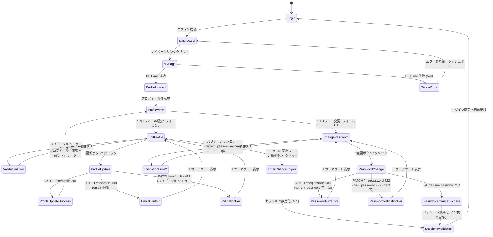
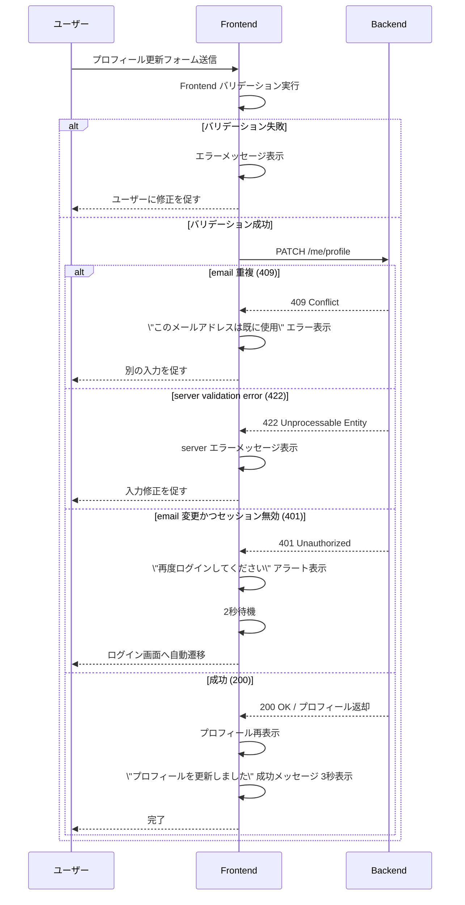

# マイページ（本人プロフィール編集）設計

> **本文書の位置づけ**
> FE-07: マイページ UI 実装の詳細設計仕様です。
> 画面遷移、UI コンポーネント、エラーハンドリングの仕様を記載します。

## 1. 概要

ログイン済みユーザーが自分のプロフィール（email、name、full_name）とパスワードをセルフサービスで編集できるマイページ機能の設計です。

### 機能の位置付け

- **対象ユーザー**: 全ロール（admin / employee）
- **アクセス方法**: 認証済みユーザーのみ、ナビゲーションメニュー / ヘッダーから遷移
- **実装URL**: `/settings/profile` または `/my-profile`（TBD）
- **API依存**: BE-09（GET /me、PATCH /me/profile、PATCH /me/password）

---

## 2. 画面状態遷移図



---

## 3. 画面レイアウト

### 3-1. マイページ全体構成

```
┌─────────────────────────────────────────────┐
│ ヘッダー（ロゴ、ユーザー名、ラッシュボード へのリンク） │
├─────────────────────────────────────────────┤
│                                             │
│ 【マイページ】                              │
│                                             │
│ ■ プロフィール情報（読み取り専用セクション） │
│   ├─ ロール: admin / employee              │
│   └─ メールアドレス: *** (マスク)          │
│                                             │
│ ■ プロフィール編集フォーム                 │
│   ├─ 表示名 (name)                         │
│   ├─ 氏名 (full_name)                      │
│   ├─ メールアドレス (email)                │
│   └─ 【更新ボタン】                        │
│                                             │
│ ■ パスワード変更フォーム                   │
│   ├─ 現在のパスワード                       │
│   ├─ 新パスワード                          │
│   ├─ 新パスワード(確認)                     │
│   └─ 【変更ボタン】                        │
│                                             │
│ 成功メッセージ / エラーアラート表示エリア   │
│                                             │
└─────────────────────────────────────────────┘
```

---

## 4. 各セクションの詳細仕様

### 4-1. プロフィール表示セクション（読み取り専用）

| 項目 | 表示内容 | 備考 |
|------|----------|------|
| ロール | "管理者" / "従業員" | 読み取り専用、バッジ表示推奨 |
| 現在のメール | **** (最初の 3 文字 + マスク) | 読み取り専用、マスク表示 |

**実装例:**
```
ロール: 👮 管理者
現在のメール: abc**** (変更: プロフィール編集を参照)
```

---

### 4-2. プロフィール編集フォーム

#### 入力項目

| フィールド | 制約 | バリデーション（Frontend） | 必須 |
|-----------|------|---------------------------|------|
| 表示名 (name) | 1-50文字 | 空欄チェック、最大長チェック | ○ |
| 氏名 (full_name) | 1-100文字 | 空欄チェック、最大長チェック | ○ |
| メールアドレス (email) | RFC準拠 | 形式チェック、空欄チェック | ✗ (変更時のみ必須) |

#### 動作仕様

**初期値の読み込み:**
```typescript
useEffect(() => {
  loadMyProfile(); // GET /me
  // setFormValues({ name, full_name, email })
}, []);
```

**リアルタイムバリデーション:**
- 表示名: 入力時に 50 文字上限チェック、超過時に警告表示
- 氏名: 入力時に 100 文字上限チェック、超過時に警告表示
- メール: 入力時に形式チェック（正規表現）、不正形式時に警告表示

**更新ボタン押下時:**
1. Frontend バリデーション実行
   - 空欄チェック
   - 形式チェック
   - 入力値の最小 1 項改変を確認（少なくとも 1 項目が元の値と異なることを確認）
2. 上記すべてパスしたら、PATCH /api/v1/me/profile を送信
3. レスポンス待機中は「更新中...」と表示、ボタン無効化

**成功時の動作 (200 OK):**
1. プロフィール情報を最新値で再表示
2. 成功メッセージ表示（3秒後自動消去）
   ```
   ✅ プロフィールを更新しました。
   ```

**失敗時の動作:**

**email 重複時 (409 Conflict):**
```
❌ このメールアドレスは既に使用されています。
別のメールアドレスを入力してください。
```

**バリデーションエラー (422 Unprocessable Entity):**
```
❌ 入力値に誤りがあります:
- 表示名: 1文字以上 50文字以下である必要があります
- メールアドレス: 正しいメールアドレスを入力してください
```

**email 変更の場合 (401 Unauthorized / Session Invalidated):**
1. PATCH 送信前に email が変更されていることを検知
2. レスポンス受信後、セッション無効化を検知
3. アラート表示
   ```
   ⚠️ メールアドレスが変更されたため、セッションが無効化されました。
   再度ログインしてください。
   ```
4. 2 秒後自動的にログイン画面へ遷移

---

### 4-3. パスワード変更フォーム

#### 入力項目

| フィールド | 制約 | バリデーション（Frontend） | 必須 |
|-----------|------|---------------------------|------|
| 現在のパスワード | 8-72文字 | 空欄チェック | ○ |
| 新パスワード | 8-72文字、英数混在 | 空欄・形式チェック、上限チェック | ○ |
| 新パスワード(確認) | 新パスワードと同一 | 入力値比較 | ○ |

#### 動作仕様

**リアルタイムバリデーション:**
- 新パスワード: 入力時に強度チェック（英数混在）、不足時に警告
  ```
  ⚠️ パスワードは英字と数字を各1文字以上含む必要があります
  ```
- 新パスワード(確認): 新パスワードと比較、不一致時に警告
  ```
  ⚠️ パスワードが一致しません
  ```
- 現在のパスワード == 新パスワード チェック（変更ボタン押下時に実施）
  ```
  ⚠️ 新しいパスワードは現在のパスワードと異なる必要があります
  ```

**変更ボタン押下時:**
1. Frontend バリデーション実行
   - 空欄チェック
   - 強度チェック（英数混在、8-72 文字）
   - 一致チェック（新パスワード == 確認用）
   - 重複チェック（current_password != new_password）
2. すべてパスしたら、PATCH /api/v1/me/password を送信
3. リクエスト待機中は「変更中...」と表示、ボタン無効化

**成功時の動作 (204 No Content / Session Invalidated):**
1. アラート表示
   ```
   ✅ パスワードが変更されました。
   セッションが無効化されたため、再度ログインしてください。
   ```
2. 2 秒後自動的にログイン画面へ遷移
3. フォーム内容をクリア

**失敗時の動作:**

**current_password 不一致 (401 Unauthorized):**
```
❌ 現在のパスワードが正しくありません。
もう一度確認してください。
```

**バリデーションエラー (422 Unprocessable Entity):**
```
❌ 新しいパスワードが要件を満たしていません:
- 8〜72文字である必要があります
- 英字と数字を各1文字以上含む必要があります
- 現在のパスワードと異なる必要があります
```

---

## 5. エラーハンドリングシーケンス



---

## 6. コンポーネント構成（参考実装例）

```
pages/
  └─ MyProfilePage.tsx
      ├─ useMyProfile hook (* GET /me 管理)
      ├─ ProfileSectionComponent
      │   └─ 表示名、氏名、ロール、メール(マスク) 表示
      ├─ ProfileEditFormComponent
      │   ├─ name input
      │   ├─ full_name input
      │   ├─ email input
      │   ├─ リアルタイムバリデーション
      │   ├─ Frontend バリデーション
      │   └─ 更新ボタン
      ├─ PasswordChangeFormComponent
      │   ├─ current_password input
      │   ├─ new_password input
      │   ├─ new_password_confirm input
      │   ├─ Reルト-タイムバリデーション
      │   ├─ Frontend バリデーション
      │   └─ 変更ボタン
      └─ MessageContainer
          ├─ 成功メッセージ（3秒自動消去）
          ├─ エラーアラート（ユーザー手動クローズ可）
          └─ セッション無効化通知（自動ナビゲーション）

api/
  └─ user.ts
      ├─ fetchMyProfile() // GET /me
      ├─ updateMyProfile(payload) // PATCH /me/profile
      └─ changePassword(payload) // PATCH /me/password
```

---

## 7. ナビゲーション統合（ヘッダー）

ユーザーメニュー内にマイページリンクを追加

```
例:
┌─ 👤 ユーザー名 ▼
│  ├─ ダッシュボード
│  ├─ 👤 マイページ (NEW)
│  ├─ 管理画面 (admin のみ)
│  └─ ログアウト
```

---

## 8. 非機能要件

### 8-1. アクセス制御
- 未認証ユーザーがマイページへアクセス → ログイン画面へ自動遷移
- 認証済みユーザーのみマイページ表示

### 8-2. セッション管理
- email / パスワード変更時にセッション無効化を自動検知（401）
- 401 受信時に自動的にログイン画面へ遷移

### 8-3. パフォーマンス
- マイページ訪問時に GET /me 1 回のみ実行（キャッシュ活用）
- 入力フィールドのリアルタイムバリデーションは遅延の少ないローカル処理

### 8-4. セキュリティ
- パスワード変更フォーム: ブラウザの自動入力を抑止（autocomplete="off"）
- 現在のパスワード入力: 画面からコピーペースト不可（paste イベント抑止）
- API リクエスト: HTTPS 必須

---

## 9. テスト計画（FE-07 テストケース）

### ユニットテスト

- **updateMyProfile**
  - ✓ 正常系: email / name / full_name 各1項目更新成功
  - ✓ 正常系: 複数項目同時更新成功
  - ✓ 異常系: 空更新要求（422）
  - ✓ 異常系: email 重複（409）
  - ✓ 異常系: email 変更で 401 セッション無効化

- **changePassword**
  - ✓ 正常系: 異なるパスワード変更成功
  - ✓ 異常系: current_password 不一致（401）
  - ✓ 異常系: 新旧パスワード同一（422）
  - ✓ 異常系: パスワード強度不足（422）

### インテグレーションテスト

- ✓ マイページ画面の全フロー（プロフィール表示 → 編集 → 更新 → 成功表示）
- ✓ パスワード変更デフロー（フォーム入力 → 変更 → セッション無効化 → ログイン画面へ）
- ✓ バリデーションエラー表示と修正入力の再試行

---

## 10. 参照資料

- API 契約: [docs/api-contract.openapi.yaml](docs/api-contract.openapi.yaml#L55-L118)（/me/profile、/me/password）
- アーキテクチャ: [docs/architecture.md](docs/architecture.md#Section-7)（マイページシーケンス）
- DB設計: [docs/database-design.md](docs/database-design.md#Section-4-1)（プロフィール変更トランザクション）
- データベース設計: [docs/database-design.md](docs/database-design.md#Section-2-5) (user_profile_change_logs)
- 実装計画: [docs/implementation-plan.md](docs/implementation-plan.md#FE-07)（FE-07 チケット）
