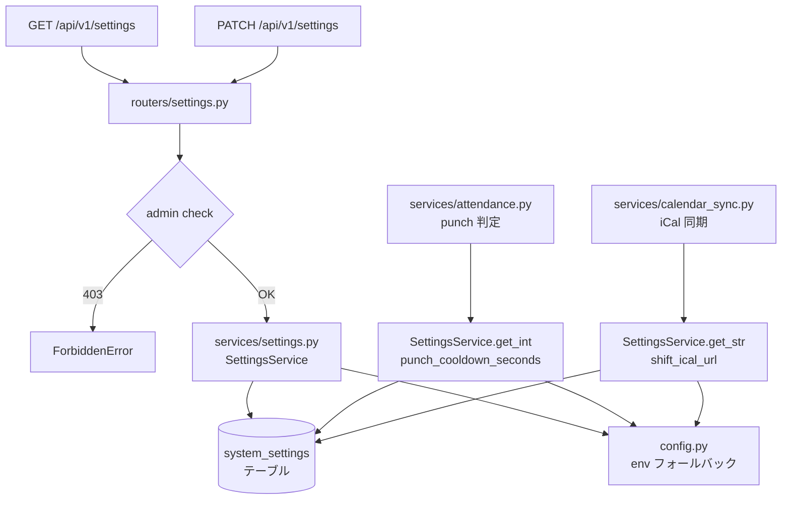
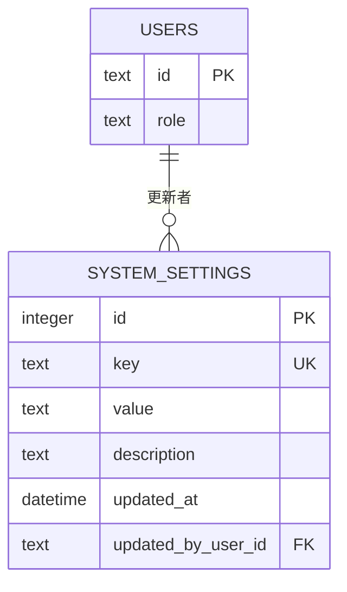
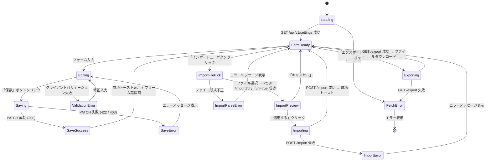
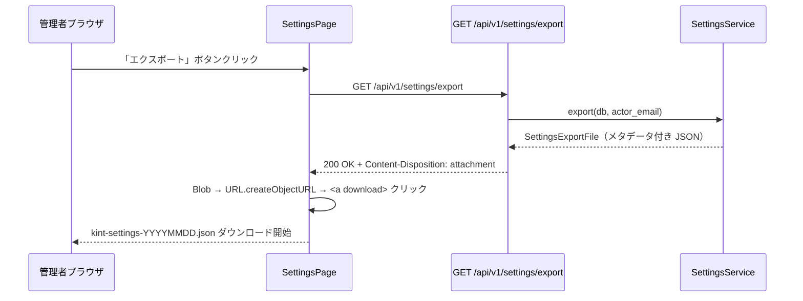
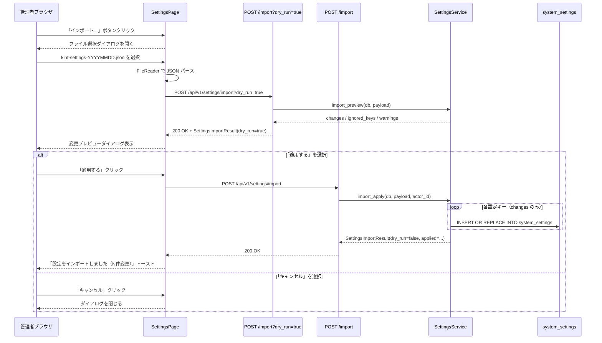
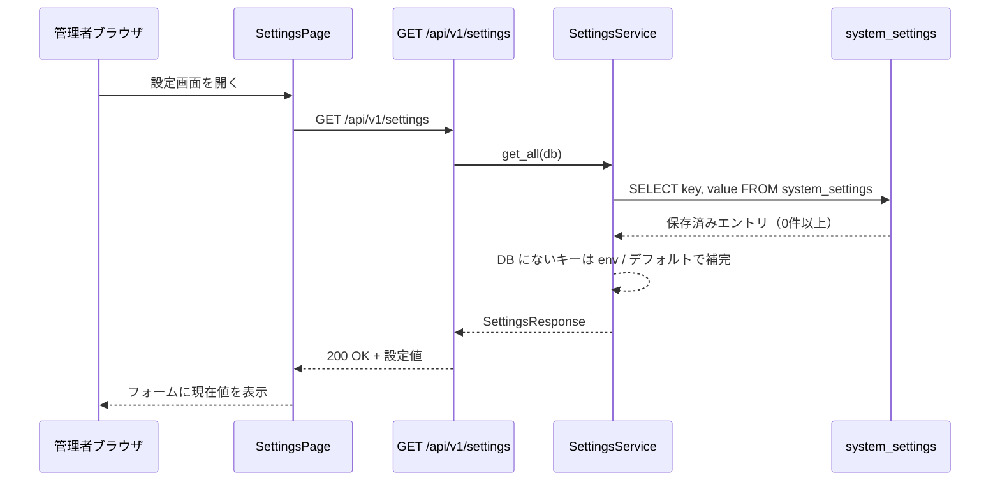
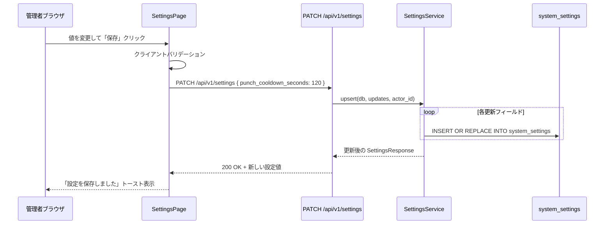
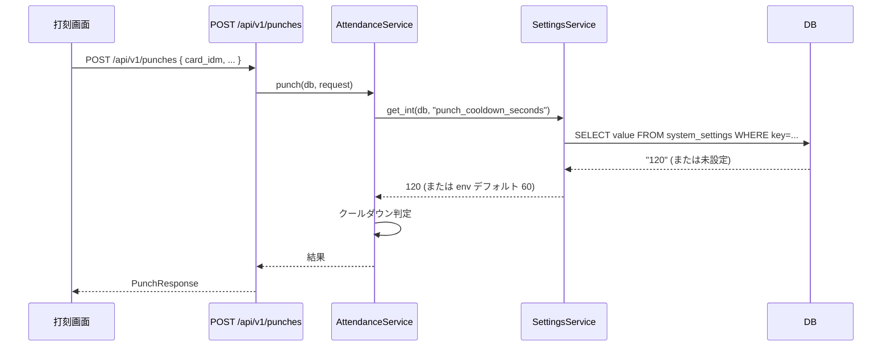

# システム設定機能 設計書

> **本文書の位置づけ**
> 打刻規則・シフトカレンダー設定を管理画面から変更できる「システム設定」機能の詳細設計仕様です。
> 実装は `@database` → `@backend` → `@frontend` の順で委譲します。

---

## 1. 概要

`punch_cooldown_seconds`（連続打刻クールダウン）・`shift_checkin_early_minutes`（シフト早着許容時間）・`shift_ical_url`（シフト iCal URL）・`site_name`（サイト名）・`site_subtitle`（サイトのサブタイトル）・`login_token_expire_hours`（ログイン継続時間）の各設定値を、管理者がブラウザ上の管理画面から変更できる機能です。

また、現在の設定値を JSON ファイルとしてエクスポートしたり、バックアップファイルからインポートして設定を復元できる機能も提供します。

### 機能の位置付け

| 項目 | 内容 |
|---|---|
| 対象ユーザー | `admin` ロールのみ |
| アクセス方法 | ログイン済み管理者 → ナビゲーション「設定」から遷移 |
| フロントエンドページ | `page=settings` |
| API | `GET /api/v1/settings`、`PATCH /api/v1/settings`、`GET /api/v1/settings/export`、`POST /api/v1/settings/import` |

---

## 2. 設定値一覧

管理対象の設定キーは以下の 3 つのみとする。

| キー | 型 | デフォルト値 | 最小 | 最大 | 説明 |
|---|---|---|---|---|---|
| `punch_cooldown_seconds` | integer | 60 | 0 | 3600 | 連続打刻防止クールダウン（秒）|
| `shift_checkin_early_minutes` | integer | 15 | 0 | 120 | シフト開始前チェックイン許容時間（分）|
| `shift_ical_url` | string \| null | null | — | — | シフト iCal 同期 URL |
| `shift_sync_time` | string \| null | `"03:00"` | — | — | iCal 自動同期の実行時刻（時・分セレクトボックス、バックエンドへの保存値はHH:MM）。null / 空文字で自動同期 OFF |
| `site_name` | string | `"Kint"` | — | — | サイトの表示名称。1〜50文字 |
| `site_subtitle` | string | `"NFC 勤怠管理システム"` | — | — | サイトのサブタイトル。1〜100文字 |
| `punch_result_display_seconds` | integer | 30 | 1 | 300 | 打刻結果表示時間（秒）|
| `monthly_report_time` | string \| null | `"20:00"` | — | — | 月次勤怠レポートの自動メール通知時刻（HH:MM、24時間表記）。月末日のこの時刻に通知。null / 空文字で自動通知 OFF |
| `login_token_expire_hours` | integer | 168 | 1 | 8760 | ログイン継続時間（時間）。JWTアクセストークンの有効期限。 |
| `enable_google_signup` | boolean | false | — | — | Googleログインでの新規ユーザー登録を許可するかどうか |
| `overtime_allowance_minutes` | integer | 30 | 0 | 120 | シフト終了後の退勤打刻を通常丸め（切り下げ）対象とする許容時間（分） |
| `attendance_alert_rules` | json | `[...初期値...]` | — | — | 勤怠の「要確認」アラートを判定するルールの配列 (JSON形式) |

---

## 3. アーキテクチャ方針

### 3-1. 設定値の永続化方式

**採用: DB オーバーライドパターン**

設定値は `system_settings` テーブルに格納する。サービス層は以下の優先順位で値を解決する。

```
優先順位: DB 保存値 > 環境変数 > コードのデフォルト値
```

環境変数（`.env`）はデフォルト値の役割を担い続ける。UI から一度変更されると DB 値が優先されるが、DB にエントリが存在しない場合は環境変数にフォールバックする。

### 3-2. コンポーネント依存関係



---

## 4. データモデル

### 4-1. `system_settings` テーブル

| カラム名 | 型 | 制約 | 説明 |
|---|---|---|---|
| `id` | INTEGER | PK, AUTOINCREMENT | — |
| `key` | TEXT | NOT NULL, UNIQUE | 設定キー（例: `punch_cooldown_seconds`）|
| `value` | TEXT | NOT NULL | 設定値（すべて文字列として格納） |
| `description` | TEXT | NULL | 設定の説明（任意）|
| `updated_at` | DATETIME | NOT NULL, DEFAULT CURRENT_TIMESTAMP | 最終更新日時 |
| `updated_by_user_id` | TEXT | NOT NULL, FK → users.id | 最終更新者 |

インデックス:
- `ix_system_settings_key` — UNIQUE インデックス（キー検索）

運用ルール:
- `key` の値は `ALLOWED_SETTING_KEYS = {"punch_cooldown_seconds", "shift_checkin_early_minutes", "shift_ical_url", "shift_sync_time", "site_name", "site_subtitle", "punch_result_display_seconds", "monthly_report_time", "login_token_expire_hours"}` のみ許容する。
- `value` は文字列として格納し、サービス層で型変換（int / str / None）を行う。
- `shift_ical_url` の空文字列 `""` は `null`（未設定）として扱う。
- `shift_sync_time` の空文字列 `""` は `null`（自動同期 OFF）として扱う。
- `monthly_report_time` の空文字列 `""` は `null`（自動通知 OFF）として扱う。


### 4-2. ER 図（既存テーブルとの関係）



---

## 5. API 設計

### 5-1. `GET /api/v1/settings`

現在の全設定値を返す。DB 未設定のキーは環境変数またはデフォルト値を返す。

| 項目 | 値 |
|---|---|
| 認証 | Bearer JWT 必須 |
| 認可 | `admin` ロールのみ |

**レスポンス例 (200)**

```json
{
  "punch_cooldown_seconds": 60,
  "shift_checkin_early_minutes": 15,
  "shift_ical_url": "https://example.com/calendar.ics",
  "shift_sync_time": "03:00",
  "site_name": "Kint",
  "site_subtitle": "NFC 勤怠管理システム",
  "punch_result_display_seconds": 30,
  "monthly_report_time": "20:00",
  "login_token_expire_hours": 168,
  "enable_google_signup": false,
  "overtime_allowance_minutes": 30,
  "attendance_alert_rules": [
    {
      "id": "e98e29ba-6415-4674-884d-2e11e0e8e60d",
      "target": "daily_working_hours",
      "operator": ">",
      "threshold_value": 5.0,
      "message": "要確認：5時間を超えています"
    }
  ]
}
```

**エラー**

| コード | 条件 |
|---|---|
| 401 | 未認証 |
| 403 | admin 以外 |

---

### 5-2. `PATCH /api/v1/settings`

指定したキーの設定値を更新する（upsert）。更新後の全設定値を返す。

| 項目 | 値 |
|---|---|
| 認証 | Bearer JWT 必須 |
| 認可 | `admin` ロールのみ |

**リクエスト例**

```json
{
  "punch_cooldown_seconds": 120,
  "shift_ical_url": "https://example.com/calendar.ics",
  "shift_sync_time": "03:00",
  "site_name": "Kint",
  "site_subtitle": "NFC 勤怠管理システム",
  "punch_result_display_seconds": 30,
  "monthly_report_time": "20:00",
  "login_token_expire_hours": 168
}
```

バリデーション仕様:

| フィールド | ルール |
|---|---|
| (body 全体) | 少なくとも 1 フィールド必須（空 body は 422） |
| `punch_cooldown_seconds` | integer, 0 ≤ value ≤ 3600 |
| `shift_checkin_early_minutes` | integer, 0 ≤ value ≤ 120 |
| `shift_ical_url` | string (URI 形式) または null / 空文字列（未設定として扱う） |
| `shift_sync_time` | string `HH:MM`（24時間表記、正規表現 `^([01]\d\|2[0-3]):[0-5]\d$`）または null / 空文字列（自動同期 OFF）。フロント UI は時・分セレクトボックス |
| `site_name` | string, 1 ≤ length ≤ 50 |
| `site_subtitle` | string, 1 ≤ length ≤ 100 |
| `punch_result_display_seconds` | integer, 1 ≤ value ≤ 300 |
| `monthly_report_time` | string `HH:MM`（24時間表記、正規表現 `^([01]\d\|2[0-3]):[0-5]\d$`）または null / 空文字列（自動通知 OFF）。フロント UI はON/OFFスイッチおよび時・分セレクトボックス（トグルONのとき入力必須） |
| `login_token_expire_hours` | integer, 1 ≤ value ≤ 8760 |
| `enable_google_signup` | boolean |
| `overtime_allowance_minutes` | integer, 0 ≤ value ≤ 120 |
| `attendance_alert_rules` | list of AlertRule objects |

**レスポンス (200)**: 更新後の全設定値（`GET` と同形式）

**エラー**

| コード | 条件 |
|---|---|
| 401 | 未認証 |
| 403 | admin 以外 |
| 422 | バリデーションエラー（空 body、範囲外の値を含む） |

### 5-3. `GET /api/v1/settings/export`

現在の設定値をメタデータ付き JSON ファイルとしてダウンロードする。

| 項目 | 値 |
|---|---|
| 認証 | Bearer JWT 必須 |
| 認可 | `admin` ロールのみ |
| レスポンスヘッダ | `Content-Disposition: attachment; filename="kint-settings-YYYYMMDD.json"` |

**レスポンスボディ例 (200)**

```json
{
  "version": "1",
  "exported_at": "2026-05-17T10:00:00Z",
  "exported_by": "admin@example.com",
  "settings": {
    "punch_cooldown_seconds": 120,
    "shift_checkin_early_minutes": 15,
    "shift_ical_url": "https://example.com/calendar.ics"
  }
}
```

**エラー**

| コード | 条件 |
|---|---|
| 401 | 未認証 |
| 403 | admin 以外 |

---

### 5-4. `POST /api/v1/settings/import`

エクスポートファイル（JSON）を受け取り、設定値を一括適用する。
`dry_run=true` を指定すると変更内容のプレビューのみ返し、DB には書き込まない。

| 項目 | 値 |
|---|---|
| 認証 | Bearer JWT 必須 |
| 認可 | `admin` ロールのみ |

**クエリパラメータ**

| パラメータ | 型 | デフォルト | 説明 |
|---|---|---|---|
| `dry_run` | boolean | false | true のとき DB への書き込みを行わずプレビューを返す |

**リクエストボディ**: エクスポートファイルと同一形式（`SettingsImportRequest`）

```json
{
  "version": "1",
  "settings": {
    "punch_cooldown_seconds": 120,
    "shift_checkin_early_minutes": 15,
    "shift_ical_url": "https://example.com/calendar.ics"
  }
}
```

**レスポンスボディ例**

```json
{
  "dry_run": false,
  "changes": [
    { "key": "punch_cooldown_seconds", "before": 60, "after": 120 }
  ],
  "ignored_keys": [],
  "warnings": [],
  "applied": {
    "punch_cooldown_seconds": 120,
    "shift_checkin_early_minutes": 15,
    "shift_ical_url": "https://example.com/calendar.ics",
    "punch_result_display_seconds": 30
  }
}
```

フィールド仕様:

| フィールド | 説明 |
|---|---|
| `dry_run` | リクエストの `dry_run` を反映。true のとき `applied` は返さない |
| `changes` | 実際に変更される（された）項目の before/after リスト |
| `ignored_keys` | 不明なキーや値が変化しないキーのリスト |
| `warnings` | バージョン不一致など注意事項 |
| `applied` | `dry_run=false` のとき更新後の全設定値を含む（`GET /settings` と同形式） |

バリデーション仕様:

| ルール | 詳細 |
|---|---|
| `version` フィールドの検証 | 未知のバージョンは `warnings` に追記し続行 |
| `settings` 内の不明なキー | `ignored_keys` に追記してスキップ（エラーにしない） |
| 各設定値の範囲チェック | PATCH と同一ルールを適用。違反は 422 |
| `settings` オブジェクト必須 | 欠落は 422 |

**エラー**

| コード | 条件 |
|---|---|
| 401 | 未認証 |
| 403 | admin 以外 |
| 422 | JSON 形式不正、設定値の範囲違反 |

---

## 6. サービス層設計

### `SettingsService`

```
src/kint/services/settings.py
```

| メソッド | 説明 |
|---|---|
| `get_all(db) -> SettingsResponse` | 全設定値を取得（DB + env フォールバック） |
| `get_int(db, key) -> int` | 指定キーを int で取得 |
| `get_str(db, key) -> str \| None` | 指定キーを str または None で取得 |
| `upsert(db, updates, actor_id) -> SettingsResponse` | 指定フィールドを upsert し、更新後の全設定値を返す。`shift_sync_time` が含まれる場合はスケジューラをリスケジュールする |
| `export(db, actor_email) -> SettingsExportFile` | メタデータ付きエクスポートオブジェクトを返す |
| `import_preview(db, payload) -> SettingsImportResult` | ドライラン: 差分を返す（DB 書き込みなし）|
| `import_apply(db, payload, actor_id) -> SettingsImportResult` | インポート適用: upsert 後に差分+結果を返す |

`get_int` / `get_str` は `services/attendance.py` や `services/calendar_sync.py` から直接呼び出す。DB に値がなければ `config.py` の環境変数値を返す。

---

## 7. フロントエンド設計

### 7-1. ファイル構成

| ファイル | 役割 |
|---|---|
| `frontend/src/components/Settings/SettingsPage.tsx` | 設定画面の親コンポーネント |
| `frontend/src/components/Settings/PunchDeviceManager.tsx` | 打刻端末の登録・解除を管理するコンポーネント |
| `frontend/src/components/Settings/SettingsPage.css` | スタイル |
| `frontend/src/components/Settings/index.ts` | エクスポート |
| `frontend/src/api/settings.ts` | API クライアント（GET / PATCH / export / import） |
| `frontend/src/api/punch_device.ts` | 打刻端末用の API クライアント (登録/検証) |
| `frontend/src/types/settings.ts` | TypeScript 型定義 |

既存ファイルへの変更:

| ファイル | 変更内容 |
|---|---|
| `frontend/src/App.tsx` | `page=settings` ルート追加、ナビゲーションに「設定」追加（admin のみ表示）、一般ユーザー用の打刻画面制限とリダイレクト制御 |

### 7-2. 画面構成

```
┌─────────────────────────────────────────────┐
│ システム設定                                   │
├─────────────────────────────────────────────┤
│                                             │
│ ▼ 一般設定                                   │
│                                             │
│  サイト名                                      │
│  ┌─────────────────────────────────────┐    │
│  │ Kint                                │    │
│  └─────────────────────────────────────┘    │
│                                             │
│  サイトのサブタイトル                          │
│  ┌─────────────────────────────────────┐    │
│  │ NFC 勤怠管理システム                  │    │
│  └─────────────────────────────────────┘    │
│                                             │
├─────────────────────────────────────────────┤
│                                             │
│ ▼ 打刻規則                                   │
│                                             │
│  シフト開始前チェックイン許容時間               │
│  ┌────────┐ 分（0〜120）                     │
│  │  15    │                                 │
│  └────────┘                                 │
│                                             │
│  連続打刻クールダウン                          │
│  ┌────────┐ 秒（0〜3600）                    │
│  │  60    │                                 │
│  └────────┘                                 │
│                                             │
├─────────────────────────────────────────────┤
│                                             │
│ ▼ シフトカレンダー                             │
│                                             │
│  iCal 同期 URL                               │
│  ┌─────────────────────────────────────┐    │
│  │ https://example.com/calendar.ics    │    │
│  └─────────────────────────────────────┘    │
│  ※ 未入力で「未設定」扱い                     │
│                                             │
│  自動同期時刻（毎日）                          │
│  ┌──────┐ （HH:MM 24時間表記）                │
│  │ 03:00│ ※ 未入力で自動同期 OFF              │
│  └──────┘                                   │
│                                             │
│                         [ 保存 ]            │
├─────────────────────────────────────────────┤
│                                             │
│ ▼ バックアップ                               │
│                                             │
│  [ ↑ 設定をエクスポート ]  [ ↓ インポート... ] │
├─────────────────────────────────────────────┤
│                                             │
│ ▼ 打刻端末管理                               │
│                                             │
│  ※ この端末が未登録の場合:                    │
│  この端末は打刻用端末として登録されていません。      │
│  端末名: ┌─────────────────────────┐        │
│          │ 例: 1F受付iPad            │        │
│          └─────────────────────────┘        │
│  [ この端末を登録する ]                       │
│                                             │
│  ※ この端末が登録済みの場合:                  │
│  この端末は打刻用端末として登録されています。        │
│  登録名: 1F受付iPad                         │
│  [ 登録を取り消す ] (赤ボタン)                │
│                                             │
└─────────────────────────────────────────────┘

**インポートダイアログ（確認画面）**

```
┌─────────────────────────────────────────────────────┐
│ 設定をインポート                                      │
├─────────────────────────────────────────────────────┤
│ ファイル: kint-settings-20260517.json               │
│ エクスポート日時: 2026-05-17 10:00 (admin@example)  │
│                                                     │
│ 変更内容のプレビュー:                                │
│  punch_cooldown_seconds: 60 → 120                   │
│  shift_ical_url: (未設定) → https://example.com/... │
│                                                     │
│  変更なし: shift_checkin_early_minutes (15)          │
│                                                     │
│         [ キャンセル ]  [ 適用する ]                 │
└─────────────────────────────────────────────────────┘
```
```

### 7-3. 状態遷移図



### 7-4. API クライアント仕様

```typescript
// frontend/src/api/settings.ts

export interface SystemSettings {
  punch_cooldown_seconds: number;
  shift_checkin_early_minutes: number;
  shift_ical_url: string | null;
  shift_sync_time: string | null;  // "HH:MM" または null（自動同期 OFF）
  site_name: string;
  site_subtitle: string;
  punch_result_display_seconds: number;
  monthly_report_time: string | null;
  login_token_expire_hours: number;
  enable_google_signup: boolean;
  overtime_allowance_minutes: number;
  attendance_alert_rules: AlertRule[];
}

export interface SettingsPatchRequest {
  punch_cooldown_seconds?: number;
  shift_checkin_early_minutes?: number;
  shift_ical_url?: string | null;
  shift_sync_time?: string | null;  // "HH:MM" または null / 空文字列
  site_name?: string;
  site_subtitle?: string;
  punch_result_display_seconds?: number;
  login_token_expire_hours?: number;
  enable_google_signup?: boolean;
  overtime_allowance_minutes?: number;
  attendance_alert_rules?: AlertRule[];
}

export interface SettingsExportFile {
  version: string;
  exported_at: string;       // ISO 8601
  exported_by: string;       // メールアドレス
  settings: SystemSettings;
}

export interface SettingsImportChange {
  key: string;
  before: number | string | null;
  after: number | string | null;
}

export interface SettingsImportResult {
  dry_run: boolean;
  changes: SettingsImportChange[];
  ignored_keys: string[];
  warnings: string[];
  applied?: SystemSettings;  // dry_run=false のときのみ
}

export async function getSettings(): Promise<SystemSettings>
export async function patchSettings(req: SettingsPatchRequest): Promise<SystemSettings>
export async function exportSettings(): Promise<SettingsExportFile>  // ファイルダウンロードをトリガーする
export async function previewImportSettings(file: SettingsExportFile): Promise<SettingsImportResult>
export async function applyImportSettings(file: SettingsExportFile): Promise<SettingsImportResult>
```

---

## 8. シーケンス図

### 8-0. エクスポート



### 8-1. インポート（ドライラン → 確認 → 適用）



### 8-2. 設定読み込み



### 8-3. 設定変更



### 8-4. 打刻時の設定値参照



---

## 9. バリデーション詳細

### バックエンド（Pydantic）

```python
class SettingsPatchRequest(BaseModel):
    punch_cooldown_seconds: int | None = None  # Field(ge=0, le=3600)
    shift_checkin_early_minutes: int | None = None  # Field(ge=0, le=120)
    shift_ical_url: str | None = None  # URL または null
    site_name: str | None = None  # min_length=1, max_length=50
    site_subtitle: str | None = None  # min_length=1, max_length=100
    punch_result_display_seconds: int | None = None  # Field(ge=1, le=300)
    monthly_report_time: str | None = None  # HH:MM または null
    login_token_expire_hours: int | None = None  # Field(ge=1, le=8760)

    @model_validator(mode="after")
    def at_least_one_field(self) -> "SettingsPatchRequest":
        # 全フィールドが None の場合は 422 エラー
        ...
```

### フロントエンド（クライアントサイド事前チェック）

| フィールド | チェック内容 |
|---|---|
| `punch_cooldown_seconds` | 0 以上 3600 以下の整数 |
| `shift_checkin_early_minutes` | 0 以上 120 以下の整数 |
| `shift_ical_url` | 空文字列または `https://` か `http://` で始まる文字列 |
| `site_name` | /^[A-Z0-9+_.-]+@[A-Z0-9.-]+$/i 形式の文字列（バリデーションはメール形式ではなく長さと値の検証）のような誤りがあるため省略し、文字列表記のみとする |
| `site_subtitle` | 空文字列以外の 100 文字以下の文字列 |
| `punch_result_display_seconds` | 1 以上 300 以下の整数 |
| `login_token_expire_hours` | 1 以上 8760 以下の整数 |

---

## 10. セキュリティ要件

- `GET /api/v1/settings`・`PATCH /api/v1/settings`・`GET /api/v1/settings/export`・`POST /api/v1/settings/import` はすべて `admin` ロール必須。
- `shift_ical_url` はサーバーサイドでのみ使用する（フロントエンドに直接 fetch させない）。
- 設定変更・インポート適用は `updated_by_user_id` で監査可能。
- インポートファイルのサイズ上限を設ける（推奨: 1 MB）。既知のキーのみ処理し、不明なキーはスキップする。
- エクスポートファイルには `shift_ical_url` が含まれる場合がある。ファイルの取り扱いは社内管理ルールに従う。

---

## 11. 実装委譲先とタスク分解

| タスク ID | 担当 | 内容 |
|---|---|---|
| SET-DB-01 | `@database` | `system_settings` テーブルのマイグレーション作成 |
| SET-BE-01 | `@backend` | `SystemSetting` モデル・`SettingsService` 実装（export / import_preview / import_apply を含む）|
| SET-BE-02 | `@backend` | `GET/PATCH /api/v1/settings`・`GET /api/v1/settings/export`・`POST /api/v1/settings/import` ルーター実装 |
| SET-BE-03 | `@backend` | `services/attendance.py` の config 参照を `SettingsService` 経由に変更 |
| SET-BE-04 | `@backend` | `services/calendar_sync.py` の `shift_ical_url` 参照を `SettingsService` 経由に変更 |
| SET-FE-01 | `@frontend` | `frontend/src/types/settings.ts`・`frontend/src/api/settings.ts` 実装（export/import 関数を含む）|
| SET-FE-02 | `@frontend` | `SettingsPage` コンポーネント実装（エクスポートボタン・インポートダイアログを含む）|
| SET-FE-03 | `@frontend` | `App.tsx` にルートとナビゲーション項目を追加 |

実装順序: SET-DB-01 → SET-BE-01 → SET-BE-02 → SET-BE-03 → SET-BE-04 → SET-FE-01 → SET-FE-02 → SET-FE-03
