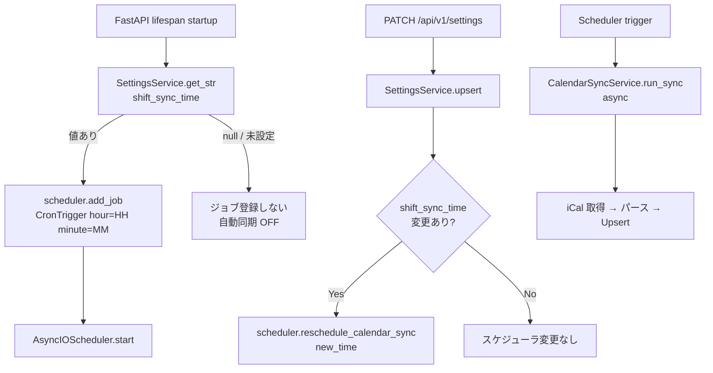

# シフトカレンダー同期機能設計書

## 1. 概要
指定されたiCal（iCalendar）形式のURLからシフトデータを取得し、データベースの `shifts` テーブルと同期する機能の設計です。Google Calendar APIの直接連携ではなく、iCalデータのURLからの取り込みを行います。

## 2. データソース
- **URL**: 環境変数 `SHIFT_ICAL_URL` で指定する iCal 配信 URL
  - 例: `https://tukumana.si.aoyama.ac.jp/shift2/api/ical/all?token=...`
- **フォーマット**: iCalendar (`.ics`)

### 設定ポリシー
- iCal の参照先 URL はコードへ直書きせず、必ず `SHIFT_ICAL_URL` から取得する。
- `SHIFT_ICAL_URL` が未設定の場合は同期処理を開始せず、設定不足として扱う。

## 3. データのマッピング仕様
iCal 内の `VEVENT`（イベント情報）をDBの `Shift` モデルへマッピングします。

| iCal (`VEVENT`) 項目 | `Shift` モデルカラム | 備考 |
| --- | --- | --- |
| `UID` | `google_event_id` | 一意となるイベントID。既存のカラム名（`google_event_id`）をそのまま流用し格納します。 |
| `DTSTART` | `start_time` | シフトの開始日時。タイムゾーンが適用された日時として扱います。 |
| `DTEND` | `end_time` | シフトの終了日時。 |
| `DTSTART` (日付) | `shift_date` | `DTSTART` から日付のみを抽出して登録。 |
| `ATTENDEE;ROLE=REQ-PARTICIPANT:MAILTO:<mail>` | `user_id` | `<mail>` の部分を取り出し、システム内の `User.email` を検索。該当するユーザーのIDを保存します。 |

### ユーザーの紐付け (判別処理)
1. `ATTENDEE` 行から `MAILTO:` 以降のメールアドレス文字列を抽出。
2. データベースの `users` テーブルに対して、`email` が一致するユーザーを検索。
3. 一致したユーザーの `id` を `user_id` として紐付け。
   - ※一致するユーザーが存在しない場合、該当シフトはスキップし、システムログに警告出力を行います。

## 4. 同期ロジック設計

### 4.1 更新・追加 (Upsert)
同期実行時、iCalデータ内のすべての `VEVENT` をパースし、以下のルールでデータベースに反映します。
- `UID` (`google_event_id`) をキーにして `shifts` テーブルを検索。
- **データが存在しない場合**: `INSERT` して新規シフトとして登録。
- **データが存在する場合**: `start_time` や `end_time` に変更がある場合のみ、データを `UPDATE`。変更がなければ何もしない。

### 4.2 削除の検知
カレンダー元データで予定が削除された場合、iCalデータからも消失します。
- **削除ロジック**: 
  1. 今回iCalから取得できた対象期間（例：本日以降の一定期間）の全 `UID` をリスト化。
  2. DB上に存在する「今日以降のシフト」のうち、取得した `UID` リストに含まれないものは、「元のカレンダー上で削除されたシフト」と判断し、DB上から削除します。

## 5. 新規使用ライブラリ
- **`icalendar`**: PythonのiCalendarパース用ライブラリ 
  （`uv add icalendar` あるいは `urllib` と標準機能でのパースも可能ですが、フォーマット変更に強くするためライブラリの利用を推奨）
- **`APScheduler`**: Python製スケジューラライブラリ（`uv add apscheduler`）。
  FastAPI の lifespan に統合し、毎日決まった時刻に自動同期を実行する。

## 6. 必要な実装タスク
1. **ライブラリ追加**: `pyproject.toml` へ `icalendar`、`apscheduler` を追加し環境を更新。
2. **同期サービスクラスの作成**: `src/kint/services/calendar_sync.py` を作成し、HTTP GETによるファイル取得・パース・DBへのUpsertロジックを実装。
3. **APIエンドポイント作成**: `src/kint/routers/shifts.py` に `POST /api/v1/shifts/sync` を作成し、フロントエンドから手動で同期する機能を提供する。
4. **スケジューラ実装**: `src/kint/scheduler.py` を作成し、毎日 `shift_sync_time` に設定された時刻で同期ジョブを起動する。
5. **設定変動への対応**: `PATCH /api/v1/settings` で `shift_sync_time` が更新された際に、ジョブを動的にリスケジュールする。

## 7. 定期自動同期設計

### 7-1. 概要

`shift_sync_time`（`system_settings` テーブルに保存）に設定された時刻を基に、毎日 1 回 iCal 同期を自動実行する。  
手動同期（`POST /api/v1/shifts/sync`）は引き続き利用可能。

### 7-2. スケジューラアーキテクチャ



### 7-3. コンポーネント設計

#### `src/kint/scheduler.py`

スケジューラのシングルトンと、ジョブ管理ユーティリティを保持する。

| 関数 / クラス | 役割 |
|---|---|
| `scheduler: AsyncIOScheduler` | モジュールレベルのスケジューラインスタンス |
| `CALENDAR_SYNC_JOB_ID = "calendar_sync_daily"` | ジョブ識別子定数 |
| `reschedule_calendar_sync(time_str: str \| None)` | 既存ジョブを削除し、指定時刻で再登録（`None` でジョブ削除のみ） |
| `init_scheduler(settings_service, db_factory)` | 起動時初期化。DB から `shift_sync_time` を取得してジョブを登録し `scheduler.start()` を呼ぶ |

#### `src/kint/main.py` — lifespan 統合

```python
@asynccontextmanager
async def lifespan(app: FastAPI):
    await init_scheduler(settings_service, db_factory)  # startup
    yield
    scheduler.shutdown()                                 # shutdown
```

#### `src/kint/services/settings.py` — upsert 後のリスケジュール

```python
async def upsert(db, updates, actor_id) -> SettingsResponse:
    result = await self._upsert_to_db(db, updates, actor_id)
    if "shift_sync_time" in updates:
        reschedule_calendar_sync(updates["shift_sync_time"])
    return result
```

### 7-4. `shift_sync_time` バリデーション

| ルール | 詳細 |
|---|---|
| 形式 | `HH:MM`（24 時間表記）、例: `"03:00"`、`"22:30"` |
| 範囲 | `00:00` ≤ value ≤ `23:59` |
| null / 空文字 | 許容。未設定（自動同期 OFF）として扱う |
| 不正形式 | 422 を返す |

正規表現: `^([01]\d|2[0-3]):[0-5]\d$`

### 7-5. エラー処理方針

| 状況 | 挙動 |
|---|---|
| `shift_ical_url` が未設定 | 同期をスキップし、警告ログを記録 |
| HTTP 取得失敗 | ログにエラーを記録し、次回スケジュール実行を待つ（リトライなし） |
| パースエラー | ログにエラーを記録し、DB は変更しない |
| スケジューラ起動時 DB エラー | `shift_sync_time` 取得失敗時は自動同期 OFF として起動を継続 |

### 7-6. タイムゾーン

- スケジューラのタイムゾーンはサーバー環境のローカルタイムゾーンに従う。
- 将来拡張として `SCHEDULER_TIMEZONE` 環境変数で上書き可能にする設計にすること（実装は委譲）。
